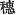
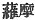
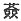
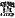
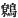
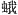
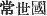
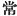
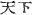

  
[Intangible Textual Heritage](../../index)  [Shinto](../index) 
[Index](index)  [Previous](kj033)  [Next](kj035) 

------------------------------------------------------------------------

[Buy this Book at
Amazon.com](https://www.amazon.com/exec/obidos/ASIN/B0028Y4SZY/internetsacredte)

------------------------------------------------------------------------

  
*The Kojiki*, translated by Basil Hall Chamberlain, \[1919\], at
Intangible Textual Heritage

------------------------------------------------------------------------

p. 103

## SECT. XXVII.—THE LITTLE-PRINCE-THE-RENOWNED-DEITY.

So when the Deity Master-of-the-Great-Land dwelt at the august cape of
Miho [1](#fn_567) in Idzumo, there came riding
on the crest [2](#fn_568) of the waves in a
boat of heavenly *Kagami* [3](#fn_569) a Deity
dressed in skins of geese [4](#fn_570) flayed
with a complete \[85\] flaying, who, when asked his name, replied not;
moreover the Deities who accompanied him, though asked, all said that
they knew not. Then the toad [5](#fn_571)
spoke, saying: "As for this, the Crumbling Prince [6](#fn_572) will surely know it." Thereupon \[the
Deity Master-of-the-Great-Land\] summoned and asked the
Crumbling-Prince, who replied. saying: "This is the
Little-Prince-the-Renowned-Deity. [7](#fn_573)
the august child of the Deity-Producing-Wondrous-Deity." [8](#fn_574) So on their then respectfully
informing [9](#fn_575) His Augustness the
Deity-Producing-Wondrous-August-Ancestor, he replied, saying: "This is
truly my child. He among my children is the child who dipped between the
fork of my hand. [10](#fn_576) So do he and
thou become \[87\] brethren, and make and consolidate this land." [11](#fn_577) So from that time forward the two
Deities the Great-Name-Possessor and the
Little-Prince-the-Renowned-Deity made and consolidated this land
conjointly. But afterwards the Little-Prince-the-Renowned-Deity crossed
over to the Eternal Land. [12](#fn_578) So
\[the Deity here\] called the Crumbling Prince, who revealed the
Little-Prince-the-Renowned-Deity, is what is now \[called\] the
scarecrow in the mountain fields. This Deity, though his legs do not
walk, is a Deity who knows everything in the Empire. [13](#fn_579)

p. 104 p. 105

------------------------------------------------------------------------

### Footnotes

[103:1](kj034.htm#fr_571) p. 103 Not to be confounded with the better known
Miho in Suruga. Derivation of the name seems uncertain.

[103:2](kj034.htm#fr_572) p. 104 The character used is  , which properly denotes an ear
of rice or other grain.

[103:3](kj034.htm#fr_573) What plant the author
intends by this name is not quite certain. The characters   and   are variously used to write it
in the native work of reference, where also we learn that it probably
corresponds to the plant known in different provinces of modern Japan as
*chichi-gusa*, *tombo-no-chichi*, *kagarahi* and *gaga-imo*. We may best
understand the *Ampelopsis serianæfolia* to have been intended, as the
plant is described as having a berry three or four inches long shaped
like a towel-gourd, (*hechima*), so that, if scooped out, it would
fairly resemble a boat in miniature.

[103:4](kj034.htm#fr_574) All the authorities
are agreed in considering the character 
, "goose," to be a copyist's error; but there is no
agreement as to the character which should be substituted for it. Hirata
reads  , "wren," changing
the phonetic. "Wren" also is the reading in "One account" of the
"Chronicles," and Moribe, commenting thereon in his "*Idzu no
Chi-Waki*," thinks that "wren" must have been the bird originally
intended by the framers of the tradition. Motowori, following a
suggestion of the editor of 1687, prefers to consider the radical for
"bird" to have been put by mistake for the radical for "insect," and
reads   which signifies
"moth," especially the "silkworm moth." Motowori, however, proceeds to
give to the character in question the Japanese reading of *hi mushi*
(lit. "fire-insect," *i.e.* "ephemera"), which is not warranted. The
proper Japanese reading is *hihiru*. The best would seem to be to adopt
the reading   "moth."

[103:5](kj034.htm#fr_575) The original word is
*tani-guku*. Its derivation and the name of the species which it denoted
are alike unknown. Indeed we might equally well translate by "frog."

[103:6](kj034.htm#fr_576) *Kuye-biko*. The
interpretation of the name here adopted is Motowori's. Tominobu takes
*Kuye* to be the name of a place, and the parsonage in question to have
been the inventor of scarecrows, whence the tradition connected with his
name.

[103:7](kj034.htm#fr_577)
*Sukuna-biko-na-no-kami*, or without the *nigori*,
*Sukuna-hiko-na-no-kami*. The interpretation of the name here followed
is that proposed by Motowori, but not followed by Hirata and Moribe, who
prefer to consider it antithetical to that of *Oho-na-muji*, "the
Great-name-Possess or."

[103:8](kj034.htm#fr_578) First mentioned in
Sect. I, Note 6. Immediately below, his name is given in the lengthened
form.

[103:9](kj034.htm#fr_579) Motowori (who,
strange to say, is followed by Hirata,—conf. Sect. XVIII, Note 18)
interprets the two characters 
 (here in accordance p. 105
with general usage taken to signify "respectfully informed") as
"informed and took up," thus making it appear that the diminutive deity
was personally taken up to Heaven. Surely a recollection of the parallel
passage in the "Chronicles," which says that "a messenger was sent up to
inform the Heavenly Deities," should have preserved the commentators
from thus offending against both grammar and common sense.

[103:10](kj034.htm#fr_580) *I.e.*, "slipped
away between my fingers." In the legend as given in the "Chronicles,"
the father explains more particularly that the
Little-Prince-the-Renowned-Deity had been a bad boy who ran away.

[103:11](kj034.htm#fr_581) For an explanation
of this expression see Sect. XXIII. Note 26.

[103:12](kj034.htm#fr_582) *Toko-yo-no-kuai*
( ). Some kind of Paradise
or Hades is meant, as is proved by innumerable references in the early
literature of Japan: and we may suppose the idea to have been borrowed
from the Chinese or through them from Buddhism, and to have been
afterwards vaguely located in some distant country. In Sect. LXXIV we
are told of the orange having been brought from the "Eternal Land" by
Tajima-mori, who is said to have been of Korean extraction. Korea, which
is to the west of Japan, and the Buddhist paradise in the west might
well he confounded by tradition, though it is equally open to discussion
whether Southern China or even the Loochoo Islands might not have been
thus vaguely designated. In any case it was a distant place, imperfectly
known, though specifically named. In the "Chronicles," Tajima-mori is
made to say that it is "the retreat of Gods and Fairies, and not to be
reached by common men."—Motowori's immense note on this word (see Vol.
XXI, pp. 10-13 of his Commentary) is a specimen of the specious
arguments by which he endeavours to ward off from the Early Japanese the
imputation of ever having borrowed any ideas from their neighbours. He
would have us believe that *Toko-yo* is derived from *soko yori*,
"thence" (!) and that the name simply denotes foreign countries in
general. This is on a par with the opinion emitted by Arawi Hakuseki in
his "*Ko-shi Tsū*," to the effect that the "Eternal Land" was simply a
place in the province of Hitachi. The latter good old commentator
apparently founded himself on no better reasons than his general
rejection of supernatural or otherwise perplexing details, and the fact
that one of the characters with which the name of the province in
question written is  ,
which also forms part of the name of *Toko-yo-no-kuni*.

[103:13](kj034.htm#fr_583) Literally
"everything beneath Heaven." "Beneath Heaven" ( ), *i.e.* "all that is beneath
the Heavens," is a common Chinese phrase for the Chinese Empire, which
was in ancient days not unnaturally p. 106
supposed by its inhabitants to form the whole civilized world. The
expression was borrowed by the Japanese to designate their own country,
But its use by them had not the same plea of ignorance of other
civilized lands, as they were acquainted with China and Korea, and had
hence obtained nearly all the arts of life.

------------------------------------------------------------------------

[Next: Section XXVIII.—The
August-Luck-Spirit-the-August-Wondrous-Spirit](kj035)
