  
[Intangible Textual Heritage](../../index)  [Shinto](../index) 
[Index](index)  [Previous](kj035)  [Next](kj037) 

------------------------------------------------------------------------

[Buy this Book at
Amazon.com](https://www.amazon.com/exec/obidos/ASIN/B0028Y4SZY/internetsacredte)

------------------------------------------------------------------------

  
*The Kojiki*, translated by Basil Hall Chamberlain, \[1919\], at
Intangible Textual Heritage

------------------------------------------------------------------------

p. 107

## \[SECT. XXIX.—THE AUGUST CHILDREN OF THE GREAT-HARVEST-DEITY AND OF THE SWIFT-MOUNTAIN-DEITY.\]

So the Great-Harvest-Deity wedded the Princess \[of?\] Inu, [1](#fn_585) daughter of the
Divine-Life-Producing-Wondrous-Deity, [2](#fn_586) and begot children: the Deity
August-Spirit-of-the-Great-Land; [3](#fn_587)
\[89\] next the Deity of Kara; [4](#fn_588)
next the Deity Sohori; [5](#fn_589) next the
Deity White-Sun; [6](#fn_590) next the
Sage-Deity. [7](#fn_591) (Five Deities [8](#fn_592)). Again he wedded the
Refulgent-Princess, [9](#fn_593) and begot
children: the Deity Great-Refulgent-Mountain-Dwelling-Grandee, [10](#fn_594) next the August-Harvest-Deity. [11](#fn_595) Again he wedded Princess
Ame-shiru-karu-midzu, [12](#fn_596) and begot
children: the Deity Oki-tsu-hiko, [13](#fn_597)
next Her Augustness Oki-tsu-hime, [14](#fn_598)
another name for whom is \[90\] the Deity Great Furnace-Princess [15](#fn_599)—this is the Deity of the Furnace [16](#fn_600) held in reverence by all people—next
the Deity Great-Mountain-Integrator, [17](#fn_601) another name for whom is the
Deity-Great-Master-of-the-Mountain-End: [18](#fn_602) this Deity dwells on Mount Hiye [19](#fn_603) in the land of Chika-tsu-Afumi, [20](#fn_604) and is likewise the Deity dwelling at
Matsu-no-wo [21](#fn_605) in Kadzunu, [22](#fn_606) who uses the whizzing barb. [23](#fn_607) Next the
Deity-of-the-Fire-in-the-Yard; [24](#fn_608)
next the Deity Asahi; [25](#fn_609) next the
Deity Hahigi; [26](#fn_610) next the Deity
Refulgent-Mountain-Dwelling-Grandee; [27](#fn_611) next the Deity \[91\]
Swift-Mountain-Dwelling; [28](#fn_612) next the
High Deity-of-the-Fire-in-the-Yard; [29](#fn_613) next the Great-Earth-Deity, [30](#fn_614) another name for whom is the Deity
August-Ancestor-of-Earth. [31](#fn_615) (Nine
Deities [32](#fn_616))

In the above paragraph the children of the Great-Harvest-Deity, from the
Deity August-Spirit-of-the Great-Land down to the Great-Earth-Deity, are
altogether sixteen Deities.

p. 108

The Deity Swift-Mountain-Dwelling [33](#fn_617)
wedded the Deity Princess-of-Great-Food, [34](#fn_618) and begot children: the Deity
Young-Mountain-Integrator; [35](#fn_619) next
the Young-Harvest-Deity; [36](#fn_620) next his
younger sister the Young-Rice-Transplanting-Female-Deity; [37](#fn_621) next the Water-Sprinkling-Deity; [38](#fn_622) next the
Deity-of-the-High-Sun-of-Summer, [39](#fn_623)
another name for whom is the Female-Deity-of-Summer; [40](#fn_624) next the Autumn-Princess; [41](#fn_625) next the Deity Stem-Harvest; [42](#fn_626) next the Deity
Lord-Stem-Tree-Young-House-Rope. [43](#fn_627)

In the above paragraph the children of the Deity
Swift-Mountain-Dwelling, from the Deity Young-Mountain-Integrator down
to the Deity Lord-Young-House-Rope, [44](#fn_628) are altogether eight Deities.

 

p. 109 p. 110
p. 111

------------------------------------------------------------------------

### Footnotes

[107:1](kj036.htm#fr_589) p. 108 *Inu-hime*. Motowori supposes *Inu* to be
the name of a place. The word properly signifies "dog."

[107:2](kj036.htm#fr_590)
*Kamu-iku-musu-bi-no-kami*.

[107:3](kj036.htm#fr_591)
*Oho-kuni-mi-tama-no-kami*.

[107:4](kj036.htm#fr_592) *Kara-no-kami*,  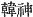. *Kara* signifies Korea and
China, and the Deity thus named appears in the "Chronicle" under the
name of *I-so-takeru* ("Fifty-fold-Valiant"), of whom it is related that
he was taken over to Korea by his father *Susa-no-wo* (the
"Impetuous-Male").

[107:5](kj036.htm#fr_593) *Sohori-no-kami*. The
etymology is not clear. Hirata derives the name from a Verb *soru*, "to
ride," "to go in a boat," in connection with the story (mentioned in the
preceding note) of I-so-takeru having been taken over to Korea.
According to this view, *Sohori*, like *Kara-no-kami*, would be an
alternative name of *I-so-takeru*. But the derivation is hazardous, to
say the least.

[107:6](kj036.htm#fr_594) *Shira-hi-no-kami*.
Motowori supposes *shira hi* (
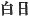) to be a copyist's error for *makahi* ( 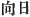). The latter, however, does
not make satisfactory sense, and Tomonobu, proposes to invert the
characters, thus:  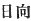, which
means "sun-confronting." Motowori suggests that the word
[may](errata.htm#15), after all, be but the name of a place.

[107:7](kj036.htm#fr_595) *Hizhiri-no-kami*,
written with the characters 
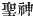. The first of [these](errata.htm#16) is defined as
signifying him who is intuitively wise and good, *i.e.* p. 109 the perfect sage. But perhaps we should in
Archaic Japanese take the term *hizhiri* in what is its probable native
etymological sense, viz. "sun-governing" (*hizhiri*,  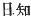), a title properly applied to
the Japanese Emperors as descendants of the Sun-God, and of which the
character  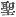, which is used
of the Chinese Monarchs, is only an equivalent in so far as it, too, is
employed as an Honorific title.

[107:8](kj036.htm#fr_596) Viz. from the
August-Spirit-of-the-Great-Land to the Sage-Deity inclusive.

[107:9](kj036.htm#fr_597) *Kagaya-hime*.

[107:10](kj036.htm#fr_598)
*Oho-kaga-yama-to-omi-no-kami*. The translation follows Hirata's
interpretation, which nearly agrees with that proposed by Mabuchi.

[107:11](kj036.htm#fr_599) *Mi-toshi-no-kami*.
For the meaning of "harvest" attributed to the word *toshi* see Sect.
XX, Note 3.

[107:12](kj036.htm#fr_600)
*Ame-shiru-karu-midzu-hime*. The name might tentatively be translated
thus: Heaven-Governing-Fresh-Princess-of Karu. Motowori suggests that
*amerishiru* may be but a sort of Pillow-Word for the rest of the name.
*Ama-tobu* is, however, the only Pillow-word for Karu found in the
poems. After all, Karu may not here be the name of a place at all.

[107:13](kj036.htm#fr_601)
*Oki-tsu-hiko-no-kami*. The translator ventures to think that the names
of this deity and the next might simply be rendered (in accordance with
the first character,  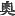
entering into their composing) "Inner Prince" and "Inner Princess" or
"Prince of the Interior" and "Princess of the Interior." Motowori
however suggests that *Okitsu* may be the name of a place, while Hirata
derives the names from *oki-tsuchi*, "laid earth," finding therein a
reference to the furnace (made of clay) mentioned immediately below.

[107:14](kj036.htm#fr_602)
*Oki-tsu-hime-no-mikoto*.

[107:15](kj036.htm#fr_603)
*Oho-be-hime-no-kami*.

[107:16](kj036.htm#fr_604) *Kama-no-kami*
( 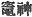). The "furnace" means
the "kitchen." Neither Motowori nor Hirata informs us that the immense
popularity of this Goddess, as well as her name, can clearly be traced
to China.

[107:17](kj036.htm#fr_605)
*Oho-yama-kuni-no-kami*. The meaning of *kuhi*, here (as in the case of
*Tsumu-guhi* and *Iku-guhi* (see Sect. II, Note 4) rendered by the word
"interior," is open to doubt.

[107:18](kj036.htm#fr_606)
*Yama-suwe-no-oko-mushi-no-kami*. Motowori supposes the word *suwe*,
"end," to have the signification of "top."

[107:19](kj036.htm#fr_607) As it stands, the
etymology of this name is not clear. In later times the mountain was
called *Hiyei* ( 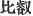). But
whether the, to outward appearance, native *Hiye* is but a corruption of
this Chinese one, or p. 110 whether it be
true that the latter (on this hypothesis bestowed on account of its
likeness in sound to the native designation) was not used till the end
of the eighth or beginning of the ninth century. as is commonly stated,
is difficult to decide.

[107:20](kj036.htm#fr_608) *I.e.*
"Close-Fresh-Sea." *Afumi* (modern pron. *Omi*, for *aha-umi*) alone
signifies "fresh sea," i e. "lake." This province contains the large
take commonly known as Lake Biha, (Biwa), but anciently simply called
"the Fresh Sea," as being the lake par excellence of Japan. When one of
the eastern provinces received, on account of a large lagoon or inlet
which it contains, the name of *Toho-tsu-Afumi* (in modern pronunciation
*Tō-tōmi*), *i.e.* "Distant-Fresh-Sea," the epithet Close was prefixed
to the name of the province nearer to the ancient centre of government.

[107:21](kj036.htm#fr_609) *I.e.*
Pine-tree-Declivity.

[107:22](kj036.htm#fr_610) *I.e.*
Pueraria-Moor.

[107:23](kj036.htm#fr_611) This passage ( 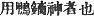) must be corrupt. Mabuchi
proposes to insert the character 
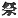 before 
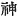, and to understand the author to have meant to tell
us that the deity was worshipped with arrows, that is to say, that
arrows were offered at his shrine. Motowori's proposal to consider  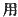 as an error for  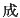 or  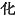, and to interpret the clause
thus: "the Deity who was changed into an arrow" is also worthy of
notice. But a further suggestion of his to read  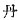 for  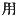 and to interpret thus: "the
Deity of the Red Arrow," seems best of all when taken in connection with
the tradition, which he quotes from the "Topography of Yamashiro," to
the effect that this god took the shape of a red arrow to gain access to
his mistress *Tama-yori-hime*, such a transformation being one of the
common-places of Japanese myth.

[107:24](kj036.htm#fr_612)
*Niha-tsu-hi-no-kami*. The interpretation of this name here adopted is
not Motowori's, who takes *hi* in the sense of "wondrous," but Hirata's.
The latter-author makes it clear that this deity (for whom
*Niha-taka-tsu-hi-no-kami*, *i.e.* "The
High-Deity-of-the-Fire-in-the-Yard," is but a slightly amplified
designation) was none other than the above-mentioned Deity of the
Kitchen, and his name an inclusive one for the pair of deities
*Oki-tsu-hiko* and *Oki-tsu-hime*.

[107:25](kj036.htm#fr_613) *Asuha-ho-kami*. The
signification of this name is obscure, and Motowori's proposal to derive
it from *ashi-niha*, "foot-place," because the god in question may be
supposed to protect the place on which people stand, is not altogether
convincing. In fact he himself only advances it with hesitation. It
should be added, however, that Hirata stamps it with his special
approval, as he does also Motowori's derivation of the following name,
*Hahigi*.

[107:26](kj036.htm#fr_614) p. 111 *Hahi-gino-kami*. Obscure, but ingeniously
derived by Motowori from *hachi-iri-gimi*, *i.e.* "entering prince," the
deity in question being supposed to have been the special
[protector](errata.htm#17) of the entrances to houses, and to have
thence received his name. Mr. Satow has translated it in the Rituals as
"Entrance Limit."

[107:27](kj036.htm#fr_615)
*Kaga-yama-to-omi-no-kami*. The name is almost identical with that in
Note 10.

[107:28](kj036.htm#fr_616)
*Ha-yama-to-no-kami*. The interpretation of the name is that proposed by
Motowori, and which seems tolerably satisfactory.

[107:29](kj036.htm#fr_617)
*Niha-taka-tsu-hi-no-kami*. See note 24.

[107:30](kj036.htm#fr_618)
*Oho-tsuchi-no-kami*.

[107:31](kj036.htm#fr_619)
*Tsuchi-no-mi-oya-kami*.

[107:32](kj036.htm#fr_620) This number is
obtained if (as is perhaps permissible from a Japanese point of view) we
consider *Oki-tsu-hiko* and *Oki-tsu-hime* as forming a single deity.
Otherwise there are ten. A similar remark applies to the number sixteen
mentioned immediately below.

[108:33](kj036.htm#fr_621) See Note 28.

[108:34](kj036.htm#fr_622) See Sect. V, Note 8.
The fact that this goddess is related to have been previously killed
(see Sect. XVII) causes Motowori some embarrassment.

[108:35](kj036.htm#fr_623)
*Waka-yama-kuhi-no-kami*.

[108:36](kj036.htm#fr_624)
*Waka-toshi-no-kami*. Motowori proposes (considering this name in
connection with the four that follow) to take *waka-toshi* in this place
in the signification of the "the first sprouting" of the young rice. The
five deities whose birth is here mentioned seem collectively to
represent the natural succession of agricultural operations throughout
the year.

[108:37](kj036.htm#fr_625)
*Waka-sa-name-no-kami*.

[108:38](kj036.htm#fr_626)
*Midzu-maki-no-kami*.

[108:39](kj036.htm#fr_627)
*Natsu-taka-tsu-hi-no-kami*. Motowori's interpretation of *hi* as
"wondrous" is perhaps as good as that here adopted, according to which
it signifies "sun." His view would give us in English "the
Summer-High-Wondrous-Deity."

[108:40](kj036.htm#fr_628)
*Natsu-no-me-no-kami*.

[108:41](kj036.htm#fr_629) *Aki-bime no-kami*.

[108:42](kj036.htm#fr_630)
*Kuku-toshi-no-kami*. The word *kuku*, "stem," seems to allude to the
length of the well-grown rice.

[108:43](kj036.htm#fr_631) p. 112 *Kuku-ki-waka-muro-tsunane-no-kami*.
Motowori supposes this god to have been the protector of houses, and
interprets the name to denote the beams, and the ropes with which the
beams were bound together. The word here read *tsuna*, "rope;" is
written with the character, and might perhaps be rendered "pueraria."
But as in early times the tendrils of such creeping plants formed the
only substitute for rope, the two renderings come to have very nearly
the same signification.

[108:44](kj036.htm#fr_632) The name is here
abbreviated in the original to *Waka-muro-tsuna-ne-no-kami*.

------------------------------------------------------------------------

[Next: Section XXX.—The August Deliberation for Pacifying the
Land](kj037)
