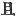
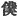
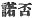
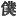
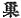
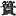
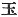
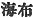

  
[Intangible Textual Heritage](../../index)  [Shinto](../index.md) 
[Index](index)  [Previous](kj038)  [Next](kj040.md) 

------------------------------------------------------------------------

[Buy this Book at
Amazon.com](https://www.amazon.com/exec/obidos/ASIN/B0028Y4SZY/internetsacredte.md)

------------------------------------------------------------------------

  
*The Kojiki*, translated by Basil Hall Chamberlain, \[1919\], at
Intangible Textual Heritage

------------------------------------------------------------------------

p. 121 \[100\]

## \[SECT. XXXII.—ABDICATION OF THE DEITY MASTER-OF-THE-GREAT-LAND.\]

Hereupon the Heaven-Shining-Great-August-Deity said: "Which Deity were
it best to send on a fresh mission?" [1](#fn_674.md) Then the Deity Thought-Includer and
likewise all the Deities said: "He who is named the Deity
Majestic-Point-Blade-Extended [2](#fn_675.md) and
dwells in the Heavenly Rock-Dwelling by the source of the Tranquil River
of Heaven, is the one that should be sent: or if not this Deity, then
this Deity's child, the Brave-Awful-Possessing-Male-Deity, [3](#fn_676.md) might be sent. Moreover, [4](#fn_677.md) owing to this Deity
Heavenly-Point-Blade-Extended having blocked up and turned back the
waters of the Tranquil River of Heaven, and to his dwelling with the
road blocked up, other Deities cannot go \[thither\]. So the
Heavenly-Deer-Deity [5](#fn_678.md) should be sent
specially to ask him." So then the Heavenly-Deer-Deity was sent to ask
the Deity Heaven-Point-Blade-Extended, who replied, saying: "I will
obey, and will respectfully serve you. Nevertheless on this errand [6](#fn_679.md) ye should send my [7](#fn_680.md) child, the
Brave-Awful-Possessing-Male-Deity," [8](#fn_681.md)—\[and with these words\] immediately
offered \[his son to Heaven-Shining-Great-August-Deity\]. So the Deity
Heavenly-Bird-Boat [9](#fn_682.md) was attached to
the Brave-Awful-Possessing-Male-Deity, and they were sent off. Therefore
these two Deities, descending to the little shore [10](#fn_683.md) of Inasa [11](#fn_684.md) in the land of Idzumo, \[101\] drew
their swords ten hand-breadths long, [12](#fn_685.md) stuck them upside down [13](#fn_686.md) on the crest of a wave, seated
themselves cross-legged [14](#fn_687.md) on the
points of the swords, and asked the Deity Master-of-the-Great-Land,
saying "The Heaven-Shining-Great-August-Deity and the
High-Integrating-Deity

p. 122

have charged us and sent us to ask, \[saying\]: 'We have deigned to
charge our august child with thy dominion, the Central Land of
Reed-Plains, as the land which he should govern. So how is thy
heart?'" [15](#fn_688.md) He replied, saying:
"I [16](#fn_689.md) am unable to say. My child the
Deity Eight-Fold-Thing-Sign-Master [17](#fn_690.md) will be the one to tell you; but he is
gone to Cape Miho [18](#fn_691.md) to pursue birds
and catch fish, and has not yet returned." So then the Deity Bird-Boat
was sent to summon the Deity Eight-Fold-Thing-Sign-Master, who, on being
graciously asked, spoke to the Great Deity his father, saying: "I will
obey. \[Do thou\] [19](#fn_692.md) respectfully
present this land to the august child of the Heavenly Deity;"—and
thereupon he trod on \[the edge of\] his boat so as to capsize it,
clapped his heavenly departing hands in the fence of green branches, and
disappeared. [20](#fn_693.md) So then they asked
\[102\] the Deity Master-of-the-Great-Land, saying: "Thy son the Deity
Thing-Sign-Master has now spoken thus. Hast thou other sons who should
speak?" Hereupon he spoke again, saying: "There is my other son, the
Deity Brave-August-Name-Firm. [21](#fn_694.md)
There is none beside him." While he was thus speaking, the Deity
Brave-August-Name-Firm came up, bearing on the tips of his fingers a
thousand-draught rock, [22](#fn_695.md) and said:
"Who is it that has come to our land, and thus secretly talks? If that
be so, [23](#fn_696.md) I should like to have a
trial of strength. So I should like to begin by taking thine august
hand." So on his letting him take his august hand, his touch at once
turned it into an icicle, and again his touch turned it into a
sword-blade. [24](#fn_697.md) So then he was
frightened and drew back. Then on the Brave-Awful-Possessing-Male-Deity
wishing to take the hand of the Deity

p. 123

\[paragraph continues\]
Brave-August-Name-Firm, and asking permission to take it in return, he
grasped and crushed it as if it were taking a young reed, and cast it
aside, upon which \[the Deity Brave-August-Name-Firm\] fled away. So
when \[the Brave-Awful-Possessing-Male-Deity\] pursuing after him, came
up with him at the Sea of Suha [25](#fn_698.md) in
the land of Shinanu, [26](#fn_699.md) and was
about to slay him, the Deity Brave-August-Name-Firm said: "I will obey.
Slay me not. I will go to no other place but this, neither will I go
against the command of my father the Deity Master-of-the-Great-Land. I
will not go against the words of the Deity Eight-Fold-Thing-Sign-Master.
I Will yield up this Central Land of Reed-Plains according to the
command of the august child of the Heavenly Deities." So they returned
again, and asked the Deity Master-of-the Great-Land \[saying\]: "Thy
children the two Deities the Deity Thing-Sign-Master and the Deity
Brave-August-Name-Firm have said that they will follow and not go
against the commands of the august child of the Heavenly Deities. So how
is thy heart?" Then he replied, saying: According as the two Deities my
children have said, I too will not go against them. In accordance with
the \[heavenly\] command, I will at once yield up this Central Land of
Reed-Plains. But as to my place of residence, if ye will make stout the
temple pillars on the nethermost rock-bottom, and make high the
cross-beams to the Plain of High Heaven like the rich and perfect august
nest where the august child of the Heavenly Deities rules the succession
of Heaven's sun, and will deign to establish me, I will hide in the
eighty (less than a hundred) road-windings, and wait on him. Again, as
for my children the hundred and eighty Deities, if the

p. 124

\[paragraph continues\] Deity
Eight-Fold-Thing-Sign-Master will be the Deities, august rear and van
and will respectfully serve them, \[104\] there will be no disobedient
Deities." [27](#fn_700.md) Having thus spoken \[he
hid himself. [28](#fn_701.md) So in accordance
with his word, [29](#fn_702.md)\] they built a
heavenly august abode on the shore [30](#fn_703.md) of Tagishi [31](#fn_704.md) in the land of Idzumo; and the Deity
Wondrous-Eight-Spirits, [32](#fn_705.md) grandson
of the Deity Of Water-Gates, [33](#fn_706.md) was
made butler to offer up the heavenly august banquet, when, [34](#fn_707.md) having said prayers, the Deity
Wondrous-Eight-Spirits turned into a cormorant, went down to the bottom
of the sea, took in his mouth red earth from the bottom, made eighty
heavenly platters, and, cutting sea-weed [35](#fn_708.md) stalks, made a fire-drill mortar, and
made a fire-drill pestle out of stalks of *komo*, [36](#fn_709.md) and drilled out fire, saying: "This
fire which I have drilled \[105\] will I burn until, in the Plain of
High Heaven, the soot on the heavenly new lattice of the gable of His
Augustness the Wondrous-Divine-Producer-the-August-Ancestor [37](#fn_710.md) hang down eight hand-breadths; and as
for what is below the earth, I will bake down to the nethermost
rock-bottom, and,—the fishing sailors, who spread their thousand-fathom
ropes of paper-mulberry and angle, having with many shouts drawn in and
landed the large-mouthed small-finned perch,—I will offer up the
heavenly true fish-food so that the split bamboos bend." [38](#fn_711.md) So the
Brave-Awful-Possessing-Male-Deity re-ascended \[to Heaven\], and
reported how he had subdued and pacified the Central Land of
Reed-Plains.

p. 125 p. 126
p. 127

------------------------------------------------------------------------

### Footnotes

[121:1](kj039.htm#fr_678.md) p. 124 Literally, "to send again."

[121:2](kj039.htm#fr_679.md) *Itsu-no-wo-ha-bari
no kami*. We have already seen (Sect. VIII, Note 15) this name (minus
the title of Deity) as the appellation of the sword with which Izanagi
("the Male-Who-Invites") decapitated his son p.
125 Kagu-tsu-chi ("Shining Elder") for having by his birth caused
the death of Izanami ("the Female-Who-Invites.") This sword's
alternative name appears immediately below as the alternative name of
this deity,—*Ame-no-wo-ha-bari-no-kami*, *i.e.*, "the Deity
Heavenly-Point-Blade-Extended." Motowori's gloss to the effect that the
deity was the *spirit* of the sword has no warrant from the text.

[121:3](kj039.htm#fr_680.md)
*Take-mika-dzu-chi-no-wo-no-kami*. See Sect. VIII, Note 7.

[121:4](kj039.htm#fr_681.md) Here, as in Sect. IX,
(Note 6) the character  ,
"moreover," occurs where some other Conjunction would seem more
appropriate both in Japanese and in English. We may here understand it
to be used for but."

[121:5](kj039.htm#fr_682.md)
*Ame-no-kaku-no-kami*. The interpretation of *kaku* as "deer" is
Hirata's. See his "Exposition of the Ancient Histories," Vol. XXII, p.
6. and *conf*. the remarks on Mount Kagu in Sect. VII, Note 12 of this
translation.

[121:6](kj039.htm#fr_683.md) Literally, "in this
road."

[121:7](kj039.htm#fr_684.md) The First Personal
Pronoun is here represented by the humble character  , "servant"

[121:8](kj039.htm#fr_685.md) See Sect. VIII, Note
7.

[121:9](kj039.htm#fr_686.md) Tori-bune-no-kami.
See Sect. VI, Note 24.

[121:10](kj039.htm#fr_687.md) The word "little" is
merely a sort of Honorific Expletive.

[121:11](kj039.htm#fr_688.md) The true etymology
of this word is doubtful; for Motowori's proposal to derive it from *ina
se*, supposed to mean "no, or yes" (
), in allusion to the question here put to the Deity
Master-of-the-Great-land is a mere fancy, and does not provide for the
alternative forms *Itasa* and *Isasa*, which occur in other documents.

[121:12](kj039.htm#fr_689.md) See Sect. VIII, Note
1.

[121:13](kj039.htm#fr_690.md) *I.e.*, as Motowori
explains, hilt downwards.

[121:14](kj039.htm#fr_691.md) The "Chronicles" say
that they "squatted."

[122:15](kj039.htm#fr_692.md) *I.e.*, "What sayest
thou to this our decree?

[122:16](kj039.htm#fr_693.md) Here and below the
humble character  ,
"servant," is used for the First Personal Pronoun.

[122:17](kj039.htm#fr_694.md)
*Ya-he-koto-shiro-nu-shi-no-kami*. For this difficult name see Sect.
XXVI, Note 7.

[122:18](kj039.htm#fr_695.md) See Sect. XXVII,
Note 1.

[122:19](kj039.htm#fr_696.md) Or, "We will."

[122:20](kj039.htm#fr_697.md) *I.e.*, He capsized
his boat and himself into the sea,—the place being one where (as is
still done in Japan) a large space of shallow water had been fenced in
with posts, and stuck over with branches of p.
126 trees, a single opening being left for fish to enter by,—then
clapped his hands in token of departure, and sank to the bottom.—This is
Hirata's interpretation of the passage, which is a difficult one, and is
differently understood by Motowori, whom Mr. Satow has followed in one
of his notes to the Rituals (see Vol. VII, Pt. II, p. 122 of these
"Transactions"), rendering it thus: "He then trod upon the edge of his
boat so as to overturn it and with his hands crossed back to back (in
token of consent), transformed his boat into a green fence of branches,
and disappeared." A careful comparison of the remarks in Motowori's
Commentary (Vol. XIV, pp. 16-19) with those in Hirata's "Exposition of
the Ancient Histories" (Vol. XXII, pp. 50-55) and with the text itself,
as also with the text of the parallel passage in the "Chronicles," has
however left no doubt in the mind of the translator that Hirata's view
is the correct one.

[122:21](kj039.htm#fr_698.md)
*Take-mi-gata-no-kami*. The interpretation of the name is that proposed
by Motowori.

[122:22](kj039.htm#fr_699.md) *I.e.*, a rock which
it would take a thousand men to lift.

[122:23](kj039.htm#fr_700.md) This expression
seems here, as Motowori says, to be used in the sense of "Come on!" It
has survived in the modern word *saraba*, which sometimes has that
meaning.

[122:24](kj039.htm#fr_701.md) *I.e.*, the
Brave-Awful-Male-Deity's hand turned first into an icicle and next into
a sword-blade on being touched by the Deity Brave-August-Name-Firm, to
the alarm and hurt of the latter.

[123:25](kj039.htm#fr_702.md) *I.e.*, the Lake of
Suha. No satisfactory etymology of the name is forthcoming.

[123:26](kj039.htm#fr_703.md) In later times
called *Shinano*. The usual derivation of the word is that which
connects it with *shina-zaka*; "mountainous ascents,"—an appropriate
enough name for the province in question. It is, however. more probably
derived from *shina*, the name of a tree resembling the lime (*Tilia
cordata*) and *nu* or *no*, "moor."

[124:27](kj039.htm#fr_704.md) *I.e.* "If ye will
build me a temple founded on the nethermost rocks and reaching up to
Heaven like unto the august residence of the Heavenly Deity who is
coming to replace me as sovereign upon earth, I will vanish to Hades,
and serve him there; and as for the Gods my children, none of them will
rebel against their new Lord, if the Deity Thing-Sign-Master be accepted
as the protector of his escort."—Some of the expressions in the original
stand in need of explanation. *Su*, here rendered "nest" in accordance
with the character  
employed in writing it, may mean "lattice" (
), and refer to the lattice-work over the hole p. 127 in the chimney of the roof. The "succession
of Heaven's sun" (in Japanese *ama-tsu-hi-tsugi*) means the inheritance
of the sovereignty of Japan, or of Idzumo. *Momotaradzu* ("less than a
hundred") is the Pillow-Word for *ya se*, "eighty," and for some other
words; it must he disregarded in making sense of any sentence in which
it occurs. The "eighty road-windings" signify, says Motowori, "an
immensely long way," and are here meant for the long road leading to
Hades or for Hades itself (Conf. Sect. XCVI, Note 7). In rendering the
last sentence of the passage (that commencing "Again, as for my
children," etc.). which is particularly vague, the translator has been
guided by Motowori's opinion, which seems the most satisfactory one. It
must be understood that the deities whose rear and van the Deity
Thing-Sign-Master is to become, are those who are about to escort the
new sovereign down from heaven.

[124:28](kj039.htm#fr_705.md) *I.e.*, disappeared.

[124:29](kj039.htm#fr_706.md) The passage placed
within brackets is supplied by Motowori to fill up an evident omission
in the text.

[124:30](kj039.htm#fr_707.md) Literally "little
shore." See Note 10 to this Section.

[124:31](kj039.htm#fr_708.md) The derivation of
*Tagishi* is doubtful; but *conf*. Sect. LXXIX, Note 2. Motowori remarks
that we seem to have here the old name of the place now known only, on
account of the temple which it contains, as *Kidzuki no Oho-yashiro*,
*i.e.* "the pestle-hardened great shrine."

[124:32](kj039.htm#fr_709.md)
*Kushi-ya-tama-no-kami*. Motowori proposes to consider *tama* as a
contraction of *tamuke*, "offering," and to take the name to signify
"the Deity of Wondrous Increasing Offerings." Hirata's interpretation,
which is followed in the translation, seems better, as the term "eight
spirits" or "eight \[fold\] spirit" accords with the religious role
attributed to this Deity without necessitating any hazardous
philological conjectures. The actual character used to write the
disputed word is  ,
"jewel."

[124:33](kj039.htm#fr_710.md) See Sect. VI, Note
9.

[124:34](kj039.htm#fr_711.md) The word "when" must
be understood presumptively, as signifying that the way in which he
carried out his task was by turning into a cormorant, making platters,
etc.

[124:35](kj039.htm#fr_712.md) It is uncertain
whether the word *me* ( ),
here rendered seaweed, is a general designation or the name of the
particular species.

[124:36](kj039.htm#fr_713.md) Supposed to be the
same as, or similar to the modern *hondahara* (*Halochola macrantha*).

[124:37](kj039.htm#fr_714.md)
*Kamu-musu-bi-mi-oya-no-kami*.

[124:38](kj039.htm#fr_715.md) The translator has
followed Moribe in the interpretation of the first part and Hirata in
the interpretation of the latter part of this extremely difficult
passage, which is a crux to all the commentators, but p. 128 whose general sense at least is this: "I
will continue drilling fire for the God's kitchen, until the soot hangs
down from the roof of the temple of the Ancestral Deity in Heaven above,
and until the earth below is baked down to its nethermost rocks; and
with the fire thus drilled will I cook for him the fish brought in by
the fishermen, and present them to him in baskets woven of split bamboos
which will bend beneath their weight."—Another plausible interpretation
of the original expression rendered by these last two words is that they
are simply the Pillow-Word for *towowo-towowo ni*, "bending." The rope
with which the fishermen are supposed to have angled is described in
detail by Hirata ("Exposition of the Ancient Histories," Vol. XXIV, p.
21) as a long rope from which other strings, each with a hook attached,
depended, and is said by him to be still in use in the provinces of
Shimofusa (Shimōsa) and Hitachi. The "lattice of the gable" must be
understood to mean bamboo lattice covering a hole beneath the gable,
which served as a chimney. Motowori's remarks on this passage will be
found in Vol. XIV, pp. 39-42 of his Commentary, and Moribe's on the
words *to-daru ama no nihi-su* (rendered "on the heavenly new lattice of
the gable") in his "Examination of Difficult Words," Vol. II. pp. 26-29;
the latter especially are well worth perusal by the student. Mr. Satow,
in one of the notes to his translation of the Rituals, (See Vol. IX, Pt.
II, p. 209 of these "Transactions"), gives a somewhat divergent
rendering of this passage, following, as he does, the interpretation
given by Motowori. It is as follows: "The fire which I have drilled will
I burn until the soot of the rich and sufficing heavenly new nest of the
PARENT Kami-musubi in heaven hangs down many hand-breadths long, and the
earth below will I bake down to its bottom-most rocks, and stretching a
thousand fathoms of paper-mulberry rope, will draw together and bring
ashore the fisherman's large-mouthed small-finned *suzuki*, \[and\] will
offer up the heavenly fish-food on bending split bamboos."

------------------------------------------------------------------------

[Next: Section XXXIII.—The August Descent from Heaven of His Augustness
the August Grandchild](kj040.md)
