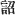
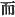
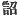
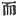
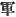
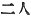
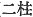
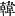

  
[Intangible Textual Heritage](../../index)  [Shinto](../index) 
[Index](index)  [Previous](kj040)  [Next](kj042) 

------------------------------------------------------------------------

[Buy this Book at
Amazon.com](https://www.amazon.com/exec/obidos/ASIN/B0028Y4SZY/internetsacredte)

------------------------------------------------------------------------

  
*The Kojiki*, translated by Basil Hall Chamberlain, \[1919\], at
Intangible Textual Heritage

------------------------------------------------------------------------

p. 135 \[111\]

## \[SECT. XXXIV.—THE AUGUST REIGN IN HIMUKA OF HIS AUGUSTNESS PRINCE RICE-EAR-RUDDY-PLENTY.\] [1](#fn_747)

So then \[the Heaven-Shining-Great-August-Deity and the
High-Integrating-Deity\] commanded [2](#fn_748)
His Augustness Heaven's-Prince-Rice-ear-Ruddy-Plenty; and he, leaving
the Heavenly Rock-Seat, [3](#fn_749) pushing
asunder the eight-fold heavenly spreading clouds, and dividing a road
with a mighty road-dividing, set off floating shut up in the Floating
Bridge of Heaven, [4](#fn_750) and descended
from Heaven onto the peak of Kuzhifuru which is Takachiho in
Tsu-kushi. [5](#fn_751) \[112\] So His Heavenly
Great Wondrous Augustness [6](#fn_752) and His
Augustness Heaven's-Round-Eyes, [7](#fn_753)
both [8](#fn_754) taking on their backs the
Heavenly rock-quivers, [9](#fn_755) taking at
their side the large mallet-headed swords, [10](#fn_756) taking in their hands the Heavenly
vegetable-wax-tree bow, [11](#fn_757) and
clasping under their arms the Heavenly true deer-arrows, stood in his
august van in respectful attendance. So His
Heavenly-Great-Wondrous-Augustness [12](#fn_758) (is the ancestor of
the Kume Lords) [13](#fn_759) Thereupon
he said: "This place is opposite to the "land of Kara." [14](#fn_760) One comes straight across to the august
Cape of Kasasa; [15](#fn_761) and it is a land
whereon \[113\] the morning sun shines straight, a land which the
evening sun's sunlight illumines. So this place is an exceedingly good
place." [16](#fn_762) Having thus spoken, he
made stout the

p. 136

temple-pillars on the nethermost rock-bottom, and made high the
cross-beams to the Plain of High Heaven, [17](#fn_763) and dwelt there.

p. 137

------------------------------------------------------------------------

### Footnotes

[135:1](kj041.htm#fr_751) p. 136 Motowori makes Sect. XXXIV commence here,
and it seems on the whole best to follow him in so doing, as the entire
period of the reign on earth of the first of the heaven-descended gods
is thus included in one Section. On the other hand, the "Descent from
Heaven," which gives its name to the preceding Sect., cannot properly be
said to be accomplished until the end of this first sentence of Sect.
XXXIV. It will be remembered that the Japanese name of this first
deity-king is (in its abbreviated and most commonly used form)
*Hiko-ho-no-ni-nigi*.

[135:2](kj041.htm#fr_752) Motowori proposes to
suppress the character  ,
"commanded," in this clause, and the character  , "and," at the beginning of
the next, and to take the Prince as the subject of the whole sentence.
This would be convenient; but the characters   and   are in all the texts.

[135:3](kj041.htm#fr_753) *I.e.*, his place in
Heaven. The original Japanese of the term is *ama-no-ikakura*.

[135:4](kj041.htm#fr_754) The translator has
adopted the interpretation proposed by Hirata, the only commentator who
gives an acceptable view of this extremely difficult clause, which
Motowori admitted that he did not understand. It must be remembered that
Hirata identifies the "Floating Bridge of Heaven" with the "Heavenly
Rock-Boat." (For details see his "Exposition of the Ancient Histories,"
Vol. XXVII, pp. 31-32).

[135:5](kj041.htm#fr_755) Tsukushi, anciently
the name of the whole of the large island forming the South-Western
corner of Japan, and Himuka (in modern pronunciation Hiuga), one of the
provinces into which that island is divided, have already been mentioned
in Sect. V, Note 14 and Sect. X, Note 4 respectively. It is uncertain
whether the mountain here named is the modern Takachiho-yama or
Kirishima-yama, but the latter view is generally preferred. *Kuzhifuru*
is explained (perhaps somewhat hazardously) as meaning "wondrous," while
*Taka-chi-ho* signifies "high-thousand-rice-ears."

[135:6](kj041.htm#fr_756) *Ame-no-oshi-hi no
mikoto*. The interpretation is only conjectural.

[135:7](kj041.htm#fr_757) *Ama-tsu-kume no
mikoto*. The traditional origin of this curious name will be found below
in the third and fourth Songs of Sect. LI (see Notes 21 and 22 to that
Section), where the "sharp slit eyes" of this worthy are specially
referred to. But Moribe seems to prove that *kume* is in reality not a
personal name at all, but simply the old term for p.
137 "army," through a misconception of the original import of
which has arisen the idea that Oho-kume and Oho-tomo were two distinct
personages. The elaborate and interesting note on this subject in his
"Examination of Difficult Words," Vol. II., pp. 46-55 is well worth
consulting. The only point in which the present writer differs from him
is with regard to the etymology of the word *kume*, which Moribe
connects with *kumi*, "a company," and *kuma*, "a bravo," whereas in the
opinion of the former it is probably nothing more nor less than an
ancient mispronunciation of the Chinese word *chun* ( ) modern Japanese *gun*,
"army," "troops."

[135:8](kj041.htm#fr_758) The Auxiliary Numeral
here used is that properly denoting human beings, not deities, *futari*
( ), instead of
*futa-hashira* ( ).

[135:9](kj041.htm#fr_759) In Japanese *ama no
iha-yugi*.

[135:10](kj041.htm#fr_760) This is the
generally received interpretation of the obscure original term
*kabu-tsuchi* (or *kabu-tsutsui*) *no tachi*, the parallel term
*ishi-tsutsui* being understood to mean "a mallet-headed sword made of
stone." (Both names appear below in the Song at the end of Sect. XLVIII,
Note 4). Moribe, however, in his "*Idzu no Chi-waki*," rejecting the
opinion that any part of the swords were made of stone, explains
*kabu-tsutsui* in the sense of "broad-tempered" and *ishi-tsutsui* in
that of "hard-tempered."

[135:11](kj041.htm#fr_761) For the bows and
arrows here mentioned see XXXI. Note 5.

[135:12](kj041.htm#fr_762) *Ohotomo no
murazhi*, a common "gentile name" down to historical times. Oho-tomo
means "numerous companies "or "large tribe," in allusion, as Moribe
supposes, to the force of which the personage here mentioned was the
general.

[135:13](kj041.htm#fr_763) *Kume no atahe*.
*Conf*. Note 7.

[135:14](kj041.htm#fr_764) Or *Kan* according
to the Sinico-Japanese reading. We might render it in English by Korea.
The Chinese character is 
.

[135:15](kj041.htm#fr_765) Etymology uncertain.
An alternative form of this name, which is preserved in the "Chronicle,"
is *Nagasa*, which Hirata thinks may stand for *Nagasaki*.

[135:16](kj041.htm#fr_766) This is the sense of
the original Japanese text of this passage as literally as it can be
rendered, and so the older editors understood it. Motowori however,
though not daring actually to alter the characters, assumes that they
are corrupt, and in his kane rendering gives us this instead:
"Thereupon, passing searchingly through a bare-backed empty country, he
arrived at the august cape of Kasasa, and said: 'This land is a land
whereon the morning sun shines straight, etc.'" His evident reason for
wishing to alter the reading is simply and solely to conceal p. 138 the fact that Korea is mentioned in a not
unfriendly manner, in the traditional account of the divine age, *i.e.*
long before the epoch of its [so-called](errata.htm#21) revelation and
conquest by the Empress Jin-go (see Sect. XCVI to XCVIII). That the
parallel passage of the "Chronicles" lends some sanction to his view is
no excuse for so dishonest a treatment of the text he undertakes to
commentate; for the "Records" and the "Chronicles "often differ greatly
in the: accounts they have preserved. One of Motowori's arguments is
that, as Kasasa is said to have been in the province of Hiuga, it could
not have been opposite to Korea, seeing that Hiuga faces east and not
west. He here forgets that a little later on in his own same Commentary
(Vol. XVII, p. 86) he asserts that Hiuga in ancient times included the
provinces of Ohosumi and Satsuma, the latter of which does face west.

[136:17](kj041.htm#fr_767) *I.e.*, he built
himself a palace to dwell in (Conf. Sect. XXXII, Note 27).

------------------------------------------------------------------------

[Next: Section XXXV.—The Duchess of Saru](kj042)
