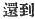
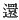

  
[Intangible Textual Heritage](../../index)  [Shinto](../index) 
[Index](index)  [Previous](kj042)  [Next](kj044) 

------------------------------------------------------------------------

[Buy this Book at
Amazon.com](https://www.amazon.com/exec/obidos/ASIN/B0028Y4SZY/internetsacredte)

------------------------------------------------------------------------

  
*The Kojiki*, translated by Basil Hall Chamberlain, \[1919\], at
Intangible Textual Heritage

------------------------------------------------------------------------

p. 139 \[114\]

## \[SECT. XXXVI.—THE DEITY PRINCE OF SARUTA AT AZAKA.\]

Now when this Deity Prince of Saruta dwelt at Azaka, [1](#fn_766) he went out fishing, and had his hand
caught by a *hirabu* shell-fish, [2](#fn_767)
and was drowned in the brine of the sea. So the name by which he was
called when he sank to the bottom was the
Bottom-Touching-August-Spirit; [3](#fn_768) the
name by which he was called when the sea-water gurgled up was the
Gurgling-up-August-Spirit; [4](#fn_769) the
name by which he was called when the bubbles formed was the
Bubble-Bursting-August-Spirit. [5](#fn_770)
Thereupon \[Her Augustness the Heavenly-Alarming-Female\], having
escorted \[back\] the Deity Prince of Saruta, came back, [6](#fn_771) and at once drove together all the
things broad of fin and the things narrow of fin, [7](#fn_772) and asked them, saying: "Will ye
respectfully serve the august son of the "Heavenly Deities? "—upon which
all the fishes declared that they would respectfully serve him. Only the
bèche-de-mer said nothing. Then Her Augustness the
Heavenly-Alarming-Female spoke to the bèche-de-mer, saying: "Ah! this
mouth is a mouth that gives no reply!"—and \[with these words\] slit the
mouth with her stiletto. [8](#fn_773) So at the
present day the \[115\] bèche-de-mer has a slit mouth. Wherefore \[from
august reign to\] august reign, when the offerings of the first-fruits
of Shima [9](#fn_774) are presented \[to the
Emperor\], a portion of them is granted to the Duchesses of Saru.

------------------------------------------------------------------------

### Footnotes

[139:1](kj043.htm#fr_770) p. 139 Etymology unknown.

[139:2](kj043.htm#fr_771) What species was
denoted by this ancient name is not clear; but one of Motowori's
suggestion, to the effect that it may have been identical with the
modern *sarubo-yahi* (a shell of a family *Arcadæ*, probably *Arca
subcrenata*), the origin of whose name would thus be traced up to the
mythological age, is at least ingenious.

[139:3](kj043.htm#fr_772) p. 140 *Soko-daku-mi-tama*.

[139:4](kj043.htm#fr_773)
*Tsubu-tatsu-mi-tama*.

[139:5](kj043.htm#fr_774) *Aka-saku-mi-tama*.
*Saku* might be translated by "opening," "forming," etc. It is the same
word as that used to express the blossoming of a flower.

[139:6](kj043.htm#fr_775) The characters
rendered "came back "are 
. Motowori and Hirata believe   to be put erroneously for
 , which would give the
sense of "arrived there," and would thus enable us to locate the episode
of the fishes at Ise instead of in Hiuga, which would better suit the
concluding clause of this Section narrating the participation of the
Duchesses of Sara in the' first-fruits of the province of Shims. If the
word Shima however here means, not the province of that name, but simply
"islands" in general, there is nothing to be gained by the pro-posed
emendation, which has moreover no sanction from any text; and it may be
added that no notice is to be found in any history of the custom here
said to have existed.

[139:7](kj043.htm#fr_776) *I.e.* all the fishes
both great and small.

[139:8](kj043.htm#fr_777) Literally, "small
string-sword," supposed to have been so called from its having been
carried inside the garments, attached to the under-belt.

[139:9](kj043.htm#fr_778) The smallest of the
Japanese provinces, situated to the East of Ise. The name signifies
"island," and it is possible that it ought here to be taken in that
sense as a common noun.

------------------------------------------------------------------------

[Next: Section XXXVII.—The Curse of the Deity
Great-Mountain-Possessor](kj044)
