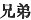
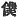
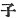
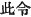
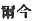
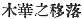
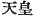

  
[Intangible Textual Heritage](../../index)  [Shinto](../index) 
[Index](index)  [Previous](kj043)  [Next](kj045) 

------------------------------------------------------------------------

[Buy this Book at
Amazon.com](https://www.amazon.com/exec/obidos/ASIN/B0028Y4SZY/internetsacredte)

------------------------------------------------------------------------

  
*The Kojiki*, translated by Basil Hall Chamberlain, \[1919\], at
Intangible Textual Heritage

------------------------------------------------------------------------

p. 140

## \[SECT. XXXVII.—THE CURSE OF THE DEITY GREAT-MOUNTAIN-POSSESSOR.\]

Hereupon His Augustness Heaven's-Sun-Height-Prince-Rice-ear-Ruddy-Plenty
met a beautiful person at the august cape of Kasasa, and asked her whose
daughter she was. She replied, saying: "I am a daughter of the
Deity-Great-Mountain-Possessor, [1](#fn_775)
and my name is the Divine-Princess-of-Ata, [2](#fn_776) another name by which I am called being
Princess-Blossoming-Brilliantly-Like-the-Flowers-of-the-Trees." [3](#fn_777) Again he asked: "Hast thou

p. 141

any brethren?" [4](#fn_778) She replied,
saying: "There is my elder sister, Princess-Long-as-the-Rocks." [5](#fn_779) Then he charged her, \[saying\]: "Ego
sum cupidus coiendi tecum. Tibi quomodo videtur?" She replied, saying:
"I [6](#fn_780) am not able to say. My father
the Deity Great-Mountain-Possessor will say." So he sent a request \[for
her\] to her father the Deity Great-Mountain-Possessor, who, greatly
delighted, respectfully sent her off, joining to her her \[116\] elder
sister Princess Long-as-the-Rocks, and causing merchandise to be carried
on tables holding an hundred. [7](#fn_781) So
then, owing to the elder sister being very hideous, \[His Augustness
Prince-Rice-ear-Ruddy-Plenty\] was alarmed at the sight of her, and sent
her back, only keeping the younger sister
Princess-Blossoming-Brilliantly-Like-the-Flowers-of-the-Trees, whom he
wedded for one night. Then the Deity-Great-Mountain-Possessor was
covered with shame at Princess Long-as-the-Rocks being sent back, and
sent a message \[to His Augustness Prince-Rice-ear-Ruddy-Plenty\],
saying: "My reason for respectfully presenting both my daughters
together was that, by sending Princess-Long-as-the-Rocks, the august
offspring [8](#fn_782) of the Heavenly
Deity, [9](#fn_783) though the snow [10](#fn_784) fall and the wind blow, might live
eternally immovable like unto the enduring rocks, and again that by
sending Princess-Blossoming-Brilliantly-Like-the-Flowers-of-the-Trees,
\[they\] might live flourishingly like unto the flowering of the
blossoms of the trees: to insure this, [11](#fn_785) I offered [12](#fn_786) them. But owing to thy thus sending
back [13](#fn_787) Princess Long-as-the-Rocks,
and keeping only
Princess-Blossoming-Brilliantly-Like-the-Flowers-of-the-Trees, the
august offspring of the Heavenly Deity shall be but as frail [14](#fn_788) as the flowers of the trees. So it is
for this \[117\]

p. 142

reason that down to the present day the august lives of Their
Augustnesses the Heavenly Sovereigns [15](#fn_789) are not long.

------------------------------------------------------------------------

### Footnotes

[140:1](kj044.htm#fr_779) p. 142 See Sect. VI. Note 17.

[140:2](kj044.htm#fr_780) *Kamu-ata-tsu-hime*.
*Ata* is a place in Satsuma.

[140:3](kj044.htm#fr_781) Or "Tree."
*Ka-no-hama-saku-ya-hime*. Perhaps (though there is no native authority
for doing so) we might rather understand *saku* as a Causative in
intention, though not in form, and render the name thus:
"Princess-Causing-the-Flowers-of-the-Trees-to-Blossom." The tree alluded
to is doubtless the cherry. This deity is now worshipped as the goddess
of Mount Fuzhi (Fusiyama), and in common parlance the last member of the
compound forming her name does not receive the *nigori*,—*hime* instead
of *bime*. The syllable *ya* has no signification in this and similar
names. It will be remembered that there was another sister named
"Princess-Falling-like-the-Flowers-of-the-Trees. (See Sect. XX, Note 5).

[141:4](kj044.htm#fr_782) Or perhaps, so
written  , the original
expression were here better rendered by "sisters."

[141:5](kj044.htm#fr_783) *I.e.*, as enduring
as the rocks. The original name is *Iha-naga-hime*.

[141:6](kj044.htm#fr_784) The character used
here and immediately below for the First Personal Pronoun is   "servant."

[141:7](kj044.htm#fr_785) *I.e.*, every kind of
goods as a dowry for his daughters.

[141:8](kj044.htm#fr_786) The usual word child
( )is employed in the
text; but it here almost certainly has, as Motowori suggests, a more
extended meaning, and signifies the posterity of the Sun-Goddess or of
Prince-Rice-ear-Ruddy-Plenty generally, *i.e.* the Emperors of Japan.
The vaguer term "offspring "is therefore nearer to the author's
intention.

[141:9](kj044.htm#fr_787) *I.e.*, either of the
Sun-Goddess or of Prince-Rice-ear-Ruddy-Plenty, There is no difference
in the sense, whichever of these two deities we take the speaker to
refer to. The Sun-Goddess was his ancestress, and he was ancestor of the
Japanese Emperors.

[141:10](kj044.htm#fr_788) Or "snow and rain,"
the reading being uncertain.

[141:11](kj044.htm#fr_789) Or "having sworn
this," or "pledged \[myself to the accomplishment of\] this."

[141:12](kj044.htm#fr_790) The Chinese
characters used are those properly denoting the presenting of tribute.

[141:13](kj044.htm#fr_791) Motowori (proposes
an emendation in this passage of 
 to  
which would not materially alter the sense.

[141:14](kj044.htm#fr_792) p. 143 The precise meaning of the syllables
*a-ma-hi-no-mi*, here rendered by the words "but as frail "in accordance
with Motowori's and Moribe's tentative interpretation, is extremely
obscure. The parallel passage in the "Chronicles "is  , *i.e.* "fading and falling
like the flowers of the trees."

[142:15](kj044.htm#fr_793) The characters
rendered "Heavenly Sovereign" are 
, a common Japanese designation of the Emperor. It
would, especially in the later volumes of this work where the expression
is repeated on almost every page, be more convenient to translate by the
single word "Emperor." But the commentators lay great stress on the high
significance of the component portions of the title, which, they
contend, was not borrowed from China, but was first used in Japan. It is
first met with in Chinese history in the middle of the seventh century
of our era, just early enough indeed for it to have been borrowed before
the time of the compilation of these "Records." But as there was no
difficulty in putting together the two component parts "Heavenly,
Sovereign," it is possible that the contention of the Japanese
commentators is correct. The ancient pure native term seems to have been
*Sumera-mikoto*, for which Mr. Satow has proposed the rendering of
"Sovereign Augustness."

------------------------------------------------------------------------

[Next: Section XXXVIII.—The August Child-Bearing of Princess-Blossoming
Brilliantly-Like-the-Flowers-of-the-Trees](kj045)
