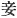

  
[Intangible Textual Heritage](../../index)  [Shinto](../index.md) 
[Index](index)  [Previous](kj044)  [Next](kj046.md) 

------------------------------------------------------------------------

[Buy this Book at
Amazon.com](https://www.amazon.com/exec/obidos/ASIN/B0028Y4SZY/internetsacredte.md)

------------------------------------------------------------------------

  
*The Kojiki*, translated by Basil Hall Chamberlain, \[1919\], at
Intangible Textual Heritage

------------------------------------------------------------------------

p. 143

## \[SECT. XXXVIII.—THE AUGUST CHILD-BEARING OF PRINCESS-BLOSSOMING BRILLIANTLY-LIKE-THE-FLOWERS-OF-THE-TREES.\]

So later on
Princess-Blossoming-Brilliantly-Like-the-Flowers-of-the-Trees waited
on [1](#fn_790.md) \[His Augustness Prince
Rice-ear-Ruddy-Plenty, and said: "I [2](#fn_791.md) am pregnant, and now the time for my
delivery approaches. "It is not fit for me to be delivered of the august
offspring of Heaven privately; [3](#fn_792.md) so
I tell thee." Then \[His Augustness Prince Rice-ear-Ruddy-Plenty\] said:
"Princess-Blossoming-Brilliantly! [4](#fn_793.md)
what! pregnant after one night! [5](#fn_794.md) It
cannot be my child. It must surely be the child of an Earthly
Deity." [6](#fn_795.md) Then she replied, saying:
"If the child with \[118\] which I am pregnant be the child of an
Earthly Deity,

p. 144

my delivery will not be fortunate. If it be the august child of the
Heavenly Deity, [7](#fn_796.md) it will be
fortunate;"—and thereupon she built a hall eight fathoms \[long\]
without doors, [8](#fn_797.md) went inside the
hall and plastered up \[the entrance\] with earth; and when the time
came for her delivery, she set fire to the hall and was delivered. [9](#fn_798.md) So the name of the child that was born
when the fire was burning most fiercely was His Augustness
Fire-Shine [10](#fn_799.md) (this is the ancestor of the Hayabito, Dukes of
Ata); [11](#fn_800.md) the name of the
child born next was His Augustness Fire-Climax; [12](#fn_801.md) the august [13](#fn_802.md) name of the child born next was His
Augustness \[119\] Fire-Subside, [14](#fn_803.md)
another name for whom is His Augustness
Heaven's-Sun-Height-Prince-Great-Rice-ears-Lord-Ears [15](#fn_804.md) (three Deities in
all). [16](#fn_805.md)

------------------------------------------------------------------------

### Footnotes

[143:1](kj045.htm#fr_794.md) p. 144 More literally "came to"; but the character
which is employed implies that her visit was to a superior.

[143:2](kj045.htm#fr_795.md) Written with the
character  , a "concubine"
or "handmaid," a common self-depreciatory equivalent of the First
Personal Pronoun in Chinese, when the speaker is a woman.

[143:3](kj045.htm#fr_796.md) *I.e.* "secretly,"
"without telling thee."

[143:4](kj045.htm#fr_797.md) In this one instance
only is the name thus abbreviated. Motowori supposes it to be on account
of the scorn implied in the god's words

[143:5](kj045.htm#fr_798.md) Literally, "one
sojourn."

[143:6](kj045.htm#fr_799.md) See Sect. I, Note 11.
Here of course one of the gods of the same country-side is meant.

[144:7](kj045.htm#fr_800.md) *I.e.* "thy child and
the Sun-Goddess descendant."

[144:8](kj045.htm#fr_801.md) That is to say that
it remained doorless after she had, as stated immediately below,
plastered up the entrance.

[144:9](kj045.htm#fr_802.md) Viz. of child, not
from the flames. There is no ambiguity in the Japanese expression.

[144:10](kj045.htm#fr_803.md) *Ho-deri-na-mikoto*.

[144:11](kj045.htm#fr_804.md)
*Hayabito-ata-no-kimi*. Ata is, as has been already stated in Note 2 to
Sect. XXXVII, the name of a place in Satsuma. *Haya-bito* ("swift men,"
"bold men," literally, if we follow the Chinese characters "falcon men")
was an ancient designation of the inhabitants of the south-western
corner of Japan which was subsequently divided into the provinces p. 145 of Satsuma and Ohosumi, and came by metonymy
to be used to denote the province of Satsuma itself, for which reason it
remained as the Pillow-Word for the word Satsuma even after the
exclusive use of this latter name had been established. In after times
the *hayabito* (also contracted to *hayato* and *haito*) were chiefly
known as forming the Infantry of the Imperial Guard, a curious choice of
provincials for which mythological sanction was invoked. They are also
said to have furnished the performers of a symbolic dance mentioned at
the end of Sect. XLI (see Note 3 to that Sect.) In later Sections of
this work, the translator has ventured to render *hayabito* by
"man-at-arms."

[144:12](kj045.htm#fr_805.md)
*Ho-suseri-no-mikoto*.

[144:13](kj045.htm#fr_806.md) The Honorific is
doubtless prefixed in this case and not in the others, because it was to
this prince or deity that the Imperial House traced its descent.
Motowori's *kana* reading, which prefixes Honorifics to all such names
indifferently, obliterates this delicate distinction.

[144:14](kj045.htm#fr_807.md) *Ho-wori-no-mikoto*.
The derivation of this name is less clear than that of his elder
brothers. Motowori's proposal to consider it as a corruption of
*ho-yohari*, "fire weakening," is however plausible; and as this triad
of names is evidently intended to paint the stages in the progress of
the conflagration, the import of the third must be something very like
what Motowori suggests, even if his guess at the original form of the
word be not quite correct. The names of all three brethren differ more
or less in the parallel passage of the "Chronicles ".

[144:15](kj045.htm#fr_808.md)
*Ama-tsu-hi-daka-hiko-ho-ho-de-mi-no-mikoto*. The interpretation of the
last four members of this compound name is extremely doubtful.

[144:16](kj045.htm#fr_809.md) The actual word in
the text is not *kumi*, "deity," but its Auxiliary Numeral *hashira*.

------------------------------------------------------------------------

[Next: Section XXXIX.—The August Exchange of Luck](kj046.md)
