  
[Intangible Textual Heritage](../../index)  [Shinto](../index.md) 
[Index](index)  [Previous](kj046)  [Next](kj048.md) 

------------------------------------------------------------------------

[Buy this Book at
Amazon.com](https://www.amazon.com/exec/obidos/ASIN/B0028Y4SZY/internetsacredte.md)

------------------------------------------------------------------------

  
*The Kojiki*, translated by Basil Hall Chamberlain, \[1919\], at
Intangible Textual Heritage

------------------------------------------------------------------------

p. 147

## \[SECT. XL.—THE PALACE OF THE OCEAN-POSSESSOR.\]

Hereupon, as the younger brother was weeping and lamenting by the
sea-shore, the Deity Salt-Possessor [1](#fn_809.md) came and asked him, saying: "What is the
cause of the Sky's-Sun-Height's [2](#fn_810.md)
weeping and lamentation? "He replied, saying: "I had exchanged a
fish-hook with my elder brother, [3](#fn_811.md)
and have lost that fish-hook; and as he asks me for it, I have given him
many fish-hooks as compensation; but he will not receive them, saying,
'I \[121\] still want the original fish-hook.' So I weep and lament for
this." Then the Deity Salt-Possessor said: "I will give good counsel to
Thine Augustness;"—and there-with built a stout little boat without
interstices, [4](#fn_812.md) and set him in the
boat, and instructed him, saying: "When I shall have pushed the boat
off, go on for some time. There will be a savoury august road; [5](#fn_813.md) and if thou goest in the boat along that
road, there will appear a palace built like fishes' scales,—which is the
palace of the Deity, Ocean-Possessor. [6](#fn_814.md) When thou reachest the august gate of
that deity\['s palace\], there will be a multitudinous\[-ly branching\]
cassia-tree [7](#fn_815.md) above the well at its
side. So if thou sit on the top of that tree, the Sea-Deity's daughter
will see thee, and counsel thee." So following \[these\] instructions,
\[His Augustness Fire-Subside\] went a little \[way\], and everything
happened as \[the Deity Salt-Possessor\] had said; and he forthwith
climbed the cassia-tree, and sat \[there\]. Then when the hand-maidens
of the Sea-Deity's daughter Luxuriant-Jewel-Princess, [8](#fn_816.md) bearing jewelled vessels, were about to
draw water, there was a light in the well. [9](#fn_817.md) On looking up, there was a beautiful
young man. They thought it very strange. \[122\]

p. 148

\[paragraph continues\] Then His
Augustness Fire-Subside saw the handmaidens, and begged to be given some
water. The handmaidens at once drew some water, put it into a jewelled
vessel, and respectfully presented it to him. Then, without drinking the
water, he loosened the jewel at his august neck, took it in his mouth,
and spat it into the jewelled vessel. Thereupon the jewel adhered to the
vessel, and the handmaidens could not separate the jewel \[from the
vessel\]. So they took it with the jewel adhering to it, and presented
it to Her Augustness Luxuriant-Jewel-Princess. Then, seeing the jewel,
she asked her hand-maidens, saying: "Is there perhaps some one outside
the gate?" They replied, saying: "There is some one sitting on the top
of the cassia-tree above our well. It is a very beautiful young man. He
is more illustrious even than our king. Lo, as he begged for water, we
respectfully gave him water; but, without drinking the water, he spat
this jewel into \[the vessel\]. As we were not able to separate this
\[from the other\], [10](#fn_818.md) we have
brought \[the vessel\] with \[the jewel\] in it to present to thee."
Then Her Augustness Luxuriant-Jewel-Princess, thinking it strange, went
out to look, and was forthwith delighted at the sight. They exchanged
glances, after which she spoke to her father, saying: "There is a
beautiful person at our gate." Then the Sea-Deity him-self went out to
look, and saying: "This person is the Sky's-Sun-Height, the august child
of the Heaven's-Sun-Height," [11](#fn_819.md) led
him into the interior \[of the palace\], and spreading eight layers of
rugs of sea-asses [12](#fn_820.md) skins, and
spreading on the top other eight layers of silk rugs, and setting him on
the top of them, arranged merchandise on tables holding an
hundred, [13](#fn_821.md) made an august banquet,

p. 149

and forthwith gave him his daughter Luxuriant-Jewel-Princess in
marriage. So he dwelt in that land for three years. Hereupon His
Augustness Fire-Subside \[123\] thought of what had gone before, [14](#fn_822.md) and heaved one [15](#fn_823.md) deep sigh. So Her Augustness
Luxuriant-Jewel-Princess, hearing the sigh, informed her father, saying:
"Though he has dwelt three years \[with us\], he had never sighed; but
this night he heaved one deep sigh. What may be the cause of it?" The
Great Deity her father asked his son-in-law saying: "This morning I
heard my daughter speak, saying: 'Though he has dwelt three years \[with
us\], he had never sighed; but this night he heaved one deep sigh.' What
may the cause be? Moreover what was the cause of thy coming here?" Then
\[His Augustness Fire-Subside\] told the Great Deity exactly how his
elder brother had pressed him for the lost fish-hook. Thereupon the
Sea-Deity summoned together all the fishes of the sea, great and small,
and asked them, saying: "Is there perchance any fish that has taken this
fish-hook?" So all the fishes replied: "Lately the *tahi* [16](#fn_824.md) has complained of something sticking in
its throat [17](#fn_825.md) preventing it from
eating; so it doubtless has taken \[the hook\]." On the throat of the
*tahi* being thereupon examined, there was the fish-hook \[in it\].
Being forthwith taken, it was washed and respectfully presented to His
Augustness Fire-Subside, whom the Deity Great-Ocean-Possessor then
instructed, saying: "What thou shalt say when thou grantest this
fish-hook to thine elder brother \[is as follows\]: 'This fish-hook is a
big hook, an eager hook, a poor hook, a silly hook.' [18](#fn_826.md) Having \[thus\] spoken, bestow it with
thy back hand. [19](#fn_827.md) \[124\] Having
done thus,—if thine elder brother make high

p. 150

fields, [20](#fn_828.md) do Thine Augustness make
low fields; and if thine elder brother make low fields, do Thine
Augustness make high fields. If thou do thus, thine elder brother will
certainly be impoverished in the space of three years, owing to my
ruling the water. If thine elder brother, incensed at thy doing thus,
should attack thee, put forth the tide-flowing jewel [21](#fn_829.md) to drown him. If he express grief, put
forth the tide-ebbing jewel to let him live. Thus shalt thou harass
him." With these words, \[the Sea-Deity\] gave \[to His Augustness
Fire-Subside\] the tide-flowing jewel and the tide-ebbing jewel,—two in
all,—and forthwith summoned together all the crocodiles, [22](#fn_830.md) and asked them, saying: "The
Sky's-Sun-Height, august child of the Heaven's-Sun-Height, is now about
to proceed out to the Upper-Land. [23](#fn_831.md)
Who will in how many days respectfully escort him, and bring back a
report?" [24](#fn_832.md) So each according to the
length of his body in fathoms spoke, fixing \[a certain number of\]
days,—one of them, a crocodile one fathom \[long\], saying: "I [25](#fn_833.md) will escort him, and come back in one
day." So then \[the Sea-Deity\] \[125\] said to the crocodile one fathom
\[long\]: "If that be so, do thou respectfully escort him. While
crossing the middle of the sea, do not alarm him!" [26](#fn_834.md) Forthwith he seated him upon the
crocodile's head, and saw him off. So \[the crocodile\] respectfully
escorted him home in one day, as he had promised. When the crocodile was
about to return, \[His Augustness Fire-Subside\] untied the
stiletto [27](#fn_835.md) which was girded on him,
and, setting it on the crocodile's neck, [28](#fn_836.md) sent \[the latter\] back. So the
crocodile one fathom \[long\] is now called the Deity
Blade-Possessor. [29](#fn_837.md)

p. 151 p. 152

------------------------------------------------------------------------

### Footnotes

[147:1](kj047.htm#fr_813.md) p. 151 *Shiho-tsuchi no kami*. The view of the
meaning of this name which has here been taken is founded on the
persistent use in all documents of the character  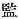, "salt," to write the first
element of the compound, and of varying characters to write the
syllables *tsu* and *chi*, an indication that the latter are to be taken
phonetically and may therefore be interpreted to signify *tsu mochi*,
"possessor of," as in numerous other instances. The fact that this god
is known as the god of salt-manufacturers (see Tanigaha Shinsei's
"Perpetual Commentary on the Chronicles of Japan" Vol. VII, p. 3) adds
another reason for rejecting both Motowori's far-fetched derivation of
the name for *Shiri-oho-tsu-mochi*, "Great Possessor of Knowledge," and
his assertion that it denotes no [individual](errata.htm#22.md) deity, but
any one gifted with superior wisdom.

[147:2](kj047.htm#fr_814.md) *Sora-tsu-hi-daka*.
It will be remembered that *Ama-tsu-hi-daka*, "Heaven's-Sun-Height," was
the first part of Prince Fire-Subsides's alternative name (see Sect.
XXXVIII, Note 15). The distinction between these two almost identical
appellations would seem to be that the former is used of the Heir
Apparent, the latter of the reigning sovereign. Both were therefore
equally applicable to Prince Fire-Subside; and while that which he
eventually bore is mentioned where his names are first given he is
naturally spoken of in this place, when his father may be supposed to
have been still living, by that variation of the name properly marking
the Heir Apparent. These names, *Ama-tsu-hi-daka* and
*Sora-tsu-hi-daka*, will be met with again below applied to other
personages.

[147:3](kj047.htm#fr_815.md) *I.e.*, "I had
received a fish-hook from my elder brother in exchange for a bow." The
text is here concise to obscurity.

[147:4](kj047.htm#fr_816.md) *I.e.*, as is
supposed, a punt or tub made of strips of bamboo plaited so tightly that
no water could find its way in between them.

[147:5](kj047.htm#fr_817.md) *I.e.*, simply "a
pleasant road." *Michi*, "a road" is properly a compound,—*mi-chi*,
"august road,"—the single syllable *chi* being the most archaic Japanese
word for "road." It is in this place written  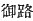, showing that the etymology
was not yet quite forgotten at the time of the compilation of these
"Records." Generally, however, throughout the work we have  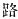 or   alone.

[147:6](kj047.htm#fr_818.md) See Sect. VI, Note 8,
where the Adjective "Great" is prefixed to the name.

[147:7](kj047.htm#fr_819.md) See Sect. XXXI, Note
10.

[147:8](kj047.htm#fr_820.md) *Toyo-tama-hime*.

[147:9](kj047.htm#fr_821.md) The character  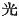 properly "light,"
"refulgence," is here taken by Motowori in the precisely opposite sense
of "shadow" (the parallel p. 152 passage in
the "Chronicles" having  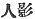
"human shadow"), and his view is absolved from unreasonableness by the
fact of the confusion between light and shade which has always existed
in Japanese phraseology. Thus *hi-kage* may signify either "sunlight" or
"a shadow cast by the sun." It is safest, however, to adhere to the
Chinese characters employed by the author; and in this special instance
we may well suppose him to have intended to say that a celestial light
shone from the body of the god in question. Such an idea is not foreign
to classical Japanese ways of thought and expression. See also Sect.
XLVI, Note 9-10.

[148:10](kj047.htm#fr_822.md) Or, taking the
character   as an initial
Particle, "So, as we were not able to separate \[one from the other\]."

[148:11](kj047.htm#fr_823.md) See Note 2 to this
Section.

[148:12](kj047.htm#fr_824.md) This is a literal
translation of the Chinese characters 
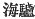, by which the Archaic word *michi*, here written
phonetically, is elsewhere represented. Perhaps the sea-lion (*Otaria
arsina*) or a species of seal may be intended.

[148:13](kj047.htm#fr_825.md) See Sect. XXXVII,
Note 7.

[149:14](kj047.htm#fr_826.md) Literally, "thought
of the first things."

[149:15](kj047.htm#fr_827.md) As the character for
"one" is thrice repeated in this passage, Motowori is probably right in
saying that it should be given its proper signification, and the
translator therefore renders it by the Numeral "one" rather than by the
Indefinite Article "a."

[149:16](kj047.htm#fr_828.md) Pronounced *tai* in
modern parlance. Perhaps we should rather add *aka-dahi*, "red *tahi*,"
as in the parallel passage of the "Chronicles." Both these fishes belong
to the family *Sparoidei*, the former being the *Pagrus cardinalis*, the
latter probably the P. *major*.

[149:17](kj047.htm#fr_829.md) Or, "of a fish-bone
in its throat."

[149:18](kj047.htm#fr_830.md) Tanigaha Shisei,
quoting from Urabe no Kaneyoshi, comments thus on the parallel passage
in the "Chronicles," where the whole of this legend is given several
times in slightly varying forms: "By big hook is meant one that will not
serve its purpose \[because too big\]; eager signifies that which
\[endeavours to, but\] cannot advance; silly means unintelligent; hence
we have a hook which, not serving its purpose, will be of no use
whatever, but rather a road to lead \[him who possesses it\] to poverty.
Poor outwardly, and inwardly silly, he will be the most useless creature
in the Empire." It should be noted, however, that Motowori interprets in
the sense of "gloomy," and Moribe in the sense of "drowning," the
phonetically written and obscure word obo, here rendered "great."

[149:19](kj047.htm#fr_831.md) p. 153 *I.e.*, "with thy hand behind thy back."
This is supposed by the commentators to have been a sort of charm by
which evil was averted from the person of him who practised it, and they
point out that Izanagi (the "Male-Who-Invites") brandished his sword
behind him when he was pursued by the hosts of Hades (see Sect. IX, Note
15).

[150:20](kj047.htm#fr_832.md) By "high fields "and
"low fields "are meant respective upland rice-fields where the rice is
planted in the dry, and "paddy-fields" properly so called, where the
rice perpetually stands in the water. Different varieties of rice are
used for these different methods of culture.

[150:21](kj047.htm#fr_833.md) *Shiho mitsu tama*.
The "tide-ebbing jewel "mentioned in the next sentence is in the
Japanese *shiho hiru tama*.

[150:22](kj047.htm#fr_834.md) See Introduction,
[p. xxxiii](kj004.htm#page_xxxiii.md), Note 41.

[150:23](kj047.htm#fr_835.md) *Uha tsu kuni*,
 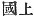.

[150:24](kj047.htm#fr_836.md) *I.e.*, "Which of
you will most speedily escort him home to the upper world, and bring
back news of his safe arrival there?"

[150:25](kj047.htm#fr_837.md) Written with the
respectful  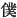, "servant."

[150:26](kj047.htm#fr_838.md) There is in, this
sentence a character  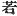,
which is hard to explain if read *moshi*, "if," as usual in Japanese.
Probably, however, it simply stands for 
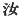 "thou," and we might translate thus: "While thou art
crossing," etc.

[150:27](kj047.htm#fr_839.md) See Sect. XXXVI,
Note 8.

[150:28](kj047.htm#fr_840.md) *I.e.*, probably,
tying it round the crocodile's neck.

[150:29](kj047.htm#fr_841.md)
*Saki-mochi-no-kami*. "Blade "is the probable signification of *sahi* or
*sabi*, though this particular proper name is written in the
"Chronicles" with the Chinese character 
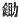, "hoe" or "mattock." Here the syllables *sa hi* are
written phonetically.

------------------------------------------------------------------------

[Next: Section XLI.—Submission of His Augustness Fire-Shine](kj048.md)
