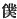

  
[Intangible Textual Heritage](../../index)  [Shinto](../index.md) 
[Index](index)  [Previous](kj047)  [Next](kj049.md) 

------------------------------------------------------------------------

[Buy this Book at
Amazon.com](https://www.amazon.com/exec/obidos/ASIN/B0028Y4SZY/internetsacredte.md)

------------------------------------------------------------------------

  
*The Kojiki*, translated by Basil Hall Chamberlain, \[1919\], at
Intangible Textual Heritage

------------------------------------------------------------------------

p. 153\[125\]

## \[SECT. XLI.—SUBMISSION OF HIS AUGUSTNESS FIRE-SHINE.\]

Hereupon \[His Augustness Fire-Subside\] gave the fish-hook \[to his
elder brother\], exactly according to the Sea-Deity's words of
instruction. So thenceforward \[the elder brother\] became poorer, and
poorer, and, with renewed savage intentions, came to attack him. When he
was about to attack \[His Augustness Fire-Subside, the latter\] put
forth the tide-flowing jewel to drown him; on

p. 154

his expressing grief, he put forth the tide-ebbing jewel to save him.
When he had thus been harassed, he bowed his head, [1a](#fn_838.md) saying: "I [2a](#fn_839.md) henceforward will be Thine Augustness's
guard by day and night, and respectfully serve thee." So down to the
present day his various posturings when drowning are ceaselessly served
up. [3a](#fn_840.md)

------------------------------------------------------------------------

### Footnotes

[154:1a](kj048.htm#fr_842.md) *I.e.*, "did humble
obeisance by prostrating himself on the ground." The Old Printed Edition
has   instead  , and the *kana* gloss
*kamugahemausu*, *i.e.* "reflected, and said": but this reading, though
interesting, is less good.

[154:2a](kj048.htm#fr_843.md) Written with the
humble character  ,
"servant."

[154:3a](kj048.htm#fr_844.md) *I.e.*, "Prince
Fire-Shine's descendants the *Hayabito* (see Sect. XXXVIII, Note 11)
still constantly perform before the Court dances and posturings
symbolical of the antics which their divine ancestor went through for
the amusement of his younger brother, after the latter had saved him
from drowning. "One account" in the "Chronicles" relates these antics at
full, telling us that they represented the straits to which he was put
as the waters gradually rose higher and higher; and we learn from other
passages in the same work and in the "Chronicles of Japan Continued"
that the *Hayabito* did really down to historical times combine the
office of Court Jesters with that of Imperial Guardsmen.

------------------------------------------------------------------------

[Next: Section XLII.—The Parturition-House of Cormorants'
Feathers](kj049.md)
