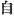
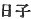
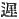
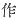
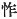
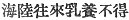
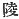

  
[Intangible Textual Heritage](../../index)  [Shinto](../index.md) 
[Index](index)  [Previous](kj048)  [Next](kj050.md) 

------------------------------------------------------------------------

[Buy this Book at
Amazon.com](https://www.amazon.com/exec/obidos/ASIN/B0028Y4SZY/internetsacredte.md)

------------------------------------------------------------------------

  
*The Kojiki*, translated by Basil Hall Chamberlain, \[1919\], at
Intangible Textual Heritage

------------------------------------------------------------------------

\[126\]

## SECT. XLII.—THE PARTURITION-HOUSE OF CORMORANTS' FEATHERS\]

Hereupon the Sea-Deity's daughter Her Augustness
Luxuriant-Jewel-Princess herself waited on [1b](#fn_841.md) \[His Augustness Fire-Subside\], and
said: "I [2b](#fn_842.md) am already with child,
and the time for my delivery now approaches. But me-thought that the
august child of an Heavenly Deity [3b](#fn_843.md)
ought not to be born in the Sea-Plain. [4](#fn_844.md) So I have waited on thee here." [5](#fn_845.md) Then forthwith on the limit of the waves
upon the sea-shore she built a parturition-hall, [6](#fn_846.md) using

p. 155

cormorants' feathers for thatch. Hereupon, before the thatch was
completed, [7](#fn_847.md) she was unable to
restrain the urgency of her august womb. So she entered the
parturition-hall. Then, when she was about to be delivered, she spoke to
her husband [8](#fn_848.md) \[saying\]: "Whenever
a foreigner is about to be delivered, she takes the shape of her native
land to be delivered. [9](#fn_849.md) So I now
will take my native shape to be delivered. Pray look not upon \[127\]
me!" Hereupon \[His Augustness Fire-Subside\], thinking these words
strange, stealthily peeped at the very moment of delivery, when she
turned into a crocodile [10](#fn_850.md) eight
fathoms \[long\], and crawled and writhed about; and he forthwith,
terrified at the sight, fled away. Then Her Augustness
Luxuriant-Jewel-Princess knew that he had peeped; and she felt ashamed,
and, straightway leaving the august child which she had borne, she said:
'I had wished always to come and go across the sea-path. [11](#fn_851.md) But thy having peeped at my \[real\]
shape \[makes me\] very shame-faced," [12](#fn_852.md)—and she forthwith closed the
sea-boundary, [13](#fn_853.md) and went down
again. [14](#fn_854.md) Therefore the name by
which the august child whom she had borne was called was his Augustness
Heaven's-Sun-Height-Prince-Wave-limit-Brave-Cormorant-Thatch-Meeting-Incompletely. [15](#fn_855.md) Nevertheless afterwards, although angry
at his having wished to peep, she could not restrain her loving heart,
and she entrusted to her younger sister Jewel-Good-Princess, [16](#fn_856.md) on the occasion of her nursing the
august child, [17](#fn_857.md) a Song to be
presented \[to His \[128\] Augustness Fire-Subside\]. The Song said:

"As for red jewels, though even the string \[they are strung on\]
shines, the aspect of \[my\] lord \[who is\] like unto white jewels is
\[more\] illustrious." [18](#fn_858.md)

p. 156

Then her husband replied by a Song, which said:

"As for my younger sister, whom I took to sleep \[with me\] on the
island where light the wild-duck, the birds of the offing, I shall not
forget her till the end of my life." [19](#fn_859.md)

So His Augustness-Prince-Great-Rice-ears-Lord-Ears [20](#fn_860.md) dwelt in the palace of Takachiho for
five hundred and eighty years [21](#fn_861.md) His
august mausoleum [22](#fn_862.md) is likewise on
the west of Mount Takachiho.

p. 157

------------------------------------------------------------------------

### Footnotes

[154:1b](kj049.htm#fr_845.md) p. 156 For "waited on "see Sect. XXXVIII, Note 1.
The word "herself" ( 
*midzukara*) has no particular force or meaning in the Japanese
original, where it is simply placed in imitation of the Chinese style.

[154:2b](kj049.htm#fr_846.md) See Sect. XXXVIII,
Note 2.

[154:3b](kj049.htm#fr_847.md) Or "of *the*
Heavenly Deity," *i.e.*, "thyself." But it seems better to understand
the speaker to intimate that it would be unfitting for one who properly
belonged to Heaven to be born in the sea, which was another country or
kingdom.

[154:4](kj049.htm#fr_848.md) *I.e.*, in the sea.

[154:5](kj049.htm#fr_849.md) Literally "come out
and arrived."

[154:6](kj049.htm#fr_850.md) It has been noticed
in the Introduction, [p. xxviii](kj004.htm#page_xxviii.md), that in early
Japan a parturient woman was expected to build for herself a special hut
in which to give birth to her child.

[155:7](kj049.htm#fr_851.md) Or, completely put
on; literally, "thatched \[so as\] to meet."

[155:8](kj049.htm#fr_852.md) The text here
has  "prince," literally
"sun-child," and so the older editors understood the expression. The
translator, however, prefers Motowori's view, according to which the
character   should be
supplied, and the whole read phonetically as *hikoi*, "husband," a word
which occurs again a few lines further on.

[155:9](kj049.htm#fr_853.md) *I.e.*, she assumes
the shape proper to her in her native land.

[155:10](kj049.htm#fr_854.md) According to the
parallel passage of the "Chronicles," she turned into a dragon. "One
account "however agrees with our text.

[155:11](kj049.htm#fr_855.md) The original of this
passage is rather confused; but the interpretation here adopted from the
Old Printed Edition is more natural than Motowori's according to which
the Verbs are to be taken in a Causative sense, to the following effect:
"I had always wished to let people come p.
157 and go across the sea-path.'' Probably it was only in order
to make this clause fit in better with the following sentence, in which
we are told that the crocodile-princess "closed the sea-boundary," and
with the fact that there is at present no path leading to the Sea-God's
palace, that Motowori was induced to sanction such a view of the grammar
of this passage.

[155:12](kj049.htm#fr_856.md) This is Motowori's
interpretation of the clause, he having emended  , "action," "doing," which is
found in the older editions, 
, "shame-faced." (The edition of 1687 mentions  , "strange," as an alternative
reading). If we followed the older reading, we should have to translate
thus: "Thy having peeped at my \[real\] shape is an outrageous action."

[155:13](kj049.htm#fr_857.md) *I.e.*, the boundary
dividing the dominions of the Sea-God from the world of men.

[155:14](kj049.htm#fr_858.md) Viz., to the
Sea-God's palace.

[155:15](kj049.htm#fr_859.md)
*Ama-tsu-hi-daka-hiko-nagisa-take-u-gaya-fuki-ahesu no mikoto*. The
older editors read *ahasezu* for *ahezu*, *i.e.* "causing to meet,"
instead of "meeting." Moribe, in his Critique on Motowori's Commentary,
would have us believe that the name comes from *umi-ga kayohi
fuki-ahezu* ( ), *i.e.*
"going and coming on sea and land and being unable to suckle"!

[155:16](kj049.htm#fr_860.md) *Tama yori-bime*.

[155:17](kj049.htm#fr_861.md) *I.e.*, of
Jewel-Good-Princess nursing the child, The mother did not return to the
upper world, and so sent this poetic message by her sister, who had
consented to act as the child's nurse.

[155:18](kj049.htm#fr_862.md) "The meaning of the
Song," says Motowori, "is this: Although red jewels are so charming that
the very string \[whereon they are strung\] doth shine, the august
aspect of my lord, who is like unto white jewels, is still more lovely.
Thus does she express her loving feeling."—Moribe supposed the "red
jewels" (or "jewel" in the Singular) to be meant for the child, than
whom her husband is yet dearer to her heart. The word *kimi*, here
etymologically rendered "\[my\] lord," is commonly used in the sense of
"thou," especially in poetry.

[156:19](kj049.htm#fr_863.md) *I.e.*, "I shall
never forget thee who wast my wife in the realm of the Sea-God. The
"birds of the [offing](errata.htm#23.md)" are a description of the wild
duck, used as a Pillow-Word for their name. In the same manner the whole
phrase, "where light the wild-duck, the birds of the offing," may be
taken simply as a "Preface" to the word "island." The Sea-God's dwelling
is called an island because it is beyond the sea. The words p. 158 *yo no koto-goto ni*, here in deference to
the views of the best commentators rendered by "till the end of my
life," will also bear the interpretation of "night by night."

[156:20](kj049.htm#fr_864.md) The alternative name
of the deity Fire-Subside.

[156:21](kj049.htm#fr_865.md) Probably the writer
means us to understand that the total age reached by this deity was five
hundred and eighty years. This is the first mention in these "Records
"of anything approaching a date. The way in which it is recorded
resembles that in which the chronicle of each Emperor's reign is brought
to a close in the later volumes of the work.

[156:22](kj049.htm#fr_866.md) The character   might also be rendered by the
simple word "grave." But neither it nor its Japanese reading *misasaki*
are ever used except honorifically of the Imperial tombs, and "mausoleum
"seems therefore a more suitable English equivalent.

------------------------------------------------------------------------

[Next: Section XLIII.—The August Children of His Augustness
Cormorant-Thatch-Meeting-Incompletely](kj050.md)
