  
[Intangible Textual Heritage](../../index)  [Shinto](../index) 
[Index](index)  [Previous](kj050)  [Next](kj052) 

------------------------------------------------------------------------

[Buy this Book at
Amazon.com](https://www.amazon.com/exec/obidos/ASIN/B0028Y4SZY/internetsacredte)

------------------------------------------------------------------------

  
*The Kojiki*, translated by Basil Hall Chamberlain, \[1919\], at
Intangible Textual Heritage

------------------------------------------------------------------------

p. 159 \[130\]

# VOL. II. [1](#fn_871)

## \[SECT. XLIV.—REIGN OF THE EMPEROR JIM-MU [2](#fn_872) (PART I.—HIS PROGRESS EASTWARD, AND DEATH OF HIS ELDER BROTHER)\]

The two Deities His Augustness Kamu-yamato-ihare-biko [3](#fn_873) and his elder brother His Augustness
Itsu-se, dwelling in the palace of Takachiho. [4](#fn_874) took counsel, saying: "By dwelling in
what place shall we \[most\] quietly carry on the government of the
Empire? [5](#fn_875) It were probably best to
go east." Forthwith they left Himuka [6](#fn_876) on their progress [7](#fn_877) to Tsukushi. [8](#fn_878) So when they arrived at Usa [9](#fn_879) in the Land of Toyo, [10](#fn_880) two of the natives, whose names were
Usa-tsu-hiko and Usa-tsu-hime [11](#fn_881)
built a

p. 160

palace raised on one foot, [12](#fn_882) and
offered them a great august banquet. Removing thence, they dwelt for one
\[131\] year at the palace of Wokoda [13](#fn_883) in Tsukushi. Again making a progress
up [14](#fn_884) from that land, they dwelt
seven years at the palace of Takeri [15](#fn_885) in the land of Agi. [16](#fn_886) Again removing, and making a progress
up from that land, they dwelt eight years at the palace of
Takashima [17](#fn_887) in Kibi. [18](#fn_888) So when they made their progress up
from that land, they met in the Hayasuhi [19](#fn_889) Channel a person riding towards them on
the carapace of a tortoise, and raising his wings [20](#fn_890) as he angled. Then they called to him
to approach, and asked him, saying: "Who art thou?" He replied, saying:
"I [21](#fn_891) am an Earthly Deity. [22](#fn_892)" Again they asked him, saying: "Knowest
thou the sea-path?" He replied, saying: "I know it well." Again they
asked him, saying: "Wilt thou follow and respectfully serve us?" He
replied, saying: "I will respectfully serve you." So they pushed a
pole [23](#fn_893) across to him, drew him into
the august vessel, and forthwith conferred \[132\] on him the
designation of Sawa-ne-tsu-hiko [24](#fn_894)
(This is the ancestor of the Rulers of the land of
Yamato.) [25](#fn_895) So when they went
up from that land they passed the Namihaya [26](#fn_896) Crossing, and brought up at the haven
of Shirakata. [27](#fn_897) At this time
Nagasune-biko [28](#fn_898) of Tomi [29](#fn_899) raised an army, and waited to go out to
fight \[against them\]. Then they took the shields that had been put in
the august vessel, and disembarked. So they called that place by the
name of Tate-dzu. [30](#fn_900) It is what is
now called the Tadetsu of Kusaka. [31](#fn_901)
Therefore when fighting with the Prince of Tomi, [32](#fn_902) His Augustness Itsu-se was pierced in
his august hand by the Prince of Tomi's hurtful arrow. [33](#fn_903) So then he said: "It is not right for
me, an august

p. 161

child of the Sun-Deity, to fight facing the sun. It is for this reason
that I am stricken by the wretched villain's [34](#fn_904) hurtful hand. I will henceforward turn
round, and smite him with my back to the sun." Having \[thus\] decided,
he, on making a progress round from the southern side, reached the sea
of Chinu, [35](#fn_905) and washed the blood on
his august hand: so it is called the sea of Chinu. [36](#fn_906) Making a progress round from thence,
and arriving at the river-mouth of Wo [37](#fn_907) in the land of Ki, [38](#fn_908) he said: "Ah! that I should die
stricken by the wretched villain's hand!" and expired [39](#fn_909) as a valiant man. [40](#fn_910) So that river-mouth was called the
river mouth of Wo. [41](#fn_911) The Mausoleum,
too, is on Mount Kama [42](#fn_912) in the land
of Ki.

p. 162 p. 163

------------------------------------------------------------------------

### Footnotes

[159:1](kj051.htm#fr_875) p. 161 Literally, "Middle Volume," there being
three in all. See Author's Preface, Note 1.

[159:2](kj051.htm#fr_876) *Jim-mu* signifies
"divine valour." It is the "canonical name" of the Emperor
*Kamu-yamato-ihare-biko* (see Introduction, [p.
xiv](kj002.htm#page_xiv)).

[159:3](kj051.htm#fr_877) In the preceding
Section this name was rendered "Divine-Yamato-Ihare-Prince." But in the
translation of Vols. II and III of this work, the Japanese proper names
are not Englished, unless there be a special reason for so doing. (See
Introduction, pp. [xviii](kj003.htm#page_xviii) and
[xix](kj003.htm#page_xix).)

[159:4](kj051.htm#fr_878) See Sect. XXXIV, Note
5.

[159:5](kj051.htm#fr_879) See Sect. XXVII, Note
13.

[159:6](kj051.htm#fr_880) See Sect. X, Note 4.

[159:7](kj051.htm#fr_881) The Japanese
expression here used is one which exclusively denotes an Imperial
Progress, and not the movements of lesser people. It recurs perpetually
in this and the following Volume.

[159:8](kj051.htm#fr_882) See Sect. V, Note 14.

[159:9](kj051.htm#fr_883) Etymology uncertain.

[159:10](kj051.htm#fr_884) See Sect. V, Note
17.

[159:11](kj051.htm#fr_885) *I.e.*, Prince of
Usa and Princess of Usa.

[160:12](kj051.htm#fr_886) In the original,
 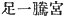, read asks *hito-tsu
agari no miya*. The parallel passage of the "Chronicles" has  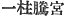 which is directed to be read
in the same manner.  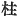
(*hashira*) however means, not "foot," but "pillar "; and the
commentators understand both passages to allude p.
162 to a single pillar, which supported the weight of the entire
building,—either as being in the middle of it, or (as Motowori opines)
by standing in the water, the edifice, according to this view, being
built on a river-bank overhanging the stream.

[160:13](kj051.htm#fr_887) This name signifies
"hillock rice-field."

[160:14](kj051.htm#fr_888) *Q.d.* towards
Yamato, the province where the capital was eventually fixed. In
Japanese, as in English, people are said to go of to the capital and
down to the country.

[160:15](kj051.htm#fr_889) Etymology uncertain.

[160:16](kj051.htm#fr_890) Etymology uncertain.
This name is better known (without the *nigori* of the second syllable)
as Aki. Aki is one of the provinces on the northern shore of the Inland
Sea.

[160:17](kj051.htm#fr_891) This name signifies
"high island."

[160:18](kj051.htm#fr_892) Etymology uncertain.
Kibi is the name of a province.

[160:19](kj051.htm#fr_893) This name signifies
"quick sucking."

[160:20](kj051.htm#fr_894) *I.e.*, as Motowori
supposes, beckoning by waving his sleeve.

[160:21](kj051.htm#fr_895) The First Personal
Pronoun is represented by the humble character  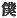, "servant."

[160:22](kj051.htm#fr_896) See Sect. I, Note
11. Motowori wishes us here to understand this expression to mean "I am
a Deity (*i.e.* a person) of the country-side." But there is no
sufficient reason for departing from the precedent of rendering the
characters  , which are
constantly used antithetically to 
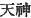, by "Earthly Deity" (as opposed to "Heavenly Deity.")
Motowori likewise proposes to append to this sentence the clause "and my
name is Udzu-biko," which is found in the "Chronicles." The name may be
taken to signify "precious prince."

[160:23](kj051.htm#fr_897) The characters  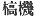 are evidently, as Motowori
says, meant to represent the Japanese word *sawo*, "pole," though they
do not properly convey that meaning. Probably they are corrupt.

[160:24](kj051.htm#fr_898) *I.e.*, if we
suppress the syllable *ne*, which seems to be either Expletive or
Honorific, the "prince of the pole."

[160:25](kj051.htm#fr_899) *Yamato no kuni no
Miyadzuko*.

[160:26](kj051.htm#fr_900) This is the reading
of the name preferred by Mabuchi and Motowori; but the usual form
*Naniha* seems to be at least as well supported by early documentary
evidence. The "Chronicles" tell us that the place was called *Nani-haya*
 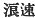, *i.e.* "wave swift," in
allusion to the strong current which the Emperor Jim-mu here
encountered; and at the present day it is still a dangerous place for
navigation. The name properly denotes the water at the mouth of the
River Yodo, on p. 163 which stands the modern
town of Ohosaka (Ōzaka), for whose name Naniha is still often used as a
poetical synonym.  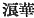, "wave
flowers," and  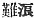,
"dangerous waves," are alternative ways of writing it.

[160:27](kj051.htm#fr_901) Motowori says that
he cannot explain the etymology of this word; but "white sandbank" would
seem a simple and obvious derivation. The Shirakata here mentioned is,
according to Motowori, that situated in the province of Idzumo.

[160:28](kj051.htm#fr_902) *I.e.*, the Prince
of Nagasune. A plausible interpretation of *nagasune* would be
"long-shank," which would give us Prince Long-Shank as the name of the
worthy here mentioned; but the "Chronicles" states that Nagasune was
properly the name of a place. The characters with which it is written,
moreover, signify not exactly "long shank," but "long marrow," a
designation which would have no evident personal applicability.

[160:29](kj051.htm#fr_903) A legend in the
"Chronicles" connects the name of this place with the word *tobi*, "a
kite," it being there related that a miraculous gold-coloured kite came
and perched on the Emperor Jim-mu's bow, and helped him to the victory.
Probably the legend grew out of the name of *Tobi*, which is obscure and
may have had had nothing to do with a "kite "originally.

[160:30](kj051.htm#fr_904) *I.e.*,
"shield-haven." But *conf*. next Note.

[160:31](kj051.htm#fr_905) The real etymology
of *Tada-tsu* seems to be "knot-grass-haven," [and](errata.htm#25)
probably *Taka-tsu* (for *Takatsu*), which is mentioned in Sect. LXIX,
Note 29, is but another form of the same name. Kusaka is a well-known
name in the annals of early Japan. Its signification is obscure, and the
characters ( 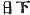), with which
it is written, are particularly curious. There were two Kusaka, one in
the province of Kahachi and the other in Idzumi.

[160:32](kj051.htm#fr_906) Viz.,
*Nagasune-biko*.

[160:33](kj051.htm#fr_907) The wording of the
original   is very
curious: Motowori reads it *Tomi-bike ga ita-ya wo ohashite*.
Immediately below we have 
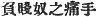.

[161:34](kj051.htm#fr_908) The character is
 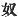, properly "slave."

[161:35](kj051.htm#fr_909) The most likely
derivation of this name is from *chi-numa*, "eulalia lagoon," the fact
that it will also bear the interpretation of "blood-lagoon "being
probably but a coincidence of which the mythopoeic faculty took
advantage.

[161:36](kj051.htm#fr_910) Here written with
characters signifying "blood-lagoon."

[161:37](kj051.htm#fr_911) p. 164 The characters rendered "river-mouth "are
 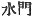, literally "water. gate;
but here, as elsewhere, "river-mouth "seems to be the signification
meant to be conveyed. Rivers in [Japan](errata.htm#26), even at the
present day, do not bear one continuous name along their entire course,
and there would be nothing unnatural in the fact of the water at the
mouth of the river having a special designation. One of the
significations of *wo* is "man," and the legendary etymology of the name
given immediately below rests on the assumption that such is the meaning
of wo in this place. Even Motowori, however, is not satisfied with it,
and it is probably erroneous.

[161:38](kj051.htm#fr_912) See Sect. XXII, Note
14.

[161:39](kj051.htm#fr_913) The Chinese
character  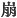, which is here
used, is one that specially denotes the demise of an Emperor.

[161:40](kj051.htm#fr_914) Probably the sense
meant to be conveyed is that he expired with a [gesture](errata.htm#27)
of anger and defiance.

[161:41](kj051.htm#fr_915) Here written  , "man." Conf. Note 37.

[161:42](kj051.htm#fr_916) *Kama-yama*, *i.e.*
furnace-mountain."

------------------------------------------------------------------------

[Next: Section XLV.—Emperor Jim-mu (Part II.—The Cross-Sword Sent Down
From Heaven).](kj052)
