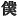

  
[Intangible Textual Heritage](../../index)  [Shinto](../index.md) 
[Index](index)  [Previous](kj053)  [Next](kj055.md) 

------------------------------------------------------------------------

[Buy this Book at
Amazon.com](https://www.amazon.com/exec/obidos/ASIN/B0028Y4SZY/internetsacredte.md)

------------------------------------------------------------------------

  
*The Kojiki*, translated by Basil Hall Chamberlain, \[1919\], at
Intangible Textual Heritage

------------------------------------------------------------------------

p. 169

## \[SECT. XLVII.—EMPEROR JIM-MU ([PART](errata.htm#30) IV.—THE UKASHI BRETHREN.md).\]

So then there were in Uda two persons, Ukashi the Elder Brother and
Ukashi the Younger Brother. [1](#fn_947.md) So

p. 170

\[paragraph continues\] \[His Augustness
Kamu-yamato-ihare-biko\] sent the crow eight feet \[long\] in advance to
ask these persons, saying: "The august child of the Heavenly Deity has
made a progress \[hither\]. Will ye respectfully serve him?" Hereupon
Ukashi the Elder Brother waited for and shot at the messenger with a
whizzing barb to make him turn back. So the place where the whizzing
barb fell is called Kabura-zaki. [2](#fn_948.md)
Saying that he intended to wait for and smite \[His Augustness
Kamu-yamato-ihare-biko\], he \[tried to\] collect an army. But being
unable to collect an army he said deceitfully that he would respectfully
serve \[His Augustness Kamu-yamato-ihare-biko\], and built a great
palace, [3](#fn_949.md) and in that palace set a
pitfall, and waited. Then Ukashi the Younger Brother came out to [4](#fn_950.md) \[His Augustness
Kamu-yamato-ihare-biko\] beforehand, and made obeisance, saying:
"Mine [5](#fn_951.md) elder brother Ukashi the
Elder Brother has shot at and turned back the messenger \[139\] of the
august child of the Heavenly Deity, and, intending to wait for and
attack thee, has \[tried to\] collect an army; but, being unable to
collect it, he has built a great palace, and set [6](#fn_952.md) a gin within it, intending to wait for
and catch thee. So I have come out to inform \[thee of this\]." Then the
two persons His Augustness Michi-no-Omi, [7](#fn_953.md) ancestor of the Ohotomo
Chieftains, [8](#fn_954.md) and His Augustness
Ohokume, [9](#fn_955.md) ancestor of the Kume
Lords, [10](#fn_956.md) summoned Ukashi the Elder
Brother and reviled him, saying: "Into the great palace which thou [11](#fn_957.md) hast built to respectfully serve \[His
Augustness Kamu-yamato-ihare-biko\], be thou [12](#fn_958.md) the first to enter, and declare plainly
the manner in which thou intendest respectfully to serve him; "—and
forthwith grasping the hilts of their cross-swords, playing with their
spears, [13](#fn_959.md) and fixing arrows \[in

p. 171

their bows\], they drove him in, whereupon he was caught in [14](#fn_960.md) the gin which he himself had set, and
died. So they forthwith pulled him out, and cut him in pieces. So the
place is called Uda-no-Chihara. [15](#fn_961.md)
Having done thus, \[His Augustness Kamu-yamato-ihare-biko\] bestowed on
his august army the whole of the great banquet presented \[to him\] by
Ukashi the Younger Brother. At this time he sang, saying:

"The woodcock, for which I laid a wood-cock-snare \[140\] and waited in
the high castle of Uda, strikes not against it; but a valiant whale
strikes against it. If the elder wife ask for fish, slice off a little
like the berries of the stand soba; if the younger wife ask for fish,
slice off a quantity like the berries of the vigorous *sasaki*." [16](#fn_962.md)

"Ugh! [17](#fn_963.md) pfui! dolt! This is saying
thou rascal. Ah! pfui! dolt! This is laughing \[141\] \[him\] to scorn."

So Ukashi the Younger Brother (he is the ancestor of
the Water Directors of Uda). [18](#fn_964.md)

p. 172

------------------------------------------------------------------------

### Footnotes

[169:1](kj054.htm#fr_951.md) p. 171 *Ye-ukashi* and *Oto-ukashi*. *Ukashi*, as
in the other compounds where it occurs, is probably in reality the name
of a place. Its etymology is doubtful.

[170:2](kj054.htm#fr_952.md) *I.e.*, Barb Point or
Cape.

[170:3](kj054.htm#fr_953.md) Or, hall.

[170:4](kj054.htm#fr_954.md) The original has a
respectful expression, which is elsewhere translated "waited on."

[170:5](kj054.htm#fr_955.md) The First Personal
Pronoun is represented by the respectful character   "servant."

[170:6](kj054.htm#fr_956.md) Literally, "spread."
This gin is supposed to have been of the kind whose top closes down
after the man or animal has fallen into it.

[170:7](kj054.htm#fr_957.md) p. 172 *I.e.*, "Grandee of the Way." This gentile
name is said in the "Chronicles "to have been bestowed on this worthy in
consideration of the services as a guide to his master the Emperor on
the occasion of the latter's progress eastward.

[170:8](kj054.htm#fr_958.md) See Sect. XXXIV, Note
12.

[170:9](kj054.htm#fr_959.md) *I.e.*, perhaps
"Great Round Eyes," supposed to be a descendant of His Augustness
*Ama-tsu-kume* (see however Sect. XXXIV, Note 7 for a discussion of the
etymology of *Kume*).

[170:10](kj054.htm#fr_960.md) See Sect. XXXIV,
Note 13.

[170:11](kj054.htm#fr_961.md) The expression *i
ga*, here rendered "thou," is, as Motowori remarks, "extremely hard to
understand," and its interpretation as an insulting form of the Second
Personal Pronoun is merely tentative. Perhaps the text is corrupt.

[170:12](kj054.htm#fr_962.md) The insulting Second
Pronoun *ore* is here employed.

[170:13](kj054.htm#fr_963.md) Here again we have
an expression written phonetically and of uncertain import. The
translator has followed Motowori in tentatively rendering it according
to the ideographic reading of the parallel passage of the "Chronicles."

[171:14](kj054.htm#fr_964.md) Literally "struck
by."

[171:15](kj054.htm#fr_965.md) *I.e.*, Uda's
Blood-Plain.

[171:16](kj054.htm#fr_966.md) This Song is
unusually difficult of comprehension: and the latest important
commentator, Moribe, seems to show satisfactorily that all his
predecessors, Motowori included, more or less misunderstood it. He had
at least the advantage of coming after them, and the translator has
followed his interpretation excepting with regard to *isukukashi*, the
Pillow-Word for "whale," which is here rendered "valiant," in accordance
with the traditional view of its signification. The *soba* tree is
identified by Motowori with the *Kaname-mochi*, "*Photinia glabra*,"
[This](errata.htm#31.md) *saka-ki*, taken together with its Prefix *ichi*
(here rendered "vigorous") is supposed in this place to signify, not the
usual *Cleyera japonica*, but another species popularly known as the
*bishiya-gaki*, whose English or Latin name the translator has failed to
ascertain. It has a large berry, whereas the soba has a small one. . .
The following is the gist of Moribe's exposition of the general
signification of the Song: "If for Ukashi's mean design to kill the
Emperor in a gin there be sought a term of comparison in the whales and
woodcock forming the Imperial banquet, then in lieu of the woodcock that
he expected to catch in the trap that he set, that great whale, the
Imperial host, has rushed up against it. Again if, as the fishermen's
wives might do, your (*i.e.*, you soldiers') wives ask you p. 173 for fish, then let each of you give to his
elder wife, of whom he must have grown weary, only a small and bony
portion, and to his younger wife, who is doubtless his heart's
favourite, a good fleshy piece. So jocular a guess at the "*penchants*
of the young warriors excites their ardour, which they give vent to in
the following shouts."

[171:17](kj054.htm#fr_967.md) Some of the Japanese
originals of this string of Interjections are of uncertain import. The
translator has been guided by Motowori's conjectures, with which Moribe
mostly agrees. The exclamations are supposed not to form part of the
actual Song, but to proceed from the mouths of the Imperial soldiers.
The words rendered "this is saying thou rascal" (such is apparently
their meaning) and those rendered "this is laughing \[him\] to scorn
"seem to be glosses as old as the text, which had already been obscure
in the eighth century. They are not written altogether phonetically.

[171:18](kj054.htm#fr_968.md) *Uda na Mohitori*.
This tribe or guild of "water-directors" was entrusted with the charge
of the water, the ice, and the gruel used in the Imperial household. In
later times the word *Mohitori* was corrupted to *Mondo*.

------------------------------------------------------------------------

[Next: Section XLVIII.—Emperor Jim-mu (Part V.—The Earth-Spider of the
Cave of Osaka)](kj055.md)
