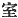
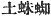
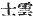
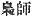

  
[Intangible Textual Heritage](../../index)  [Shinto](../index.md) 
[Index](index)  [Previous](kj054)  [Next](kj056.md) 

------------------------------------------------------------------------

[Buy this Book at
Amazon.com](https://www.amazon.com/exec/obidos/ASIN/B0028Y4SZY/internetsacredte.md)

------------------------------------------------------------------------

  
*The Kojiki*, translated by Basil Hall Chamberlain, \[1919\], at
Intangible Textual Heritage

------------------------------------------------------------------------

p. 173

## \[SECT. XLVIII.—EMPEROR JIM-MU (PART V.—THE EARTH-SPIDER OF THE CAVE OF OSAKA).\]

When \[His Augustness Kamu-yamato-ihare-biko\] made his progress, and
reached the great cave of Osaka, [1](#fn_965.md)
earth-spiders [2](#fn_966.md) with tails,
\[namely\] eighty bravoes, [3](#fn_967.md) were in
the cave awaiting him. So then the august son of the Heavenly Deity
commanded that a banquet be bestowed on the eighty bravoes. Thereupon he
set eighty butlers, one for each of the eighty bravoes, and girded each
of them with a sword, and instructed the butlers, saying: \[142\] "When
ye hear me sing, cut \[them down\] simultaneously." So the Song by which
he made clear to them to set about smiting the earth-spiders said:

"Into the great cave [of](errata.htm#33.md) Osaka people have entered in
abundance, and are p. 174 \[there\]. Though
people have entered in abundance, and are \[there\], the children of the
augustly powerful warriors will smite and finish them with \[their\]
mallet-headed \[swords\], \[their\] stone-mallet \[swords\]: the
children of the augustly powerful warriors, with \[their\] mallet-headed
\[swords\], \[their\] stone-mallet \[swords\], would now do well to
smite." [4](#fn_968.md)

Having thus sung, they drew their swords, and simultaneously smote them
to death.

------------------------------------------------------------------------

### Footnotes

[173:1](kj055.htm#fr_969.md) p. 174 The etymology of this name is not clear, but
readers will of course not confound it with that of the modern town of
Ohosaka (Ozaka). The character rendered "cave,"  , signifies simply "apartment;"
but the traditional reading is *muro*, which means a cave or pit dug in
the earth. That the latter is the idea which the author wishes to convey
becomes clear by comparison with a greater number of passages in the
older literature. For a more particular discussion of this subject see
Mr. Milne's paper entitled "Notes on Stone Implements from Otaru and
Hakodate," published in Vol. VIII, part I of these "Transactions," p. 76
*et seq.*, where a number of passages relative to the "earth-spiders"
are likewise brought together.

[173:2](kj055.htm#fr_970.md) *Tsuchi-gumo*,
generally written  , but
here semi-phonetically  .
There is little doubt that by this well-known name, which has given rise
to much conjecture, a race of cave-dwelling savages or a class of
cave-dwelling robbers is intended. Motowori supposes that their name had
its origin in a comparison of their habits with those of the spider. But
it were surely more rational to regard it as a corruption of
*tsuchi-gomori*, "earth-hiders," a designation as obvious as it is
appropriate. The "Chronicles" describe one tribe of them as "being short
in stature, and having long arms and legs like pigmies." For a further
discussion of the subject see Motowori's Commentary, Vol. XIX, pp.
30-31, the "Perpetual Commentary on the Chronicles of Japan," Vol. VIII,
p. 35, the "*Tou-ya*," Vol. XX, *s.v.* *kumo* and the "Examination of
Difficult Words," Vol. 1I, pp. 55 *et seq.*

[173:3](kj055.htm#fr_971.md) p. 175 The original term is *takeru* ( ), which might also be rendered
"bandit," or "robber [chief](errata.htm#32.md)."

[174:4](kj055.htm#fr_972.md) The import of this
poem is too clear to stand in need of explanation. The word
*mitsumitsushi*, here rendered "augustly powerful" in accordance with
Moribe's view, is understood by Motowori to mean "perfectly full," in
allusion to the fully or perfectly round eyes of the deity Kume, to
whose name he supposes there to be a reference. Mabuchi, on the other
hand, explains the word to signify "young and flourishing." But Moribe's
view both of this and of the import of *kume* as "warriors "seems so
greatly preferable to any other, that the translator has not hesitated
to follow him (*conf*. Sect. XXXIV, Note 7). The "*children* of the
warriors" are of course the warriors themselves. With regard to the
signification of the two kinds of swords here mentioned it has, however,
been thought best to adhere to the usual view, and Note 10 to Sect.
XXXIV should be referred to.

------------------------------------------------------------------------

[Next: Section XLIX.—Emperor Jim-mu (Part. VI.—The Prince of Tomi and
the Shiki Brethren)](kj056.md)
