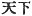

  
[Intangible Textual Heritage](../../index)  [Shinto](../index) 
[Index](index)  [Previous](kj056)  [Next](kj058) 

------------------------------------------------------------------------

[Buy this Book at
Amazon.com](https://www.amazon.com/exec/obidos/ASIN/B0028Y4SZY/internetsacredte)

------------------------------------------------------------------------

  
*The Kojiki*, translated by Basil Hall Chamberlain, \[1919\], at
Intangible Textual Heritage

------------------------------------------------------------------------

p. 177

## \[SECT. L.—EMPEROR JIM-MU (PART VII.—THE EMPIRE PACIFIED)\]

So then His Augustness Nigi-hayabi [1](#fn_975)
waited on and said to the august child of the Heavenly Deity: "As I
heard that \[thou\], the august child of the Heavenly Deity, hadst
descended from Heaven, I have followed

p. 178

down to wait on thee." Forthwith presenting to him the heavenly
symbols, [2](#fn_976) he respectfully served
him. So His Augustness Nigi-hayabi wedded the Princess of Tomi, [3](#fn_977) \[145\] sister of the Prince of Tomi,
and begot a child, His Augustness *Umashi-ma-ji*. [4](#fn_978) (He was the ancestor
of the Chiefs of the Warrior-Clan, [5](#fn_979)
of the Grandees of Hodzumi; [6](#fn_980) and of
the Grandees of the Neck-Clan). [7](#fn_981) So having thus subdued and pacified the
savage Deities, and extirpated the unsubmissive people, \[His Augustness
Kamu-yamato-ihare-biko\] dwelt at the palace of Kashibara [8](#fn_982) near Unebi [9](#fn_983) and ruled the Empire. [10](#fn_984)

------------------------------------------------------------------------

### Footnotes

[177:1](kj057.htm#fr_979) The component parts
of this name, rendered according to the analogy of that in Sect. XXXIII,
Note 5, may be interpreted to signify "Plenty-Swift." The genealogy of
this god is not known.

[178:2](kj057.htm#fr_980) *I.e.*, the swords,
quivers, bow, and arrows mentioned in Sect. XXXIII, as having been
brought down from Heaven by the divine attendants of the Emperor
Jim-mu's grandfather.

[178:3](kj057.htm#fr_981) *Tomi ya-bime*, The
syllable *ya* is inexplicable, but perhaps merely an Expletive.

[178:4](kj057.htm#fr_982) The signification of
this name is by no means clear; but, rendered according to the
characters with which it is written in the "Chronicles," it would mean
"Savoury-True-Hand."

[178:5](kj057.htm#fr_983) *Mononobe no
murazhi*. This and the two following are of course "gentile names."

[178:6](kj057.htm#fr_984) *Hodzumi no omi*.
Hodzumi, which is the name of a place, signifies "rice-ears piled up."

[178:7](kj057.htm#fr_985) *Une-be no omi*. The
interpretation of this name is given according is Motowori, who explains
that the members of this family,—in particular the female
members,—waited at the Emperor's table, and wore veils over their necks
when so employed. The name is commonly corrupted to *uneme*.

[178:8](kj057.htm#fr_986) Better known as
Kashihabara. The name signifies "oak-moor," or rather "a place planted
with oaks." This is usually, though without sufficient foundation,
reckoned the earliest of the historical capitals of Japan. It is in
Yamato.

[178:9](kj057.htm#fr_987) Unebi is the name of
a hill in Yamato. The etymology of the word is obscure.

[178:10](kj057.htm#fr_988) p. 179 *I.e.*, "ruled the Empire from his palace of
Kashibara near Unebi. For the expression 
 (literally "\[all\] beneath Heaven"), here rendered
"Empire," see Sect. XXVII, Note 13.

------------------------------------------------------------------------

[Next: Section LI.—Emperor Jim-mu (Part. VIII.—He Weds
I-suke-yori-hime)](kj058)
