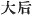
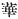
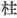

  
[Intangible Textual Heritage](../../index)  [Shinto](../index) 
[Index](index)  [Previous](kj057)  [Next](kj059) 

------------------------------------------------------------------------

[Buy this Book at
Amazon.com](https://www.amazon.com/exec/obidos/ASIN/B0028Y4SZY/internetsacredte)

------------------------------------------------------------------------

  
*The Kojiki*, translated by Basil Hall Chamberlain, \[1919\], at
Intangible Textual Heritage

------------------------------------------------------------------------

p. 179

## \[SECT. LI.—EMPEROR JIM-MU (PART. VIII.—HE WEDS [I-SUKE-YORI-HIME](errata.htm#34)).\]

So when he dwelt in Himuka, \[His Augustness Kamu-yamato-ihare-biko\]
wedded [1](#fn_985) Princess Ahira, [2](#fn_986) younger sister of the Duke of
Wobashi [3](#fn_987) in Ata, [4](#fn_988) and begot children: \[146\] there were
two, [5](#fn_989)—His Augustness
Tagishi-mimi, [6](#fn_990) next His Augustness
Kisu-mimi. [7](#fn_991) But when he sought for
a beautiful maiden to make her his Chief Empress, [8](#fn_992) His Augustness Oho-kume said: "There is
here a beauteous maiden who is called the august child of a Deity. The
reason why she is called the august child of a Deity is that the
Princess Seya-datara, [9](#fn_993) daughter of
Mizokuhi [10](#fn_994) of Mishima, [11](#fn_995) was admired on account of her beauty by
the Great-Master-of-Things the Deity of Miwa, [12](#fn_996) qui, quum pulchra puella oletum fecit,
in sagittam rubro \[colore\] fucatam se convertit, et ab inferiori parte
cloacae \[ad usum\] faciendi oleti virginis privatas partes transfixit.
Tunc pulchra virgo consternata est, et surrexit, et trepide fugit.
Statim sagittam attulit, et juxta thalamum posuit. Subito \[sagitta\]
formosus adolescens facta \[147\] est, qui cito pulchram puellam sibi in
matrimonio junxit, et filiam procreavit nomine
Hoto-tarara-i-susugi-hime; [13](#fn_997) et
est nomen alternativum Hime-tatara-i-suke-yori-hime. [14](#fn_998) (Id est posterior
mutatio nominis, quoniam abhorruit facere mentionem privatarum
partium). So therefore she is called the august child of a Deity.
Hereupon seven beauteous maidens were out playing on the moor of
Takasazhi, [15](#fn_999) and
I-suke-yori-hime [16](#fn_1000) was among
them. His Augustness Ohokume,

p. 180

seeing I-suke-yori-hime, spoke to the Heavenly Sovereign in a Song,
saying:

"Seven maidens on the moor of Takasazhi in Yamato:—which shall be
interlaced?" [17](#fn_1001)

Then I-suke-yori-hime was standing first among the beauteous maidens.
Forthwith the Heavenly Sovereign, having looked at the beauteous
maidens, and knowing in his august heart [18](#fn_1002) that I-suke-yori-hime was standing in
the very front, replied by a Song, saying:

"Even \[after nought but\] a fragment\[ary glimpse\], I will intertwine
the lovely \[one\] standing in the very front. [19](#fn_1003)

Then His Augustness Ohokume informed I-suke-yori-hime \[148\] of the
Heavenly Sovereign's decree, whereupon she, seeing the slit sharp
eyes [20](#fn_1004) of His Augustness Ohokume,
sang in her astonishment, saying:

|                                                                         |     |     |
|-------------------------------------------------------------------------|-----|-----|
| "                                                                       | ?   | ?   |
| "                                                                       | ?   | ?   |
| "Wherefore the slit sharp eye? [21](#fn_1005) |     |     |

Then His Augustness Ohokume replied by a Song, saying:

"My slit sharp eyes \[are\] in order to find the maiden
immediately." [22](#fn_1006)

So the maiden said that she would respectfully serve \[the Heavenly
Sovereign\]. [23](#fn_1007) Hereupon [24](#fn_1008) the house of Her Augustness [25](#fn_1009) I-suke-yori-hime was on \[the back
of\] the River Sawi. [26](#fn_1010) The
Heavenly Sovereign made a progress to the abode of I-suke-yori-hime, and
augustly slept \[149\] \[there\] one night. [27](#fn_1011) (The reason why
that river was called the River Sawi was that on the River's banks the
mountain-lily-plant grew in abundance. So the name of the
mountain-lily-plant was taken, and the designation

p. 181

of River Sawi \[bestowed\]. The name by which the
mountain-lily-plant was originally called was *sawi*).
Afterwards, when I-suke-yori-hime came and entered into the palace, the
Heavenly Sovereign sang augustly saying:

"In a damp hut on the reed-moor having spread layer upon layer of sedge
mats, we two slept! [28](#fn_1012)

The names of the august children thus born were: His Augustness
Hiko-ya-wi, [29](#fn_1013) next His Augustness
Kamu-ya-wi-mimi, [30](#fn_1014) next His
Augustness Kamu-nuna-kaha-mimi" [31](#fn_1015)
(Three Deities.) [32](#fn_1016)

p. 182 p. 183

------------------------------------------------------------------------

### Footnotes

[179:1](kj058.htm#fr_989) p. 181 Or, "*had* wedded"; for the episode here
related must be supposed to have taken place [before](errata.htm#35)
Jim-mu and his army started eastward on their career of conquest.

[179:2](kj058.htm#fr_990) *Ahira-hime*. Ahira
is supposed by Motowori to be the name of a place in Satsuma. Its
etymology is quite obscure.

[179:3](kj058.htm#fr_991) *Wobashi no kimi*.
Wobashi is supposed by Motowori to be the name of a place in Satsuma.
The characters with which it is generally written mean "small bridge."

[179:4](kj058.htm#fr_992) Ata is a place in
Satsuma.

[179:5](kj058.htm#fr_993) Or, "there were two
Deities." The character [employed](errata.htm#36) is not that which
itself actually signifies "deity," but is the Auxiliary
[Numeral](errata.htm#37) for divine beings.

[179:6](kj058.htm#fr_994) *I.e.*, perhaps
"rudder-ears."

[179:7](kj058.htm#fr_995) Motowori adduces good
reasons for believing this name to be but a slightly altered form of the
preceding one, and for holding that in the original form of the
tradition there was but one child mentioned.

[179:8](kj058.htm#fr_996) See Motowori's
Commentary, Vol. XX, pp. 10-15, for the reasons for thus interpreting
the characters   in the
text. Elsewhere it has generally, for the sake of convenience, been
simply rendered "Empress."

[179:9](kj058.htm#fr_997) *Seya-dotara-hime*.
The signification of the name is obscure. Motowori supposes *Seya* to be
a place and tatara (*nigori’ed* to *datara*) perhaps a plant written
with the Chinese character 
, said by Dr. Williams in his "Syllabic Dictionary" to
be possibly a species of *Heteroiropa*.

[179:10](kj058.htm#fr_998) It is uncertain
whether this name should, or should not, be p.
182 regarded as properly that of a place. The meaning is equally
obscure. The Chinese characters with which it is here written signify
"ditch-eater," whereas those employed in the "Chronicles" signify
"ditch-stake." Perhaps both transcriptions are simply phonetic.

[179:11](kj058.htm#fr_999) A district in the
province of Tsu (Settsu). The name signifies "three islands."

[179:12](kj058.htm#fr_1000)
*Miwa-no-oho-mono-mushi-no-kami*. This god is supposed to be identical
with Oho-kuni-nushi (the "Master of the Great Land," see end of Sect. XX
and following Sects). The rigidly literal rendering of the name as here
given would be "the Deity Great Master of Things of Miwa "; but the more
intelligible version here given represents the Japanese author's
meaning. For the traditional etymology of Miwa see the story related in
Sect LXV.

[179:13](kj058.htm#fr_1001) *Hoto* significat
partes privatas. Verbi *tatara* sensum supra s.v. *Seya-datara-hime*
pertractavimus. *I* est vox expletiva. *Susugi* sensus est "trepide
fugiens." *Hime* indicat regiam puellam.

[179:14](kj058.htm#fr_1002) *I.e.*, Princess
Tatara-Startled-Good-Princess.

[179:15](kj058.htm#fr_1003) Etymology obscure.

[179:16](kj058.htm#fr_1004) An abbreviated
form of the princess's alternative name.

[180:17](kj058.htm#fr_1005) The meaning of
this Song is: "To which of the seven maidens now disporting themselves
on the moor of Takasazhi shall I convey the Emperor's command to come
that he may make her his consort, and sleep with his arms intertwined in
hers?"—Motowori, overlooking the difference between mart, which is the
word in the text, and the *nigori*’ed form *magu* met with in some other
passages, misinterprets the last clause thus: "Which shall be sought?"
He makes the same mistake in his explanation of the next Song.

[180:18](kj058.htm#fr_1006) *I.e.*, "having a
presentiment."

[180:19](kj058.htm#fr_1007) The translation of
this Song follows Moribe's exegesis. Motowori interprets it thus; "Well,
well! I will seek the lovely one standing in the very front." As here
rendered, the little poem is quite clear,—simply a declaration on the
Emperor's part that he will make the girl standing in front his wife.

[180:20](kj058.htm#fr_1008) *Sakeru-to-me*,
the original of the phrase here rendered "slit sharp eyes," is obscure
and variously understood by the commentators. Moribe supposes the god to
have worn a casque with a vizor, and the slit to have been made in the
latter, and not actually in, or rather near, the eyes. It should however
be observed that, though the Japanese word *saku* means "to slit," the
Chinese character in the text properly signifies p.
183 "to tattoo (or brand) with ink," and is used with that
meaning at the end of Sect. CXLIX, and elsewhere in the ancient books.
The present writer, after comparing various passages in which the term
occurs, thinks that we may understand a [tattooing](errata.htm#38) of
the outer corners of the eyes, which would give to the latter the
appearance of being long and sharp, or, if the tattooing were very dark,
of being actually slit.

[180:21](kj058.htm#fr_1009) The first lines of
this short poem are so hopelessly unintelligible that the commentators
are not even agreed as to how the syllables composing them should be
divided into words. For the straits to which Motowori and his
predecessors were driven in their efforts to obtain some plausible
signification, see his Commentary, Vol. XX, pp. 27-29, and for Moribe's
totally divergent interpretation see "*Idzu no Koto-waki*," Vol. II, pp.
30-31. It is not worth while to quote here more such conjectures.—For
the doubt attaching to the precise signification of the words rendered
by "slit sharp eyes," see the preceding Note.

[180:22](kj058.htm#fr_1010) The signification
of his Song is as plain as that of the preceding one is obscure.

[180:23](kj058.htm#fr_1011) *Q.d.*, as his
wife.

[180:24](kj058.htm#fr_1012) This initial
expression is meaningless.

[180:25](kj058.htm#fr_1013) Having become the
Emperor's consort, this Honorific title is now prefixed for the first
time to her name.

[180:26](kj058.htm#fr_1014) *Sawi-gaha*.
*Sawi*, as we learn from the compiler's note below, was the name of a
kind of lily.

[180:27](kj058.htm#fr_1015) Literally, "one
sojourn."

[181:28](kj058.htm#fr_1016) The signification
of this Song is: "Now indeed thou comest to share the majesty of the
palace. But the beginning of our intimacy was on that night when I came
to thy humble dwelling on the reed-grown moor where, when we slept
together, we had to pile mat upon mat to keep out the damp."—The
translator has followed Moribe's interpretation throughout. Motowori
takes in the sense of "ugly" the word here rendered "damp," and all the
previous commentators give a different explanation of the words *iya
saya shikite*, here translated by "spreading layer upon layer." They
take them to mean "spreading more land more [cleanly](errata.htm#39)."

[181:29](kj058.htm#fr_1017) This name may
signify "prince eight-wells." But the interpretation of *ya wi* as
"eight wells" in his and the following name is doubtful.

[181:30](kj058.htm#fr_1018) This name may
signify "divine-eight-wells-ears." But see preceding Note.

[181:31](kj058.htm#fr_1019) p. 184 This name may signify
"divine-lagoon-river-ears." But perhaps Nuna-kaha is the name of a
place.

[181:32](kj058.htm#fr_1020) The character in
the text is not actually "Deity," but 
 *hashira*, the Auxiliary Numeral for Deities, which
is constantly throughout these "Records" used in speaking of members of
the Imperial family.

------------------------------------------------------------------------

[Next: Section LII.—Emperor Jim-mu (Part. IX—Troubles Which Followed His
Decease).](kj059)
