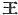
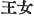

  
[Intangible Textual Heritage](../../index)  [Shinto](../index.md) 
[Index](index)  [Previous](kj062)  [Next](kj064.md) 

------------------------------------------------------------------------

[Buy this Book at
Amazon.com](https://www.amazon.com/exec/obidos/ASIN/B0028Y4SZY/internetsacredte.md)

------------------------------------------------------------------------

  
*The Kojiki*, translated by Basil Hall Chamberlain, \[1919\], at
Intangible Textual Heritage

------------------------------------------------------------------------

## \[SECT. LVI.—EMPEROR AN-NEI.\]

His Augustness Shiki-tsu-hiko-tama-de-mi dwelt in the palace of Ukiana
at Kata-shiha, [1b](#fn_1055.md) and ruled the
Empire. This Heavenly Sovereign wedded Akuto-hime, [2b](#fn_1056.md) daughter of the Departmental Lord
Haye, [3b](#fn_1057.md) elder brother of
Kaha-mata-bime, and begot august children: His Augustness

p. 190

\[paragraph continues\]
Toko-ne-tsu-hiko-irone, [4](#fn_1058.md) next His
Augustness Oho-yamato-hiko-suki-tomo, [6](#fn_1060.md) next His Augustness
Shiki-tsu-hiko. [5](#fn_1059.md) Of the august
children of this Heavenly Sovereign,—three Deities,—His Augustness
Oho-yamato-hiko-suki-tomo \[was he who afterwards\] ruled the Empire.
There were two Kings, [7](#fn_1061.md) children
of the next \[brother\], His Augustness \[155\] Shiki-tsu-hiko. One
child [8](#fn_1062.md) (was
the ancestor of the Territorial Lords of Suchi in Iga, [9](#fn_1063.md) of the Territorial Lords of
Nabari, [10](#fn_1064.md) and of the Territorial
Lords of Minu); [11](#fn_1065.md) one
child, [12](#fn_1066.md) His Augustness
Wa-chi-tsumi, [13](#fn_1067.md) dwelt in the
palace of Miwi in Ahaji. [14](#fn_1068.md) So
this King had two daughters: the name of the elder was Hahe-irone, [15](#fn_1069.md) and another name for her was Her
Augustness Princess Oho-yamato-kuni-are: [16](#fn_1070.md) the name of the younger was
Hahe-irodo. [17](#fn_1071.md) The Heavenly
Sovereign's august years were forty-nine. Augustness mausoleum est in
privatis partibus Montis Unebi. [18](#fn_1072.md)

p. 191

------------------------------------------------------------------------

### Footnotes

[189:1b](kj063.htm#fr_1059.md) In Kahachi:
*uki-ana* signifies "floating hole," *Kata-shiha* is said to signify
"hard rock" (*kata-iha*); but this seems doubtful, and the reading given
by the characters in the text is not *Kata-shiha*, but *Kata-shiho*.

[189:2b](kj063.htm#fr_1060.md) *I.e.*, Princess
of Akuto, or Akuta,—for the latter form of the name is more common.
There exists a place thus called in Settsu. The derivation of the word
is obscure.

[189:3b](kj063.htm#fr_1061.md)
*Agata-nushi-Haye*. The reading of this name is obscure, and its,
derivation uncertain.

[190:4](kj063.htm#fr_1062.md) *Irone* signifies
"elder brother" or "elder sister." The rest of the compound is obscure.

[190:5](kj063.htm#fr_1064.md) The first three
elements of the compound signify "Great Yamato Prince." The last two are
obscure, but Motowori identifies *suki* (see Note 3 to preceding Sect.)

[190:6](kj063.htm#fr_1063.md) *I.e.*, "Prince of
Shiki"; so called, it is supposed, with reference to the place of
residence of his grandfather.

[190:7](kj063.htm#fr_1065.md) The character thus
translated is  , of which
"King "is the original and proper signification. To judge by some other
passages in the ancient histories, it had not yet in the 8th century
altogether paled to p. 191 the lesser meaning
of "prince," which has belonged to it in later times when denoting
Japanese personages. It is still, as far as possible, used to denote the
rulers of all countries excepting Japan, the zealous admirers of the
native literature and institutions even designating by it the Emperor of
China, who, one would have thought, had a special right to the more
Honorific title of Emperor, which his own subjects were the first to
invent. On the whole, therefore, "King "seems to be the most appropriate
[rendering](errata.htm#41.md). The characters 
 are, by analogy, rendered "Queen."

[190:8](kj063.htm#fr_1066.md) The text has
"descendant"; but it must here be corrupt or at least faulty, as may be
seen by the omission of the proper name.

[190:9](kj063.htm#fr_1067.md) *Iga no Suchi no
inaki*. The etymology of *Iga* and that of *Suchi* are alike obscure.
See however Motowori's Commentary, Vol. XXI, p. 13, for the traditional
derivation of the former. It is the name of a small province which in
very ancient times formed part of the province of Ise.

[190:10](kj063.htm#fr_1068.md) *Nabari no inaki*.
Nabari is in Iga. The name signifies, "hiding."

[190:11](kj063.htm#fr_1069.md) *Minu no inaki*.
Minu, not to be confounded with the province of the same name, is a
place in Iga. The name probably signifies "three moors."

[190:12](kj063.htm#fr_1070.md) *I.e.*, the other
child.

[190:13](kj063.htm#fr_1071.md) Motowori reads
*Chichitsumi*. In any case, the name remains obscure.

[190:14](kj063.htm#fr_1072.md) For Ahaji see
Sect. VI, Note 3. *Mi-wi* signifies "august well," and the name is
traced to the custom of bringing water from the Island of Ahaji for use
in the Imperial Palace, as mentioned in Sect. CXXIX of the present work,
and elsewhere in the early literature.

[190:15](kj063.htm#fr_1073.md) *Irone* means
"elder sister." *Hahe* is of uncertain import, it being written with
completely different characters in the two histories.

[190:16](kj063.htm#fr_1074.md)
*Oho-yamato-kuni-are-hime-no-mikoto*. *Ono-yamato-kuni* signifies "the
land of Great Yamato," and *hime* signifies "princess "or "maiden."
Motowori suggests that *are*, which is an obscure word, may signify
"pure."

[190:17](kj063.htm#fr_1075.md) *Irodo* signifies
"younger sister." For *hahe* *conf*. Note 15.

[190:18](kj063.htm#fr_1076.md) *Scil*. in
interiori parte montis, *e.g.* in spelunca. Motowori explains the use of
the term by reference to such words as foot, where the name of a portion
of the human body is applied to a mountain. In Japanese there are others
besides *ashi* ("foot"), such as *itadaki*, *hara* and *koshi*.

------------------------------------------------------------------------

[Next: Section LVII.—Emperor I-toku](kj064.md)
