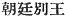
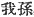
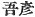

  
[Intangible Textual Heritage](../../index)  [Shinto](../index) 
[Index](index)  [Previous](kj068)  [Next](kj070) 

------------------------------------------------------------------------

[Buy this Book at
Amazon.com](https://www.amazon.com/exec/obidos/ASIN/B0028Y4SZY/internetsacredte)

------------------------------------------------------------------------

  
*The Kojiki*, translated by Basil Hall Chamberlain, \[1919\], at
Intangible Textual Heritage

------------------------------------------------------------------------

p. 205

## \[SECT. LXII.—EMPEROR KAI-KUWA.\]

His Augustness Waka-yamato-ne-ko-hiko-ōho-bibi dwelt in the palace of
Izakaha at Kasuga, [1](#fn_1202) and ruled the
Empire. This Heavenly Sovereign wedded the Princess of Takanu, [2](#fn_1203) daughter of Yugori [3](#fn_1204) the Great Departmental Lord of
Taniha, [4](#fn_1205) and begot an august
child: His \[167\] Augustness Hiko-yumusumi, [5](#fn_1206) (one
Deity). Again he wedded his step-mother, Her Augustness
I-gaka-shiko-me, [6](#fn_1207) and begot
august children: His Augustness Mima-kiri-biko-iniwe; [7](#fn_1208) next Her Augustness Mima-tsuhime [8](#fn_1209) (two
Deities). Again he wedded Her Augustness Oke-tsu-hime, [9](#fn_1210) younger sister of His Augustness
Hiko-kuni-oketsu, [10](#fn_1211) ancestor of
the Grandees of Wani, [11](#fn_1212) and begot
an august child: King Hiko-imasu [12](#fn_1213) (one
Deity). Again, wedding Princess Washi, [13](#fn_1214) daughter of the Noble
Kadzuraki-no-tarumi, [14](#fn_1215) he begot
an august child,—King Take-tayo-hadzura-wake [15](#fn_1216) (one
Deity); The august children of this Heavenly Sovereign
\[numbered\] in all five Deities (four Kings and one Queen), So His
Augustness Mi-maki-iri-biko-iniwe \[was he who afterwards\] ruled the
Empire. The children of his elder brother, King Hiko-yumusumi were: King
Oho-tsutsuki-tari-ne; [16](#fn_1217) next King
Sanugi-tari-ne [17](#fn_1218) (two Kings). There \[168\] were five Deities
daughters of these two Kings. Next King Hiko-imasu wedded the Princess
of Yena in Yamashiro, [18](#fn_1219) another
name for whom was Kari-bata-tobe, [19](#fn_1220) and begot children: King
Ohō-mata; [20](#fn_1221) next King
Wo-mata; [21](#fn_1222) next King Noble
\[of?\] Shibumi [22](#fn_1223) (three Deities). Again, wedding
Saho-no-oho-kurami-tome, [23](#fn_1224)
daughter of Take-kuni-katsu-tome, of Kasuga, [24](#fn_1225) he begot children: King
Saho-biko; [25](#fn_1226) next King
Wo-zaho; [26](#fn_1227) next Her Augustness
Saho-bime, [27](#fn_1228) another name for
whom is Sahaji-hime [28](#fn_1229)

p. 206

\[paragraph continues\] (Her Augustness Saho-bime here mentioned was consort of the
Heavenly Sovereign Ikume); [29](#fn_1230) and King Muro-biko, [30](#fn_1231) (four Deities). Again, wedding
Okinaga-no-midzu-yori-hime, [31](#fn_1232)
daughter of the \[169\] Heavenly Deity Mikage, [32](#fn_1233) who is held in reverence by the
deacons of Mikami in Chika-tsu-Afumi, [33](#fn_1234) he begot children: King
Tatatsu-michi-no-ushi, Prince of Taniha; [34](#fn_1235) next King Midzuho-no-ma-wa-ka; [35](#fn_1236) next King Kamu-oho-ne, [36](#fn_1237) another name for whom is King
Yatsuri-iri-biko; [37](#fn_1238) next
Midzuho-no-i-ho-yori-hime; [38](#fn_1239) next
Mimi-tsu-hime; [39](#fn_1240) (three Deities). Again, wedding his mother's younger
sister Her Augustness Woke-tsu-hime, [40](#fn_1241) he begot children: King Ma-wata of
Oho-tsutsuki in Yamashiro; [41](#fn_1242) next
King Hiko-osu; [42](#fn_1243) next king
Iri-ne [43](#fn_1244) (two
Deities). Altogether the children of King Hiko-imasu \[numbered\]
in all eleven Kings. So the children of the elder brother King Oho, mata
were: King Ake-tatsu; [44](#fn_1245) next King
Unakami [45](#fn_1246) \[170\] (two Deities). This King Ake-tatsu (was the ancestor of the Dukes of the Homuji Tribe in
Ise [46](#fn_1247) and of the Rulers of Sana
in Ise) [47](#fn_1248) King Una-kami
(was the ancestor of the Dukes of
Himeda. [48](#fn_1249) The next King
Wo-mata (was the ancestor of the Dukes of Magari in
Tagima). [49](#fn_1250) The next King
Noble Shibumi (was the ancestor of the Dukes of Sasa) [50](#fn_1251) The next King Saho-biko (was the ancestor of the Chiefs of the Kusaka Tribe [51](#fn_1252) and of the Rulers of the Land of
Kahi). [52](#fn_1253) The next, King
Wo-zaho (was the ancestor of the Lords of
Kadzunu [53](#fn_1254) and the Lords of Kanu
in Chika-tsu-Afumi.) [54](#fn_1255) The
next King Muro-biko (was the ancestor of the Lords
of Mimi in Wakasa.). [55](#fn_1256)
King Michi-no-ushi wedded the Lady Masu of Kahakami in Taniha, [56](#fn_1257) and begot children: Her Augustness
Princess Hibasu; [57](#fn_1258) next Her
Augustness Princess Matonu; [58](#fn_1259)
next Her Augustness Oto-hime; [59](#fn_1260)
next King Mi-kado-wake [60](#fn_1261) (four Deities). This King Mikado-wake \[171\] (was the ancestor of the Lords of Ho in
Mikaha). [61](#fn_1262) Prince
Midzuho-no-ma-waka, younger brother of this King Michi-no-ushi,

p. 207

\[paragraph continues\] (was the ancestor of the Suzerains of Yasu in
Chika-tsu-Afumi). [62](#fn_1263) The
next, King Kamu-oho-be (was the ancestor of the
\[Rulers of\] the Land of Minu, [63](#fn_1264)
of the Rulers of the land of Motosu, [64](#fn_1265) and of the Chiefs of the Nagahata
Tribe) [65](#fn_1266) The next, King
Mawaka of Oho-tsutsuki in Yama-shiro wedded Princess Ajisaha of
Mone, [66](#fn_1267) daughter of his younger
brother Irine, and begot a child: King Kami-me-ikadzuchi. [67](#fn_1268) This King wedded Princess
Takaki, [68](#fn_1269) daughter of the Grandee
Tohotsu of Taniha [69](#fn_1270) and begot a
child: King Noble Okinaga. [70](#fn_1271) This
king wedded the Princess of Takanuka in Kadzuraki, [71](#fn_1272) and begot children: Her Augustness
Princess Okinaga-tarashi [72](#fn_1273) next
Her Augustness Sora-tsu-hime; [73](#fn_1274)
next King Prince Okinaga [74](#fn_1275) (three Deities. This \[172\] King was the ancestor of the
Dukes of Homuji in Kibi, [75](#fn_1276) and of
the Dukes of Aso in Harima). [76](#fn_1277) Again King Noble Okinaga wedded
Princess Inayori of Kahamata [77](#fn_1278)
and begot a child: King Oho-tama-saka [78](#fn_1279) (This was the
ancestor of the Rulers of the land of Tajima). [79](#fn_1280) The above-mentioned
Take-toyo-hadzu-ra-wake (was the ancestor of the
Grandees of Chimori, [80](#fn_1281) of the
Rulers of the Oshinumi Tribe, [81](#fn_1282)
of the Rulers of the Mima Tribe, [82](#fn_1283) of the Oshinumi Tribe in Inaba, [83](#fn_1284) of the Lords of Takanu in
Taniba, [84](#fn_1285) and of the Abiko of
Yosami). [85](#fn_1286) The Heavenly
Sovereign's august years were sixty-three. His august mausoleum is at
the top of the hill of Izakaha. [86](#fn_1287)

p. 208 p. 209
p. 210 p. 211

------------------------------------------------------------------------

### Footnotes

[205:1](kj069.htm#fr_1206) p. 207 For Kasuga see Sect. LVIII, Note 7. Izakaha
is a place in Yamato. The signification of the name is uncertain.

[205:2](kj069.htm#fr_1207) *Takanu-hime*.
Takanu is the name of a district in Tango, and signifies "bamboo moor."

[205:3](kj069.htm#fr_1208) The signification
of this name is quite obscure.

[205:4](kj069.htm#fr_1209) *Taniha no
oho-agata-nushi*. *Taniha* (modern *Tamba*) is the name of a province
(formerly including the province of Tango) in Central Japan. It is
supposed to mean "the place of rice-fields," the rice offered at the
shrine of the Sun-Goddess in Ise being brought thence.

[205:5](kj069.htm#fr_1210) p. 208 *Hiko* signifies "prince." The other
syllables of tie name are obscure.

[205:6](kj069.htm#fr_1211) See Sect. LXI, Note
8.

[205:7](kj069.htm#fr_1212) *Biko* (*hiko*)
signifies "prince." The other elements of this compound are obscure.

[205:8](kj069.htm#fr_1213) One is tempted to
render this name by Princess of Mima. But there is no authority for
regarding Mima either in this or in the preceding personal name as
originally the name of a place.

[205:9](kj069.htm#fr_1214) Motowori has no
explanation to offer of the syllables Oke-tsu. *Hime* means "princess."

[205:10](kj069.htm#fr_1215) *Hiko* means
"prince "and *kuni* means "country.

[205:11](kj069.htm#fr_1216) *Wani no omi*.
*Wani* is a place in Yamato, and there is a pass or hill of that name
(*Wani-zaka*). The only signification belonging to the word wani is
"crocodile."

[205:12](kj069.htm#fr_1217) *Hiko-imasu no
miko*. Signification obscure.

[205:13](kj069.htm#fr_1218) Or "the Princess
of Washi "or "the Eagle Princess." In Japanese *Washihime*.

[205:14](kj069.htm#fr_1219) *Kadzuraki* is the
name of a district in Yamato, and Motowori believes Tarumi to be the
name of a place in Settsu.

[205:15](kj069.htm#fr_1220)
*Take-toyo-hadzura-wake no miko*. The first two elements of the compound
signify respectively "brave "and "luxuriant" while the last probably
means "lord." The signification of *hadzura* is obscure.

[205:16](kj069.htm#fr_1221)
*Oho-tsutsuki-tari-ne no miko*. Tsutsuki being the name of a district in
Yamashiro, the whole compound signifies "prince great sufficing lord of
great Tsutsuki."

[205:17](kj069.htm#fr_1222) *Sanugi-tari-ne no
miko*, *i.e.*, "prince sufficing lord of Sanugi," (Sanuki,—see Sect. V,
Note 6).

[205:18](kj069.htm#fr_1223) *Yamashiro no Yena
tsu Hime*. Yamashiro is the name of a province, and Yena that of a place
in Settsu. The signification of the latter name is obscure.

[205:19](kj069.htm#fr_1224) Motowori believes
*Karibata* to be the name of a place, and *tobe* (*to-me*) to signify
"old woman," as in the name *Ishi-ko-ri-do-me*, which latter is however
extremely obscure (see Sect. XVI, Note 12).

[205:20](kj069.htm#fr_1225) *Oho-mata no
miko*. The signification of this name and of the parallel name of the
younger brother is obscure.

[205:21](kj069.htm#fr_1226) *Wo-mata no miko*.

[205:22](kj069.htm#fr_1227) *Shibumi no Sukune
no miko*. Shibumi is probably the name of a place, there being a Shibumi
in Ise.

[205:23](kj069.htm#fr_1228) *Saho* is the name
of a well-known place in Yamato, and *Kurami* p.
209 is supposed by Motowori to be the name of a place in Wakasa.
*Oho* means "great," and *tome*, according to Motowori, means "old
woman" or simply "female." *Conf*. Note 19.

[205:24](kj069.htm#fr_1229) *Kasuga no
Take-kuni-katsu-tome*. Motowori supposes this to be the name, not of the
father, but the mother of the princess just mentioned. *Take* signifies
"brave," and *kuni* "land." The meaning of *katsu* is obscure.

[205:25](kj069.htm#fr_1230) *Saho-biko no
miko*, *i.e.*, "Prince of Saho."

[205:26](kj069.htm#fr_1231) *Wō-zaho no miko*,
*i.e.*, "little (*q.d.* 'younger') prince of Saho."

[205:27](kj069.htm#fr_1232) *I.e.*, the
princess of Saho.

[205:28](kj069.htm#fr_1233) It is uncertain
whether we should understand this name to signify "princess Sahaji" or
"the princess of Sahaji," but the latter seems the more probable.

[206:29](kj069.htm#fr_1234) *I.e.*, the
Emperor Sui-nin.

[206:30](kj069.htm#fr_1235) *More-biko no
miko*. *Muro-biko* signifies "Prince of Muro." Muro being a place in
Yamato. It signifies "dwelling "and specially "cave."

[206:31](kj069.htm#fr_1236) *I.e.*,
"flourishing and good princess of Okinaga," the latter being the name of
a place in Afumi (Omi). Its signification is not clear.

[206:32](kj069.htm#fr_1237) *Ame no Mikaga no
kami*. The signification of Mikaga is obscure, as is also the connection
between this deity and the deacons of Mikami.

[206:33](kj069.htm#fr_1238) The signification
of the name Mikami is obscure. The word rendered "deacon" is *hufuri*,
the name of an inferior class of Shinto priests. See for a discussion of
the etymology of the word, etc., Mr. Satow's remarks on p. 112 of Vol.
VII of these Transactions. For Chika-tsu-Afumi see Sect. XXIX, Note 20.

[206:34](kj069.htm#fr_1239) *Tanika no hiko
Tatatsu-michi-no-ushi no miko*. The signification of *Tatatsu* is
obscure, but we may accept it as the personal name of the worthy here
mentioned. *Michi-no-ushi* means "master of the road," *i.e.* "lord of
the province."

[206:35](kj069.htm#fr_1240) *Midzuho no
ma-waka no miko*, *i.e.* "the True Young King of Midzuho," Midzuho being
the name of a place in Afumi. It probably means "fresh young rice-ears."

[206:36](kj069.htm#fr_1241) *Kamu-oho-ne no
miko*, *i.e.*, probably, "prince divine great lord."

[206:37](kj069.htm#fr_1242) *Yatsuri-iri-biko
no miko*. Yatsuri is the name of a village in Yamato, and is of
uncertain origin. The signification of *iri* obscure.

[206:38](kj069.htm#fr_1243) *I-ho* signifies
"five hundred "and *yori* probably signifies "good." The compound may
therefore be taken to mean "manifoldly excellent princess of Midzuho."

[206:39](kj069.htm#fr_1244) p. 210 *I.e.*, probably "the Princess Miwi"
(Miwi-dera in Afumi). *Mi-wi* signifies "three wells."

[206:40](kj069.htm#fr_1245) This name is
parallel to that which has been commented on in Note 9 to this Section.

[206:41](kj069.htm#fr_1246)
*Yamashiro-no-oho-Tsutsuki no ma-waka no miko*. All the elements of this
compound have already appeared in this Section.

[206:42](kj069.htm#fr_1247) *Hiko-osu no
miko*. The signification of osu is obscure,

[206:43](kj069.htm#fr_1248) *Iri-ne no miko*.
Signification obscure.

[206:44](kj069.htm#fr_1249) *Ake-tatsu no
miko*. See Sect. LXXII, Note 20.

[206:45](kj069.htm#fr_1250) *Unakami no miko*.
See Sect. LXXII, Note 19.

[206:46](kj069.htm#fr_1251) *Ise no Homuji-be
no kimi*. See the mention of the establishment of this Clan at the end
of Sect. LXXII.

[206:47](kj069.htm#fr_1252) *Ise no Sana no
miyatsuko*. The etymology of Sana is obscure.

[206:48](kj069.htm#fr_1253) *Himeda no kimi*.
Himeda is a place in Afumi. The signification of the name is obscure.

[206:49](kj069.htm#fr_1254) *Tagima no Magari
no kimi*. Tagima is the name of a district in Yamato, and is of
uncertain origin. Magari is the name of a place, and means "crook "or
"bend."

[206:50](kj069.htm#fr_1255) *Sasa no kimi*:
Sasa is the name of a place in Iga, and is of uncertain signification.

[206:51](kj069.htm#fr_1256) *Kusakabe no
murazhi*.

[206:52](kj069.htm#fr_1257) *Kahi no kuni no
miyatsuko*. For Kahi see Sect. LXXXVI, Note 1.

[206:53](kj069.htm#fr_1258) *Kadzunu no wake*.
Kadzunu is the name of a district in Yamashiro, and signifies "pueraria
moor."

[206:54](kj069.htm#fr_1259) *Chika-tsu-Afumi
no Kanu no wake*. Kanu is a village in Afumi. The name is written with
characters signifying "mosquito moor."

[206:55](kj069.htm#fr_1260) *Wakasa no Mimi no
wake*. Mimi is the name of a village, and is of uncertain signification.

[206:56](kj069.htm#fr_1261) *Taniha no
Kahakami no Masu no iratsume*. Masu is of uncertain. derivation.
Kahakami is the name of a village, now comprised in the province of
Tango. It signifies "river-land."

[206:57](kj069.htm#fr_1262) *Hibasu-hime*. The
signification of this name is obscure.

[206:58](kj069.htm#fr_1263) *Matonu-hime*. The
signification of this name is obscure.

[206:59](kj069.htm#fr_1264) *I.e.*, "the
younger princess."

[206:60](kj069.htm#fr_1265) This name, which
is written  , is curious,
and Motowori has no suggestion to make touching its interpretation.

[206:61](kj069.htm#fr_1266) *Mikaha no Ho no
wake*. Ho is the name of a district, and is of obscure derivation.
Mikaha is the name of a maritime province. It p.
211 signifies "three rivers," with reference to two large rivers
which flow through it and to another which forms the boundary between it
and the province of Wohari.

[207:62](kj069.htm#fr_1267) *Chika-tsu-Afumi
no Yasu no atahe*. Yasu is the name of a district, and is of uncertain
origin.

[207:63](kj069.htm#fr_1268) *Minu no kuni no*
\[*miyatsuko*\]. The word *miyatsuko*, which is not in the text, is
supplied in Motowori's *kana* reading.

[207:64](kj069.htm#fr_1269) *Motosu no kuni no
miyatsuko*. Motosu is the name of a district in Mino, and seems to
signify "original dwelling-place."

[207:65](kj069.htm#fr_1270) *Nagahata-be no
murazhi*. Nagahata is the name of a place in Hitachi, and seems to
signify "long loom."

[207:66](kj069.htm#fr_1271) *Mone no
Ajisaha-bime*. This name is particularly obscure, and Mone probably
corrupt.

[207:67](kj069.htm#fr_1272) *Kani-me-ikadzuchi
no miko*. Motowori thinks that this name signifies "fierce like a crab's
eye," with reference perhaps to some personal peculiarity of the prince
who bore it.

[207:68](kj069.htm#fr_1273) *Takaki-hime*.
This name is obscure and perhaps corrupt.

[207:69](kj069.htm#fr_1274) *Taniha no Tohotsu
omi*. This name is obscure.

[207:70](kj069.htm#fr_1275) *Okinaga no sukune
no miko*. For Okinaga see Note 31 to this Section.

[207:71](kj069.htm#fr_1276) *Kadzuraki no
Takanuka-hime*. Takanuka is the name of a place in Yamato. It is written
with characters. signifying "high brow."

[207:72](kj069.htm#fr_1277)
*Okinaga-tarashi-hime*. Okinaga is the name of a place (see Note 31).
*Tarashi* is an honorific designation, signifying literally
"sufficient," *i.e.*, "perfect," and is supposed by Motowori to have
been bestowed after death on this princess, who was. the celebrated
conqueror of Korea, and is better known to fame by her "canonical name"
of Jingō Kōgō.

[207:73](kj069.htm#fr_1278) *I.e.*, "the
princess of the sky."

[207:74](kj069.htm#fr_1279) *Okinaga-hiko no
miko*.

[207:75](kj069.htm#fr_1280) *Kibi no Homuji no
kimi*. Homuji is the name of a district in the modern province of Bingo,
and may perhaps be of Chinese origin.

[207:76](kj069.htm#fr_1281) *Harima no Aso no
kimi*. Aso is the name of a place, and is of uncertain origin.

[207:77](kj069.htm#fr_1282) *Kahamata no
Ina-yori-bime*. Kahamata ("river-fork") is the name of a place in
Kohachi. *Ina* signifies "rice," and *yori* probably signifies "good "in
this and numerous other proper names.

[207:78](kj069.htm#fr_1283) *Oho-tamu-saka no
miko*. This name is obscure. Motowori thinks that *Tamu-saka* may be the
name of a place, and signifying "winding ascent."

[207:79](kj069.htm#fr_1284) p. 212 *Tajima no kuni no miyatsuko*. For *Tajima*
see Sect. LXXIV, Note 1.

[207:80](kj069.htm#fr_1285) *Chi-mori no omi*.
*Chi-mori* signifies "road-keeper," and perhaps we should translate this
"gentile name," by "road-keeping grandees," and suppose that anciently
they may have performed some functions in which the bestowal of it
originated.

[207:81](kj069.htm#fr_1286) *Oshinumi-be no
miyatsuko*. Oshinumi is the name of a district in Yamato, and is of
uncertain import.

[207:82](kj069.htm#fr_1287) *Mina-be no
miyatsuko*. Perhaps we should rather translate thus, "the Rulers of
Minabe," for the name is altogether obscure.

[207:83](kj069.htm#fr_1288) *Inaba no
Oshinumi-be*. Motowori supposes a branch of this family, which was
originally established in Yamato, to have removed to the province of
Inaba.

[207:84](kj069.htm#fr_1289) *Taniha no Takanu
no wake*. Takanu is the name of a district in the modern province of
Tango. It signifies "high moor."

[207:85](kj069.htm#fr_1290) *Yosami no obiko*.
Yosami is the name of a place in Kahachi and is of uncertain origin,
though the legends connect with the word and, "a net" (see Motowori's
Commentary, Vol. XXII, p. 81). It is chiefly known on account of its
lake or pool, which is often mentioned in the early poetry. Abiko is a
very rare "gentile name," which in the "Catalogue of Family Names "is
written with the characters 
, but is derived by Motowori from  , *i.e.*, "my grandchildren."

[207:86](kj069.htm#fr_1291) In Yamato. The
name is of uncertain origin.

------------------------------------------------------------------------

[Next: Section LXIII.—Emperor Sū-jin (Part I.—Genealogies)](kj070)
