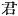
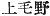
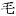

  
[Intangible Textual Heritage](../../index)  [Shinto](../index.md) 
[Index](index)  [Previous](kj069)  [Next](kj071.md) 

------------------------------------------------------------------------

[Buy this Book at
Amazon.com](https://www.amazon.com/exec/obidos/ASIN/B0028Y4SZY/internetsacredte.md)

------------------------------------------------------------------------

  
*The Kojiki*, translated by Basil Hall Chamberlain, \[1919\], at
Intangible Textual Heritage

------------------------------------------------------------------------

p. 212 \[173\]

## \[SECT. LXIII.—EMPEROR SŪ-JIN (PART I.—GENEALOGIES).\]

His Augustness Mima-ki-iri-biko-iniwe dwelt at the Palace of Midzu-gaki
at Shiki, [1](#fn_1288.md) and ruled the Empire.
This Heavenly Sovereign wedded Tohotsu-no-ayu-me-me-kuhashi, [2](#fn_1289.md) daughter of Arakaha-to-be, [3](#fn_1290.md) Ruler of the land of Ki, [4](#fn_1291.md) and begot august children: His
Augustness Toyo-ki-iri-biko, [5](#fn_1292.md) and
next Her Augustness Toyo-suki-iri-bime [6](#fn_1293.md) (two
Deities). Again, wedding the Great Princess of Ama, [7](#fn_1294.md) ancestress of the Chiefs of
Wohori, [8](#fn_1295.md) he begot august
children: His Augustness Oho-iri-ki; [9](#fn_1296.md) next His Augustness

p. 213

\[paragraph continues\]
Ya-saka-no-iri-biko; next Her Augustness Nuna-ki-no-iri-bime; next Her
Augustness Towochi-no-iri-bime [10](#fn_1297.md)
(four Deities). Again, wedding Her Augustness
Princess Mimatsu, [11](#fn_1298.md) daughter of
His Augustness Oho-biko, he begot august children: His Augustness
Ikume-iri-biko-isachi [12](#fn_1299.md) next His
Augustness Iza-no-ma-waka; [13](#fn_1300.md) next
Her Augustness Princess Kuni-kata; [14](#fn_1301.md) next Her Augustness \[159\] Princess
Chiji-tsuku-yamato; [15](#fn_1302.md) next Her
Augustness Princess Iga; [16](#fn_1303.md) next
His Augustness Yamato-Hiko [17](#fn_1304.md)
(six Deities). The august children of this
Heavenly Sovereign \[numbered\] in all twelve Deities (seven Kings and Queens). So His Augustness
Ikume-iri-biko-isachi \[was he who afterwards\] ruled the Empire. The
next, His Augustness Toyo-ki-iri-biko (was the
ancestor \[of the Dukes\] of Kami-tsu ke-nu, [18](#fn_1305.md) and the Dukes of
Shimo-tsu-ke-nu). [19](#fn_1306.md) The
younger sister, Her Augustness Princess Toyo-Suki (was high-priestess of [20](#fn_1307.md) the temple of the Great Deity of
Ise.) [21](#fn_1308.md) The next brother,
His Augustness Oho-iri-ki (was ancestor of the
Grandees of Noto). [22](#fn_1309.md) The
next, His Augustness Yamato-hiko,—(in the time of
this King a hedge of men was the first time set in the
mausoleum). [23](#fn_1310.md)

p. 214

------------------------------------------------------------------------

### Footnotes

[212:1](kj070.htm#fr_1292.md) p. 213 In Yamato. *Shiki* probably signifies "stone
castle" (*ishi-ki*). *Midzugaki* signifies "fresh young hedge,"—an
Honorific designation of the hedge round the Emperor's abode, which
passed into a Proper Name.

[212:2](kj070.htm#fr_1293.md) According to
Motowori's exegesis, this name is a rather remarkable instance of verbal
usage, *ayu-me* ("trout-eyes") being not properly part of the name at
all, but only a Pillow-Word for what follows, viz., *Me-kakushi-hime*,
*i.e.* "Princess Beautiful Eyes." *Tohotsu* is the name of a place in
the province of Ki, signifying "far harbour."

[212:3](kj070.htm#fr_1294.md) *Arakaha* is the
name of a place in Ki, and signifies "rough (*i.e.* impetuous and
dangerous) river." The syllables *to-be* are of uncertain import.

[212:4](kj070.htm#fr_1295.md) *Ki no kuni no
miyatsuko*.

[212:5](kj070.htm#fr_1296.md) *Toyo* signifies
"luxuriant" and *biko* (*hiko*) "prince." The other elements of the
compound are obscure.

[212:6](kj070.htm#fr_1297.md) p. 214 *Bime* (*hime*) signifies "princess," and
*suki* is identified by Motowori with Shiki, the name of the residence
of the monarch whose daughter this princess was.

[212:7](kj070.htm#fr_1298.md) *Oho-ama-hime*. Ama
is the name of a district in Wohari, and probably signifies "fisherman."

[212:8](kj070.htm#fr_1299.md) *Wohari no
murazhi*.

[212:9](kj070.htm#fr_1300.md) The signification
of this and the two following names is uncertain.

[213:10](kj070.htm#fr_1301.md) *Towochi* is the
name of a district in Yamato.

[213:11](kj070.htm#fr_1302.md) *Mimatsu-hime*.
Signification uncertain.

[213:12](kj070.htm#fr_1303.md) Signification
uncertain.

[213:13](kj070.htm#fr_1304.md) The syllables *ma*
and *waka*, literally "true and young" or "truly young "are honorific.
*Iza* is of doubtful signification.

[213:14](kj070.htm#fr_1305.md) *Kuni-kata-hime*.
*Kuni* means "country," and *kata* here probably signifies "hard" or
"firm."

[213:15](kj070.htm#fr_1306.md)
*Ohiji-tsuku-yamato-hime*. *Ohiji* probably means "a thousand," and
*Yamato* is the name of a province. *Tsuku* is obscure.

[213:16](kj070.htm#fr_1307.md) *Iga-hime*. *Iga*
is the name of a district and of a province (see Sect. LVI, Note 9).

[213:17](kj070.htm#fr_1308.md) *I.e.*, "Yamato
Prince."

[213:18](kj070.htm#fr_1309.md) *Kami-tsu-ke-nu*
\[*no kimi*\]. The character 
 (Dukes) is supplied by Motowori. This is the ancient
form of the name now pronounced *Kōdzuke* (*conf*. *Shimo-tsu-ke-nu*
corrupted to *Shimotsuke*). The author of the "Inquiry into the Meaning
of the Names of All the Provinces" draws attention to the curious fact
that, whereas the final syllable *nu* of the original word is dropped in
speaking, it is the *ke* which is dropped in writing—the original form
of the name, as written, being 
, whereas now only the first two of these three
characters are used. Its signification is supposed to be "upper
vegetation-moor," *ke* ( )
being regarded as the Archaic general term for trees and grasses,
identical with *ke* that means "hairs," vegetation having struck the
early speakers of the language as being similar to the hairs on the
bodies of men and beasts.

[213:19](kj070.htm#fr_1310.md) *Shimo-tsu-ke-nu
no kimi*. *Shimo* means "lower." For the rest of the name see preceding
Note. Both names are those of provinces in Eastern Japan.

[213:20](kj070.htm#fr_1311.md) Or more literally,
"worshipped and celebrated the festivals at," etc.

[213:21](kj070.htm#fr_1312.md) *Viz*., of the
Sun-Goddess (*Ama-terasu*).

[213:22](kj070.htm#fr_1313.md) *Noto no omi*.
*Noto*, formerly a part of the province of Echizen, p. 215 is the name of the peninsula that juts out
into the Sea of Japan on the western coast of the Main Island. The
etymology of the name is obscure.

[213:23](kj070.htm#fr_1314.md) The meaning of
this imperfectly formed sentence is: On the occasion of "the interment
of the next prince, His Augustness Yamato-hiko, the custom of setting a
row of the deceased prince's retainers round his grave and burying them
alive was first introduced." For a further notice of this custom see
Sect. LXXV, Note 4. According to the "Chronicles," the "ancient" custom
of burying retainers up to their necks in the neighbourhood of their
lord's grave was abolished after this very same interment. Motowori
endeavours to reconcile the two statements by supposing that the custom
was really an old one, but that on the occasion here mentioned the
number of victims was increased to an unprecedented degree, so that, as
related in the "Chronicles," their cries, while their heads were being
pulled to pieces by the crows and dogs, filled the Emperor with
commiseration.

------------------------------------------------------------------------

[Next: Section LXIV.—Emperor Sū-jin (Part II.—A Pestilence Is Staid By
Oho-tata-ne-ko)](kj071.md)
