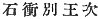

  
[Intangible Textual Heritage](../../index)  [Shinto](../index) 
[Index](index)  [Previous](kj075)  [Next](kj077) 

------------------------------------------------------------------------

[Buy this Book at
Amazon.com](https://www.amazon.com/exec/obidos/ASIN/B0028Y4SZY/internetsacredte)

------------------------------------------------------------------------

  
*The Kojiki*, translated by Basil Hall Chamberlain, \[1919\], at
Intangible Textual Heritage

------------------------------------------------------------------------

\[183\]

## \[SECT. LXIX.—EMPEROR SUI-NIN (PART I.—GENEALOGIES)\]

His Augustness Ikume-iri-biko-isachi dwelt at the palace of Tama-kaki in
Shiki, [1b](#fn_1375) and ruled the Empire.
This Heavenly Sovereign wedded Her Augustness the

p. 226

\[paragraph continues\] Princess
Sahaji, [2](#fn_1376) younger sister of His
Augustness Saho-biko, and begot an august child: His Augustness
Homo-tsu-wake [3](#fn_1377) (one Deity). Again, wedding Her Augustness the
Princess Hibasu, daughter of King Tatsu-michi-no-ushi, Prince of Taniha,
he begot august children: His Augustness Ini-shiki-no-iri-biko; [4](#fn_1378) next His Augustness
Oho-tarashi-hiko-oshiro-wake; [5](#fn_1379)
next His Augustness Oho-naka-tsu-hiko; [6](#fn_1380) next His Augustness Yamato-hime; [7](#fn_1381) next His Augustness
Waka-ki-iri-biko [8](#fn_1382) (five Deities). Again, wedding Her Augustness
Nubata-no-iri-bika, [9](#fn_1383) younger
sister of Her Augustness Princess Hibasu, he begot august children: His
Augustness Nu-tarashi-wake; [10](#fn_1384)
next His Augustness Iga-tarashi-hiko [11](#fn_1385) (two
Deities). Again, wedding Her Augustness Azami-no-iri-bime, [12](#fn_1386) younger \[184\] sister of His
Augustness Nubata-no-iri-bime, [13](#fn_1387)
he begot august children: His Augustness Ikobaya-wake; [14](#fn_1388) next Her Augustness the Princess of
Azami [15](#fn_1389) (two Deities). Again,
wedding Her Augustness Kagu-ya-hime, [16](#fn_1390) daughter of King
Oho-tsutsuki-tari-ne, he begot an august child: King Wozabe [17](#fn_1391) (one
Deity). Again, wedding Karibata-tobe daughter of Fuchi Ohokuni in
Yamashiro, [18](#fn_1392) he begot august
children: King Ochi-wake; [19](#fn_1393) next
King Ika-tarashi-hiko; [20](#fn_1394) next
King Itoshi-wake. [21](#fn_1395) Again,
wedding Oto-karibata-tobe, [22](#fn_1396)
daughter of Fuchi of Otokuni, he begot august children: King
Iha-tsuku-wake; [23](#fn_1397) next Her
Augustness Iha-tsuku-bime, another name for whom was Her Augustness
Futaji-no-iri-bime [24](#fn_1398) (two Deities). The august children of this Heavenly
Sovereign \[numbered\] altogether sixteen (thirteen Kings and three
Queens). So His Augustness Oho-tarashi-hiko-oshiro-wake \[was he who
afterwards\] ruled the Empire. (His august stature
was ten feet [25](#fn_1399) \[185\] two
inches: the length of his august shank was four feet one inch),

p. 227

\[paragraph continues\] The next, His
Augustness Inishi-no-iri-biko made the pool of Chinu; [26](#fn_1400) again he made the pool of
Sayama, [27](#fn_1401) again he made the pool
of Takatsu at Kusaka [28](#fn_1402) Again he
dwelt at the palace of Kahakami at Totori, [29](#fn_1403) and caused a thousand
cross-swords [30](#fn_1404) to be made, and
presented them to the temple of the Deity of Iso-no-kami. [31](#fn_1405) Forthwith he dwelt at that
palace, [32](#fn_1406) and established the
Kahakami Tribe, [33](#fn_1407) The next, His
Augustness Oho-naka-tsu-hiko, (was the ancestor of
the Lords of Yamanobe, [34](#fn_1408) of the
Saki. kusa, [35](#fn_1409) of the Lords of
Inaki, [36](#fn_1410) Lords of the Ada, [37](#fn_1411) of the Lords of Minui in the Land of
Wohari: [38](#fn_1412) of the Lords of
Ihanashi in Kibi, [39](#fn_1413) of the Lords
of Koromo, [40](#fn_1414) of the Lords of
Takasuka, [41](#fn_1415) of the Dukes of
\[186\] Asuka, [42](#fn_1416) and of the Lords
of Mure). [43](#fn_1417) The next, Her
Augustness Yamato-hime, (was the high-priestess of
 [44](#fn_1418) the temple of the Great Deity
of Ise). The next, King Ikobaya-wake (was the
ancestor of the Lords Anahobe at Saho). [45](#fn_1419) The next, Her Augustness the Princess
of Azami (was married to King Inase-biko).
The next, King Ochi-wake (was the ancestor of the Mountain Dukes of
Wotsuki [46](#fn_1420) and of the Duke of
Koromo in Mikaha). [47](#fn_1421) The next,
King Ika-tarashi-hiko (was the ancestor of the
Mountain Dukes Kasuga, [48](#fn_1422) of the
Dukes of Ike in Koshi, [49](#fn_1423) and of
the Dukes of Kasugahe). [50](#fn_1424)
The next, King Itoshi-wake (owing to his having no
children, made the Itoshi Tribe [51](#fn_1425)
his proxy). The next, King Iha-tsuku-wake, (was the ancestor of
the Dukes of Haguchi [52](#fn_1426) and of the
Dukes of Miwo). [53](#fn_1427) The next, Her
Augustness Futaji-no-Iri-hime (became the empress of
His Augustness Yamato-take).

p. 228 p. 229

------------------------------------------------------------------------

### Footnotes

[225:1b](kj076.htm#fr_1379) p. 227 For Shiki see Sect. LXIII, Note 1.
*Tama-kaki* signifies "jewel (*i.e.*, beautiful) hedge."

[226:2](kj076.htm#fr_1380) This name and the
next have already been met with in Sect. LXI, as have those of Princess
Hibasu, King Tatasu-mechi, King Oho-tsutsuki-ne, Princess
Kari-bata-tobe, and King Inase-biko.

[226:3](kj076.htm#fr_1381) See Sect. LXXI,
Note 8.

[226:4](kj076.htm#fr_1382) The signification
of this name is not clear, but Motowori identifies Shiki with the place
of the same name.

[226:5](kj076.htm#fr_1383) p. 228 This name seems to be a string of Honorifics
[signifying](errata.htm#44) "great perfect prince ruling lord."

[226:6](kj076.htm#fr_1384) *I.e.*, "great
middle prince," he being third of five children.

[226:7](kj076.htm#fr_1385) *I.e.*, "Yamato
princess." She is a very celebrated personage in Japanese legendary
story,—high priestess of Ise and aunt of the hero Yamato-take. A
miraculous tale is related of her birth, and she is supposed to have
lived several hundreds of years.

[226:8](kj076.htm#fr_1386) The signification
of this name is obscure.

[226:9](kj076.htm#fr_1387) The signification
of this name is obscure.

[226:10](kj076.htm#fr_1388) Motowori's
conjectural interpretation of this name is "jewel-perfect-lord."

[226:11](kj076.htm#fr_1389) The signification
of *iga* is obscure. The other two elements of the compound signify
"perfect prince."

[226:12](kj076.htm#fr_1390) Signification
obscure.

[226:13](kj076.htm#fr_1391) Signification
obscure.

[226:14](kj076.htm#fr_1392) Signification
obscure. The "Chronicles "read this name *Ike-baya*.

[226:15](kj076.htm#fr_1393) *Azami-tsu-him*e,
Signification obscure.

[226:16](kj076.htm#fr_1394) *i.e.*, probably
"the refulgent princess," the syllable *ya* being void of signification
as in *Ka-no-Nana-saku-ya-hime* (see Sect. XXXVII, Note 3). This name is
celebrated as that of the heroine of the fairy-tale entitled "Tale of a
Bamboo-Cutter." though there is no reason for identifying the two
personages.

[226:17](kj076.htm#fr_1395) This name is
obscure, and Motowori suspects it of being corrupt.

[226:18](kj076.htm#fr_1396) *Yamashiro no
ohokunino fuchi*. Yamashiro is the name of a province, and Ohokuni
("great land" that of a village, while Fuchi is a personal name written
with a character signifying "deep pool."

[226:19](kj076.htm#fr_1397) *Ochiwake no
miko*. Motowori derives *ochi* from *oho*, "great, and *chi*, supposed
to be an Honorific, while *wake* is taken to mean "lord." After all, the
signification of the name remains obscure.

[226:20](kj076.htm#fr_1398) *Ika-tarashi-hiko
no miko*. The name probably signifies "severe (or dignified) perfect
prince."

[226:21](kj076.htm#fr_1399) This name is
obscure.

[226:22](kj076.htm#fr_1400) *I.e.*,
Karibata-tobe, the younger sister.

[226:23](kj076.htm#fr_1401) This name and the
next are obscure. The first of the two is not in the older editions, but
Motowori supplies what appears to be a lacuna in the text by adding the
five characters  .

[226:24](kj076.htm#fr_1402) Signification
obscure.

[226:25](kj076.htm#fr_1403) The actual word
"feet "is not in the original, but an equivalent Chinese measure is
used.

[227:26](kj076.htm#fr_1404) p. 229 *Chinu no ike*. The "Sea of Chinu" in the
province of Idzumi, which is the same as the "Pool" here mentioned, has
been mentioned in Sect. XLIV, Note 36.

[227:27](kj076.htm#fr_1405) *Sayama no ike*,
in the province of Kahachi. The name probably signifies a "gorge" or
"defile."

[227:28](kj076.htm#fr_1406) See above Sect.
XLIV, Note 31.

[227:29](kj076.htm#fr_1407) *Totori* (lit.
"bird-catching") was in the province of Idzumi, and the name is said to
have been derived from the place having been one of those through which
Ohotaka of Yamanobe passed when pursuing the bird whose sight was to
make Prince Homachi-wake obtain the power of speech. (See the story as
given at the beginning of the next Section). The name of Kaha-kami
("head-waters of the river"), as we learn by comparison with the
parallel [passage](errata.htm#45) of the "Chronicles," is to be traced
to the River Udo, near whose head waters the palace in question is said
to have been situated.

[227:30](kj076.htm#fr_1408) See Sect. XLV,
Note 5.

[227:31](kj076.htm#fr_1409) See Sect. XLV,
Note 16.

[227:32](kj076.htm#fr_1410) Or, "in that
temple."

[227:33](kj076.htm#fr_1411) *Kahakami-be*.

[227:34](kj076.htm#fr_1412) *Yamanobe no
wake*. Yamanobe (or Yamabe) is the name of a district in Yamato and
signifies "mountain-slope."

[227:35](kj076.htm#fr_1413) *Sakikusa no
wake*. Of Sakikusa nothing is known. The word means "lily."

[227:36](kj076.htm#fr_1414) *Inaki no wake*.
Which Inaki is meant is not known, there being several places of that
name in Japan. The name is connected with the word *ine*, "rice."

[227:37](kj076.htm#fr_1415) *Ada no wake*. Of
Ada nothing is known.

[227:38](kj076.htm#fr_1416) *Wohari no kuni no
Minu no wake*. Minu is the name of a village, and signifies "three
moors."

[227:39](kj076.htm#fr_1417) *Kibi no Ihanashi
no wake*. Ihanashi is the name of a district, forming part of the modern
province of Bizen, and seems to signify "rockless."

[227:40](kj076.htm#fr_1418) *Koromo no wake*.
Motowori supposes this name to be corrupt. Koromo is the name of a
village in Mikaha.

[227:41](kj076.htm#fr_1419) *Takasuka no
wake*. Nothing is known either of the place or of the family.

[227:42](kj076.htm#fr_1420) *Asuka no kimi*.
It is not known where was this Asuka, which must not be confounded with
the famous Asuka mentioned in Sect. CXXXIII, Note 11.

[227:43](kj076.htm#fr_1421) p. 230 *Mure no wake*. There are several places
called Mure. The signification of the name is obscure.

[227:44](kj076.htm#fr_1422) Or more literally,
"worshipped and celebrated the festivals at," etc.

[227:45](kj076.htm#fr_1423) *Saho no
Anahobe-wake*. The name Anahobe is derived from Anahobe, the name of the
Emperor Yu-riyaku, and *be* "a tribe," it being related in the
"Chronicles" that the tribe which was established as his "name-proxy"
was so called.

[227:46](kj076.htm#fr_1424) *Wotsuki no yama
no kimi*. Wotsuki is the name of a place in Afumi (Omi). The family name
must be interpreted to signify that they were wardens of the mountain.

[227:47](kj076.htm#fr_1425) *Mikaha no Koromo
no kimi*. *Conf*. the name in Note 40, with which this is probably
identical. Motowori suspects an error in the text.

[227:48](kj076.htm#fr_1426) *Kazuga no yama no
kimi*. *Conf*. the name in Note 46.

[227:49](kj076.htm#fr_1427) *Koshi no ike no
kimi*. Nothing is known of the place or of the family; Koshi may or may
not be the northern province of that name.

[227:50](kj076.htm#fr_1428) *Kasugabe no
kimi*. There were two places of the name of Kasugabe (*i.e.* "Kasuga
Clan," so called perhaps after a family that had resided there). It is
not known which is here alluded to.

[227:51](kj076.htm#fr_1429) *Itoshi-be*. The
name, which is thus restored by Motowori, is variously mutilated in the
older editions. This is the first mention of adoption, lit. in Japanese
"child-proxy making." The custom is perpetually referred to in the later
portion of these "Records."

[227:52](kj076.htm#fr_1430) *Haguhi no kimi*.
Haguhi is the name of a district in Noto. The derivation is obscure.

[227:53](kj076.htm#fr_1431) *Miwo no kimi*.
Miwo is the name of a place in Afumi. It probably means "three
mountain-folds."

------------------------------------------------------------------------

[Next: Section LXX. Emperor Sui-nin (Part II. Conspiracy of King
Saho-biko and the Empress Saho-bime)](kj077)
