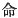
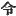
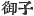
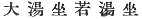

  
[Intangible Textual Heritage](../../index)  [Shinto](../index) 
[Index](index)  [Previous](kj077)  [Next](kj079) 

------------------------------------------------------------------------

[Buy this Book at
Amazon.com](https://www.amazon.com/exec/obidos/ASIN/B0028Y4SZY/internetsacredte)

------------------------------------------------------------------------

  
*The Kojiki*, translated by Basil Hall Chamberlain, \[1919\], at
Intangible Textual Heritage

------------------------------------------------------------------------

p. 233

## \[SECT. LXXI.—EMPEROR SUI-NIN (PART III.—BIRTH OF PRINCE HOMU-CHI-WAKE AND DEATH OF THE CONSPIRATORS)\]

At this time the Empress [1](#fn_1434) was
pregnant. Thereupon the Heavenly Sovereign could not restrain \[his pity
for\] the Empress, who was pregnant and whom he had loved for now three
years. So he turned his army aside, and did not hasten the attack.
During this delay, the august child that she had conceived was born. So
having put out the august child and set it outside the rice-castle. she
caused \[these words( to be said to the Heavenly Sovereign: "If this
august child be considered to be \[189\] the Heavenly Sovereign's august
child, let him [2](#fn_1435) deign to
undertake it." Hereupon the Heavenly Sovereign said: [3](#fn_1436) "Although detesting the elder brother,
I yet cannot repress my love for the Empress," and forthwith planned to
secure the Empress. Wherefore, choosing from among his warriors a band
of the strongest and deftest, he charged \[them, saying\]: "When ye take
the august child, likewise abduct the queen its mother. Whether by the
hair or by the hands, or wherever ye may best lay hold of her, clutch
her and drag her out." Then the Empress, knowing his intention
beforehand, shaved off all her hair and covered her head with her hair,
and likewise made her jewel-string rotten and wound it thrice round her
arm, and moreover made her august garments rotten by means of
rice-liquor and put on the garments as if they were whole. Having made
these preparations, she took the august child in her arms and pushed it
outside the castle. Then the strong men, taking the august child,
forthwith clutched at the august parent. Then, on their clutching her
august hair, the august hair

p. 234

fell off of itself; on their clutching her august arms, the jewel-string
likewise snapped; on their clutching her august garments, the august
garments at once tore. Therefore they obtained the august child, but did
not get the august parent. So the warriors came back \[to the
Sovereign\], and reported, saying: "On account of her august hair
falling off of itself, of her august garments easily tearing, and
moreover of the jewel-string which was wound round her august hand at
once snapping, we have not got the august parent; but we have obtained
the august child." Then the Heavenly Sovereign, sorry and angry, hated
the people who made the jewels, \[190\] and deprived them all of their
lands. [4](#fn_1437) So the proverb says:
"Landless jewels-makers." [5](#fn_1438) Again
did the Heavenly Sovereign cause [6](#fn_1439)
the Empress to be told, saying: "A child's name must be given by the
mother; by what august name shall this child be called?" Then she
replied, saying: "As he was born now at the time of the castle being
burnt with fire and in the midst of the fire, it were proper to call him
by the august name of Prince [7](#fn_1440)
Homu-chi-wake." [8](#fn_1441) And again he
caused her to be asked: "How shall he be reared?" [9](#fn_1442) She replied, saying: "He must be
reared by taking an august mother [10](#fn_1443) and fixing on old bathing-women and
young bathing-women." [11](#fn_1444) So he was
respectfully reared in accordance with the Empress's instructions. Again
he asked the Empress, saying: "Who shall loosen the fresh small
pendant [12](#fn_1445) which thou elitist make
fast?" She replied, \[191\] saying: "It were proper that Ye-hime and
Oto-hime, [13](#fn_1446) daughters of King
Tatasu-michi-no-ushi [14](#fn_1447) prince of
Taniha, should serve thee, for these two queens are of unsullied
parentage." [15](#fn_1448) So at last \[the
Heavenly Sovereign\] slew King Saho-biko, and his younger sister
followed him. [16](#fn_1449)

p. 235 p. 236

------------------------------------------------------------------------

### Footnotes

[233:1](kj078.htm#fr_1438) p. 235 *I.e.*, Her Augustness Saho-bime, who was
the subject of the preceding sentence.

[233:2](kj078.htm#fr_1439) *I.e.*, the
Sovereign. The import of this passage is, according to Motowori, that
the Empress imagined that her own conduct might perhaps influence the
Emperor to refuse to give the child' she bore him its proper rank,—not
from doubts as to its legitimacy, but as having a rebel mother. By
"undertaking "the child is of course meant undertaking the care and
education of it.

[233:3](kj078.htm#fr_1440) Motowori supposes
the Chinese character rendered "said" to be an error, and prefers to
consider this clause as containing not the words, but the thought of the
Monarch. It would certainly be more convenient to adopt this view, if it
were sanctioned by any text.

[234:4](kj078.htm#fr_1441) Or, as Motowori
prefers to read, "deprived them of all their [lands](errata.htm#47)."

[234:5](kj078.htm#fr_1442) There is nowhere
else any reference to this saying. Motowori supposes it to point to
those who, hoping for reward, get punishment instead, these jewellers
having doubtless rotted the, string on which the beads were strung by
special desire of the Empress, whereas they ended by getting nothing but
confiscation for their pains.

[234:6](kj078.htm#fr_1443) Motowori (following
Mabuchi) is evidently correct in supposing the character   in this place, and again a
little further on, to be a copyist's error for  , "caused," and the translator
has rendered it accordingly,

[234:7](kj078.htm#fr_1444) "Prince "is here
written  .

[234:8](kj078.htm#fr_1445) This name may also
be read *Ho-muchi-wake*, and is in the "Chronicles" given as
*Ho-muchi-wake* while it appears as *Homuchi-wake* at the commencement
of Sect. LXIX. The first two elements apparently signify
"fire-possessing;" while *wake* is the frequently recurring Honorific
signifying either "lord "or "young and flourishing."

[234:9](kj078.htm#fr_1446) Lit., "his days be
reverently prolonged." The same expression is repeated thrice below.

[234:10](kj078.htm#fr_1447) *I.e.*,
foster-mother.

[234:11](kj078.htm#fr_1448) The characters
  used in the original of
this passage would, if they stood alone, be of difficult interpretation.
But a comparison with the passage in "One account" of "Chronicles,"
which relates the nursing of [Fuki-ahezu-no-mikoto](errata.htm#48), the
father of the first "Earthly Emperor "Jim-mu, leaves no doubt that the
author intended to speak of bathing-women attached to the service of the
Imperial infant.

[234:12](kj078.htm#fr_1449) The words *midzu
no wo-himo*, literally rendered "fresh small pendant," call for some
explanation. *Midzu*, which includes in a single p.
236 term the ideas of youth, freshness, and beauty, is here used
as an Honorific. The "small pendant "is interpreted by Mabuchi and
Motowori to signify the "inner, girdle" which held together the
under-garment of either sex. The old literature of Japan teems with
allusions to the custom of lovers or spouses making fast each other's
inner girdle, which might not be untied till they met again, and the
poets perpetually make a lover ask some such question as "When I am far
from thee, who shall loosen my girdle?" The translator cannot refrain
from here quoting, for the benefit of the lover of Japanese verse
(though he will not attempt to translate them), the two most graceful of
the many stanzas from the "Collection of a Myriad Leaves" brought
together by Motowori to illustrate this passage:

Wagimoko ga  
     Yuhiteshi himo wo  
Tokame ye mo:  
     Toyeba tayu to mo  
     Tada ni afu made ni,  
Unabara wo  
     Tohoku watarite  
Toshi-fu to-mo  
     Ko-ra ga musuberu  
     Himo toku na yume.

Tanigaha Shisei also appropriately quotes the following:

Futari shite  
     Musubiski himo wo  
     Hitori shite  
Ware ha toki-mizhi  
     Tada ni afu made ha.

a literal rendering of which would run thus: "I will not, till we meet
face to face, loosen alone the girdle which we two tied together."

[234:13](kj078.htm#fr_1450) *I.e.*, the "Elder
Princess and the Younger Princess."

[234:14](kj078.htm#fr_1451) Motowori is
probably right in explaining *tatasu* as the Honorific Causative of
*tatsu*, "to stand" and *michi no ushi* as *michi-nushi* or
*kuni-nushi*, *i.e.*, "owner of the province," "ruler."

[234:15](kj078.htm#fr_1452) Lit., "are pure
subjects."

[234:16](kj078.htm#fr_1453) *I.e.*, was slain
with him.

------------------------------------------------------------------------

[Next: Section LXXII.—Emperor Sui-nin (Part IV.—The Dumb Prince
Homu-chi-wake)](kj079)
