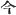
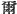
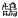
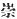
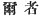
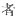
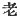

  
[Intangible Textual Heritage](../../index)  [Shinto](../index.md) 
[Index](index)  [Previous](kj078)  [Next](kj080.md) 

------------------------------------------------------------------------

[Buy this Book at
Amazon.com](https://www.amazon.com/exec/obidos/ASIN/B0028Y4SZY/internetsacredte.md)

------------------------------------------------------------------------

  
*The Kojiki*, translated by Basil Hall Chamberlain, \[1919\], at
Intangible Textual Heritage

------------------------------------------------------------------------

p. 237 \[192\]

## \[SECT. LXXII.—EMPEROR SUI-NIN (PART IV.—THE DUMB PRINCE HOMU-CHI-WAKE).\]

So the way they led about and amused the august child was by making a
two-forked boat [1](#fn_1450.md) out of a
two-forked cryptomeria from Ahidzu in Wohari, [2](#fn_1451.md) bringing it up and floating it on the
Pool of Ichishi and on the Pool of Karu [3](#fn_1452.md) in Yamato, \[thus\] leading about and
amusing the august child. Nevertheless the august child spoke never a
word, though his eight-grasp beard reached to the pit of his
stomach. [4](#fn_1453.md) So [5](#fn_1454.md) it was on hearing the cry of a
high-flying swan [6](#fn_1455.md) that he made
his first utterance. [7](#fn_1456.md) Then \[the
Heavenly Sovereign\] sent Yamanobe-no-Ohotaka [8](#fn_1457.md) (this is a name of
a person) to catch the bird. So this person, pursuing the swan,
arrived in the Land of Harima from the Land of Ki, and again in his
pursuit crossed over to the Land of Inaba, then reaching the Land of
Taniba and the Land of Tajima; \[thence\] pursuing round \[193\] to the
eastward, he reached the Land of Afumi. and thereupon crossed over into
the Land of Minu; and, passing along by the Land of Wohari, pursued it
into the Land of Shinanu, and at length, reaching in his pursuit the
Land of Koshi, spread a net in the Estuary of Wanami, [9](#fn_1458.md) and, having caught the bird, brought
it up \[to the capital\] and presented it \[to the Sovereign\]. So that
estuary is called the Estuary of Wanami. It had been thought that, on
seeing the bird again, he would speak; but he did not speak, as had been
thought. [10](#fn_1459.md) Hereupon the Heavenly
Sovereign, deigning to be grieved, augustly fell asleep, when, in an
august dream, he was instructed, saying: "If thou wilt build my temple
like unto thine august abode, the august child shall surely speak." When
he had been thus instructed, \[the Heavenly

p. 238

\[paragraph continues\] Sovereign\] made
grand divination to seek what Deity's desire [11](#fn_1460.md) this might be. Then \[it was
discovered that\] the curse was the august doing of the Great Deity of
Idzumo. [12](#fn_1461.md) So when about to send
the august child to worship \[at\] that Great Deity's temple, \[he made
divination to discover [13](#fn_1462.md)\] by
whom it were well to have him attended. Then the lot fell on King
Ake-tatsu. [14](#fn_1463.md) So he \[194\] made
King Ake-tatsu swear, [15](#fn_1464.md) saying:
"If there is truly to be an answer [16](#fn_1465.md) to our adoration of this Great Deity,
may the heron dwelling on the tree by the Pool of Sagisu [17](#fn_1466.md) here fall \[through my\] oath." When
he thus spoke, the heron that had been sworn by fell to the ground dead.
Again on his commanding it to come to life\] in answer to his\] oath, it
then came to life again. [18](#fn_1467.md)
Moreover he caused to wither by an oath and again brought to life again
by an oath a broad-foliaged bear-oak on Cape Amakashi. [19](#fn_1468.md) Then \[the Heavenly Sovereign\]
granted to Prince Ake-tatsu the name of Prince
Yamato-oyu-shiki-tomi-tomi-toyo-asakura-ake-tatsu. [20](#fn_1469.md) So when the august child was sent off
with the two Princes, Prince Ake-tatsu and Prince Una-kami, [21](#fn_1470.md) as his attendants, it was
divined [22](#fn_1471.md) that \[if they went
out\] by the Nara gate, [23](#fn_1472.md) \[195\]
they would meet a lame person and a blind person; [24](#fn_1473.md) \[if they went out\] by the
Ohosaka [25](#fn_1474.md) gate, they would
likewise meet a lame person and a blind person, and that only the Ki
gate,—a side gate, [26](#fn_1475.md)—would be the
lucky gate; and when they started off, they established the Homuji
clan [27](#fn_1476.md) in every place they
arrived at. So when they had reached Idzumo and had finished worshipping
the Great Deity, and were returning up \[to the capital\], they made in
the middle of the River Hi [28](#fn_1477.md) a
black plaited bridge and respectfully offered a temporary palace \[for
the august

p. 239

child\] to dwell in. [29](#fn_1478.md) Then when
the ancestor of the rulers of the Land of Idzumo, whose name was
Kihisa-tsu-mi, [30](#fn_1479.md) \[196\] having
made an imitation green-leafed mountain, [31](#fn_1480.md) placed \[it\] in the lower reach of
the river, and was about to present the great august food the august
child [32](#fn_1481.md) spoke, saying: "What here
resembles a green-leafed mountain in the lower \[reach of the\] river;
looks like a mountain, but is not a mountain. Is it perchance the great
court [33](#fn_1482.md) of the deacons [34](#fn_1483.md) who holds in reverence the Great
Deity Ugly-Male-of-the-Reed-Plains [35](#fn_1484.md) that dwells in the temple of So at
Ihakuma in Idzumo? [36](#fn_1485.md) \[Thus\] he
deigned to ask. Then the Kings, who had been sent in august attendance
\[on him\], hearing with joy and seeing with delight, [37](#fn_1486.md) set the august child to dwell in the
palace of Nagaho at Ajimasa, [38](#fn_1487.md)
and despatched a courier \[to inform the Heavenly Sovereign\]. Then the
august child wedded \[197\] Princess Hinaga [39](#fn_1488.md) for one night. So, on looking
privately at the beautiful maiden, \[he found her\] to be a serpent, at
the sight of which he fled away alarmed. Then Princess Hinaga was vexed,
and, illuminating the sea-plain, [40](#fn_1489.md) pursued after them in a ship; and
they, more and more alarmed at the sight, pulled the august vessel
across the mountain-folds, [41](#fn_1490.md) and
went fleeing up \[to the capital\]. Thereupon they made a report,
saying: "We have come up \[to the capital\] because thy great and august
child has become able to speak through worship-ping the Great Deity." So
the Heavenly Sovereign, delighted, forthwith sent King Unakami back to
build the Deity's temple. Thereupon the Heavenly Sovereign, on account
of this august child, established the Totori Clan, the Torikahi Clan,
the Homuji Clan, the Ohoyuwe and the Wakayuwe. [42](#fn_1491.md)

p. 240 p. 241
p. 242 p. 243

------------------------------------------------------------------------

### Footnotes

[237:1](kj079.htm#fr_1454.md) p. 240 From a comparison with a passage in the
"Chronicles," where the same expression occurs, one is led to suppose
that the craft here mentioned was a sort of double boat, in each half of
which passengers could sit.

[237:2](kj079.htm#fr_1455.md) Nothing is known of
any place called Ahidzu in the province of Wohari.

[237:3](kj079.htm#fr_1456.md) Karu has been
mentioned in Sect. LVII, Note 1. The Pool of Ihare.

[237:4](kj079.htm#fr_1457.md) Lit., "in front of
his heart." This phrase descriptive of a long beard has already occurred
at the commencement of Sect. XII.

[237:5](kj079.htm#fr_1458.md) Motowori reasonably
supposes the character  
in this sentence to be a copyist's error for the emphatic  , and the translation has been
made accordingly.

[237:6](kj079.htm#fr_1459.md) The original has
the character  , which is
now applied to a small species of swan (*Cignus minor*, Pallas; *Cygnus
Bewickii*, Yarrell). But it is uncertain what bird is intended by the
author.

[237:7](kj079.htm#fr_1460.md) A more or less
inarticulate utterance is probably meant; but the expression in the
original is obscure.

[237:8](kj079.htm#fr_1461.md) Motowori supposes
the Note in the original to refer only to the word Ohotaka, while he
takes Yamamobe to be the name of a place (already mentioned in Sect.
LXVIII, Note 1). The surname of Ohotaka, signifying "great hawk," was,
according to the same commentator, giver to the worthy here mentioned in
consequence of the incident related in the text. As the bird was not a
hawk, this does not seem very convincing, and Motowori's apparent idea
that the man was likened to a hawk because he pursued the other bird as
a hawk would do, is extremely far-fetched. It is moreover doubtful
whether the name should not be read *Oho-washi* (this is Mabuchi's
reading), "great." The "Chronicles "give an altogether different name,
viz., *Ame-no-yukata-tana*.

[237:9](kj079.htm#fr_1462.md) No such place is
now known. The name may be interpreted to mean "snare-net "in allusion
to this story, as stated in the next sentence of the text.

[237:10](kj079.htm#fr_1463.md) The various texts
and printed editions all differ slightly in their reading of this
passage, and from some it might be gathered that the prince did indeed
speak as it had been thought that he would do, u t could not speak
freely. The translation follows Motowori's emended text.

[238:11](kj079.htm#fr_1464.md) Literally,
"heart."

[238:12](kj079.htm#fr_1465.md) *I.e.*,
*Oho-kuni-nushi* (the Master of the Great Land), the aboriginal monarch
of Idzumo, the descendant of the Sun Goddess, whose p. 241 abdication of the .sovereignty of Japan in
favour of the descendant of the Sun Goddess forms the subject-matter of
Sect. XXXII. The word *tatari*, here written with the Chinese character
  and rendered "curse,"
signifies properly the vengeance of a spirit, *i.e.*, either of a deity
or of the ghost of a dead man. The word translated "doing "is literally
"heart."

[238:13](kj079.htm#fr_1466.md) That some such
words must be supplied is evident, and the translator has followed
Mabuchi and Motowori in supplying them.

[238:14](kj079.htm#fr_1467.md) Lit., "King
Ake-tatsu at the divination."

[238:15](kj079.htm#fr_1468.md) Remember that the
original word *ukehi* combines the meanings of our words "wager,"
"oath," "pledge," "curse," etc.,—being in fact a general name for all
words to which any mysterious importance attaches.

[238:16](kj079.htm#fr_1469.md) Lit., a "sign," a
"proof."

[238:17](kj079.htm#fr_1470.md) *Sagisu no ike*, a
pool in Yamato. *Sagi-su*, signifies "heron's nest."

[238:18](kj079.htm#fr_1471.md) The reading of the
characters   (rendered
"then") in this passage has been a crux to all the editors. Fortunately
they make no difference to the sense.

[238:19](kj079.htm#fr_1472.md) *Amakashi no
saki*, Perhaps "Amakashi Point "would be a better rendering if, as
Motowori supposes, an inland place in the province of Yamato is meant.
It might be the point or extremity of a hill or bluff. *Ame-kashi*
signifies literally "sweet oak." The "broad-foliaged bear-oak" mentioned
immediately above is supposed by Motowori to be the usual evergreen oak,
and not any special kind. The epithet "broad-foliaged" is not, as he
remarks, specially appropriate, and he moreover supposes the word
*kuma*, "bear," to be a corruption of *kumi* or *kumori*, words which
would refer to the thick luxuriance of the foliage. The dictionaries do
not help us much to a decision on the point.

[238:20](kj079.htm#fr_1473.md) The component
parts of this tremendous name, which is happily abbreviated to Ake-tatsu
in the subsequent portions of the text, are somewhat obscure, especially
the word *oyu*, whose reading rests only on a conjecture of Motowori's,
who emends the evidently erroneous character   to   (*oyu*,) "old." *Toyo*,
"luxuriant," is an Honorific, *ake* and *tatsu* signify respectively
"dawn" and "rise," while the rest seem to be names of places of which
this Prince may be supposed to have been the possessor.

[238:21](kj079.htm#fr_1474.md) Or, the Prince of
Unakami, as Unakami is the name of a place Kadzusa.

[238:22](kj079.htm#fr_1475.md) *I.e.*, shown by
divination.

[238:23](kj079.htm#fr_1476.md) p. 242 Nara in Yamato, which is here mentioned for
the first time, was the capital, of Japan from A.D. 710 to 784, and has
always been famous in Japanese history and literature. The name is
derived by the author of the "Chronicles "from the verb *narasu*, "to
cause to resound," the hosts of the Emperor Su-jin having, it is said,
caused the earth to resound with their trampling when they went out to
do battle with Haniyasu. A more probable derivation is from *nara*, the
name of a kind of deciduous oak, the *Quercus glandulifera*. The word
rendered "gate" should possibly be taken simply in the sense of "exit
"or "approach.'

[238:24](kj079.htm#fr_1477.md) Or, "lame
[people](errata.htm#49.md) and blind people," a peculiarly unlucky omen for
travellers, to whom, as Motowori remarks, sound feet and good eye-sight
are indispensable to carry them on their way.

[238:25](kj079.htm#fr_1478.md) See Sect. LXIV,
Note 25.

[238:26](kj079.htm#fr_1479.md) In the text the
word "gate "is here, by a copyist's error written "moon." When the
author says that the Ki gate, *i.e.*, gate or exit leading to the
province of Ki, as a "side-gate," he means that it was; not the one by
which travellers would naturally have left the town:—the province of Ki,
indeed, is to the South of Yamato where the capital was, whereas the
province of Idzumo, whither they were bound, was to the north-west. This
road into Ki over Matsuchi-yama is one famous in the classical poetry of
Japan.

[238:27](kj079.htm#fr_1480.md) *Homuji-be*. The
meaning of the clause is that they granted the surname of Homuji to
persons in every important locality through which they passed on their
journey.

[238:28](kj079.htm#fr_1481.md) See Sect. XVIII,
Note 2.

[239:29](kj079.htm#fr_1482.md) The signification
of this passage is: "They built as a temporary abode for the prince a
house in the River Hi (whether with its foundations actually in the
water or on an island is left undetermined), connecting it with the main
land by a bridge made of branches of trees twisted together and with
their bark left on them" (this is here the import of the word "black").
Such bridges have been met with by the translator in the remote northern
province of Deha, where the country people call them *shiba-bashi* (or,
rather, in their patois *suba-bashi*, *i.e.*, "twig-bridge"). The
traveller is so likely to fall through interstices into the stream
below, that it is not to be wondered at that they should now be confined
to the rudest localities.

[239:30](kj079.htm#fr_1483.md) Motowori supposes
*Kihisa* to be the name of a place, and *tsu-mi* to stand as usual for
*tsu mochi*, "possessor," according to which view the name would mean
"lord" or "possessor of Kihisa.

[239:31](kj079.htm#fr_1484.md) p. 243 No book of reference with which the
translator is acquainted throws any light on this curious expression,
and there is no parallel passage in the "Chronicles" to look for help.

[239:32](kj079.htm#fr_1485.md) Viz., to the
Prince ("the august child"). The preparations which *Kihisa-tsu-mi* is
here said to have made are supposed by Motowori to have been prompted by
a desire to add beauty to the feast. But the whole passage is very
obscure.

[239:33](kj079.htm#fr_1486.md) Viz., the court in
front of, or the approach to, the shrine, which would naturally be
planted with the sacred tree, the *saka-ki* (*Cleyera japonica*), and
thus justly the prince's comparison to it of the artificial grove at
which he was looking.

[239:34](kj079.htm#fr_1487.md) *I.e.*, the priest
attached to the worship of, etc. For "deacon" see Note 33 to Sect. LXII.

[239:35](kj079.htm#fr_1488.md)
*Ashihara-shiko-wo*, one of the many names of the Deity *Oho-kuni-nushi*
("Master of the Great Land," see Sect. XX, Note 19). the Deity whom the
Prince and his followers had just been worshipping.

[239:36](kj079.htm#fr_1489.md) These names cannot
now be identified, and are of uncertain etymology. Ikakuma seems,
however, to mean "curve in the rock." One would have expected in this
place, instead of these unknown names, to find a reference to the main
temple of the Deity, which was styled *Kidzuki no oho-yashiro*, *i.e.*,
"the great shrine of Kidzuki."

[239:37](kj079.htm#fr_1490.md) Some such words as
"the changed and more intelligent appearance of the Prince, and his
attainment of the power of speech "must be mentally supplied in order to
bring out the sense which the author intends to convey.

[239:38](kj079.htm#fr_1491.md) These names cannot
be identified. Nagaho signifies "long-rice-ear," while *ajimasa* in
modern usage is the name of a palm (the *Levistona Sinensis*); but
Motowori supposes that it formerly designated the palmetto or some
cognate tree.

[239:39](kj079.htm#fr_1492.md) *Hi-naga-hime*.
The signification of the name is obscure, but it would seem most natural
to suppose it connected with the River Hi which figures in the Idzumo
cycle of legends. A proposal of Motowori's to read *Koye-naga* instead
of the traditional *Hi-naga* seems scarcely to be meant in earnest. If
accepted, it would give us the meaning of "fat and long princess," with
reference to the story of her being a serpent.

[239:40](kj079.htm#fr_1493.md) It will be
remembered that the Province of Idzumo is a maritime one, and that the
fugitives might be supposed to reach the sea-shore in their flight. It
is true that this is exactly the reverse of the direction which they
would be obliged to take in travelling up to the capital, which was in
Yamato.

[239:41](kj079.htm#fr_1494.md) *I.e.*, p. 244 the depressions or valleys separating one
mountain from another.

[239:42](kj079.htm#fr_1495.md) In the original
*Totori-be*, *Torikahi-be*, *Homuji-be*, *Oho-yuwe* and *Waka-yuwe*. All
these "gentile names" have a meaning connecting them either really or
apparently with the story above related,—*to-tori* signifying
"bird-catcher" and *tohi-kahi* "bird-feeder," while the name of the
*Homuji* Clan is of course derived from that of the Prince (Homuchi or
Homuji), and *Oho-yuwe* and *Waka-yuwe* signify respectively "elder
bather "and "younger bather."

------------------------------------------------------------------------

[Next: Section LXXIII. Emperor Sui-nin (Part. V.—His Later
Wives.)](kj080.md)
