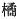

  
[Intangible Textual Heritage](../../index)  [Shinto](../index.md) 
[Index](index)  [Previous](kj080)  [Next](kj082.md) 

------------------------------------------------------------------------

[Buy this Book at
Amazon.com](https://www.amazon.com/exec/obidos/ASIN/B0028Y4SZY/internetsacredte.md)

------------------------------------------------------------------------

  
*The Kojiki*, translated by Basil Hall Chamberlain, \[1919\], at
Intangible Textual Heritage

------------------------------------------------------------------------

p. 245

## \[SECT. LXXIV.—EMPEROR SUI-NIN (PART VI.—TAJI-MORI BRINGS BACK THE ORANGE FROM THE ETERNAL LAND.)\]

Again the Heavenly Sovereign sent Tajima-mori, [1](#fn_1497.md) ancestor of the Chiefs of
Miyake, [2](#fn_1498.md) to the Eternal
Land [3](#fn_1499.md) to fetch the fruit of the
everlasting [4](#fn_1500.md) fragrant tree. So
Tajima-mori at last reached that country, plucked the fruit of the tree,
and brought of clubmoss eight and of spears eight; but meanwhile the
Heavenly Sovereign had died. Then Tajima-mori set apart of clubmoss four
and

p. 246

of spears four, which he presented to the Great Empress, [5](#fn_1501.md) and set up of clubmoss four and of
spears four as an offering at the door of the Heavenly Sovereign's
august mausoleum, [6](#fn_1502.md) and, raising
on high the fruit of the tree, wailed and wept, saying: "Bringing the
fruit of the ever-lasting fragrant tree from the Eternal Land, I have
come to serve thee;" and at last he wailed and wept himself to death.
This fruit of the everlasting fragrant tree is what is now called the
orange. [7](#fn_1503.md)

------------------------------------------------------------------------

### Footnotes

[245:1](kj081.htm#fr_1501.md) p. 246 The meaning of this name, which is written
phonetically both here and in the "Chronicles," has, given rise to
differences of opinion, some deriving it from the name of the province
of Tajima (itself of obscure origin) and from the word *mori* "keeper,"
while others think it comes from *tachibana*, the Japanese word for
orange, with reference to the story here told. The supporters of the
former view, on the other hand, derive the *tachibana* from
*Tajima-mori*.

[245:2](kj081.htm#fr_1502.md) *Miyake no
murazhi*. Whether *miyake* is simply the name of a place or whether it
should be taken in the sense of "granary," is uncertain. If the latter
view be adopted, it would be natural to suppose that this family had
originally furnished the superintendents of the Imperial Granaries. In
any case it traced its origin to a Korean source (see the "Catalogue of
Family Names," and the genealogies in Sect. CXV).

[245:3](kj081.htm#fr_1503.md) See Sect. XXV.

[245:4](kj081.htm#fr_1504.md) Written in the
parallel passage of the "Chronicles "with characters signifying
literally "timeless." The whole of this circumlocution for the orange
has indeed to be interpreted by the help of the "Chronicles." it being
here written phonetically and offering some difficulties as it stands.

[246:5](kj081.htm#fr_1505.md) This corrupt and
obscure passage seems to be well restored by Motowori, whose explanation
of it is likewise as convincing as it is ingenious. The expression
"clubmoss-oranges "signifies oranges as they grow on the branch
surrounded by leaves, while "spear-oranges "are the same divested of
leaves, and hanging to the bate twig. Thus the words clubmoss "and
"spear "come to be used as "Auxiliary Numerals "for oranges plucked in
these two different manners.

[246:6](kj081.htm#fr_1506.md) Viz., says
Motowori, Princess Hibasu, who however, according to the account in the
"Chronicles," was already dead at this time.

[246:7](kj081.htm#fr_1507.md) p. 247 The word *tachibana* (written  ) in the text should probably
be taken as a specific and not as a general term. In modern usage it
designates the *Citrus japonica*. But it is a matter of dispute whether
the application of the term has not altered since ancient times, and
whether we should not understand by it one of the other kinds of orange
now to be found in Japan,—perhaps the *Citrus nobilis*.

------------------------------------------------------------------------

[Next: Section LXXV.—Emperor Sui-nin (Part VII.—His Death and that of
the Empress Hibasu.)](kj082.md)
