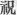
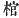

  
[Intangible Textual Heritage](../../index)  [Shinto](../index.md) 
[Index](index)  [Previous](kj081)  [Next](kj083.md) 

------------------------------------------------------------------------

[Buy this Book at
Amazon.com](https://www.amazon.com/exec/obidos/ASIN/B0028Y4SZY/internetsacredte.md)

------------------------------------------------------------------------

  
*The Kojiki*, translated by Basil Hall Chamberlain, \[1919\], at
Intangible Textual Heritage

------------------------------------------------------------------------

p. 247 \[200\]

## \[SECT. LXXV.—EMPEROR SUI-NIN (PART VII.—HIS DEATH AND THAT OF THE EMPRESS HIBASU.)\]

This Heavenly Sovereign's august years were one hundred and fifty-three.
His august mausoleum is in the middle of the moor of Mitachi at
Sugahara. [1](#fn_1504.md) Again in the time of
the Great Empress Her Augustness Princess Hibasu, [2](#fn_1505.md) the Stone-Coffin-Makers [3](#fn_1506.md) were established, and also the
Earthenware-Masters' Clan [4](#fn_1507.md) was
established. This Empress was buried in the mausoleum of Terama near
Saki. [5](#fn_1508.md)

------------------------------------------------------------------------

### Footnotes

[247:1](kj082.htm#fr_1508.md) Both the locality
and the etymology of *Mitachi* are obscure. *Sugahara* ("sedge-moor") is
known to be in the province of Yamato.

[247:2](kj082.htm#fr_1509.md) *I.e.*, at the time
of the burial of the great Empress, etc.

[247:3](kj082.htm#fr_1510.md) The character  , ("to pray") in the text is
indubitably a copyist's error for "
, coffin." These stone coffins are described by Mr.
Henry von Siebold in his "Note on Japanese Archaeology" p.5. It must be
understood that, from being the name of an office, Stone-Coffin-Maker
(*Ishi-ki-tsukuri*) became a "gentile name."

[247:4](kj082.htm#fr_1511.md) *Hanishi-be*. The
meaning of this expression becomes clear by reference to the parallel
passage of the "Chronicles," which it may be worth while to quote at
length from Mr. Satow's translation in pp. 229-330 of Vol. VIII, Pt.
III, of these Transactions: "In the autumn of 32nd year, on the *tsuchi
no to u* day of the moon, which rose on the *ki no ye inu* day, the
empress Hi ba su hime no Mikoto (in another source called Hi-ba-su ne no
Mikoto) died, and they were several days going to bury her. The Mikado
commanded all his high officers, saying: "We knew p.
248 before that the practice of following the dead is not good.
In the case of the present burying what shall be done? Thereupon Nomi no
Sukune advanced and said: "It is not good to bury living men standing at
the sepulchre of a prince, and this cannot be handed down to posterity.
I pray leave now to propose a convenient plan. and to lay this before
the sovereign." And he sent messengers to summon up a hundred of the
clay-workers' tribe of the country of Izumo, and he himself directed the
men of the clay-workers' tribe in taking clay and forming shapes of men,
horses and various things, and presented them to the Mikado, saying:
'From now and henceforward let it be the law for posterity to exchange
things of clay for living men, and set them up at sepulchres.' Thereupon
the Mikado rejoiced, and commanded Nomi no Sukune, saying: 'Thy
expedient plan has truly pleased Our heart; and the things of clay were
for the first time set up at the tomb of Hi-ba-su hime no Mikoto.
Wherefore these things were *haniwa* (a circle of clay). Then he seat
down an order, saying: 'From now and henceforward, be sure to sit up
these things of clay at sepulchres, and let not men be slain.' Mikado
bountifully praised Nomi no Sukune, bestowed on him a kneading-place,
and appointed him to the charge of the clay-workers' tribe."

[247:5](kj082.htm#fr_1512.md) In the province of
Yamato. In the old poetry there are many plays or, this word *Saki*,
which is homonymous with the Verb "to blossom." But whether that be its
real derivation, it were hard to say. *Terama* appears to signify
"Buddhist temple-space," an etymology which is embarrassing to the
Shinto commentators who, accepting every word of our text as authentic
history, are hard-driven to explain how Buddhist temples could have
existed in Japan before the date assigned for the introduction of
Buddhism.

------------------------------------------------------------------------

[Next: Section LXXVI.—Empress Kei-ko (Part I,—Genealogies)](kj083.md)
