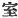
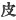
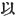
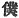
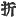
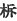
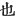
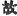

  
[Intangible Textual Heritage](../../index)  [Shinto](../index.md) 
[Index](index)  [Previous](kj086)  [Next](kj088.md) 

------------------------------------------------------------------------

[Buy this Book at
Amazon.com](https://www.amazon.com/exec/obidos/ASIN/B0028Y4SZY/internetsacredte.md)

------------------------------------------------------------------------

  
*The Kojiki*, translated by Basil Hall Chamberlain, \[1919\], at
Intangible Textual Heritage

------------------------------------------------------------------------

## \[SECT. LXXX. EMPEROR KEI-KŌ (PART V.—YAMATO-TAKE SLAYS THE KUMASO BRAVOES).\]

Thereupon the Heavenly Sovereign, alarmed at the valour and ferocity of
his august child's disposition, commanded him, saying: "In the West
there are two Kumaso bravoes, [1](#fn_1564.md)—unsubmissive and disrespectful men. So
take [2b](#fn_1565.md) them,"—and \[with this
command\] he sent him off. It happened that at this time his august hair
was bound at the brow. [3b](#fn_1566.md) Then His
Augustness Wo-usu was granted by his aunt Her Augustness
Yamato-hime [4](#fn_1567.md) her august \[upper\]
garment and august skirt; and, with a sabre hidden in his august bosom,
he went forth. [5](#fn_1568.md) So, on reaching
the house of the Kumaso bravoes, he saw that near the house there was a
three-fold belt of warriors, who had made a cave [6](#fn_1569.md) to dwell in. Hereupon they, noisily
discussing a rejoicing for the august cave, [7](#fn_1570.md) were getting food ready. So \[Prince
Wo-usu sauntered about the neighbourhood, waiting for the day of the
\[207\] rejoicing. Then when the day of the rejoicing came, having
combed down after the manner of girls his august hair which was bound
up, [8](#fn_1571.md) and having put on his aunt's
august \[upper\] garment and august skirt, he looked quite

p. 256

like a young girl, and, standing amidst the women, [9](#fn_1572.md) went inside the cave. Then the elder
brother and the younger brother, the two Kumaso bravoes, delighted at
the sight of the maiden, set her between them, and rejoiced exuberantly.
So, when \[the feast was\] at its height, \[His Augustness Wo-usu\],
drawing the sabre from his bosom, and catching Kumaso [10](#fn_1573.md) by the collar of his garment, thrust
the sabre through his chest, whereupon, alarmed at the sight, the
younger bravo ran out. But pursuing after and reaching him at the bottom
of the steps [11](#fn_1574.md) of the cave, and
catching him by the back, [12](#fn_1575.md)
\[Prince Wo-usu\] thrust the sabre through his buttock. Then the Kumaso
bravo spoke, saying: "Do not move the sword; I [13](#fn_1576.md) have something to say." Then \[His
Augustness Wo-usu\], respited him for a moment, holding him down \[as he
lay\] prostrate. Hereupon \[the bravo\] said: "Who is Thine Augustness?"
Then he said: "I am the august child of Oho-tarashi-hiko-oshiro-wake,
the Heavenly Sovereign who, dwelling in the palace of Hishiro at
Makimuku, rules the Land of the Eight Great Islands; and my name is King
Yamato-wo-guna. Hearing that you two \[fellows [14](#fn_1577.md)\], the Kumaso bravoes, were
unsubmissive and disrespectful, \[the Heavenly Sovereign\] sent me with
the command to take and slay you." Then the Kumaso bravo said: "That
must \[208\] be true. There are no persons in the West so brave and
strong as we two. [15](#fn_1578.md) Yet in the
Land of Great Yamato there is a man braver than we two,—there is. [16](#fn_1579.md) Therefore will I offer thee an august
name. From this time forward it is right that thou be praised as the
August Child Yamato-take." [17](#fn_1580.md) As
soon as he had finished saying this, \[the Prince\] ripped him up [18](#fn_1581.md) like a ripe

p. 257

melon, [19](#fn_1582.md) and slew him. [20](#fn_1583.md) So thenceforward he was praised by
being called by the august name of [21](#fn_1584.md) his Augustness Yamato-take. When he
returned up \[to the capital\] after doing this, he subdued and pacified
every one of the Deities of the mountains and of the Deities of the
rivers and likewise of the Deities of Anado, [22](#fn_1585.md) and then went up to \[the capital\].

------------------------------------------------------------------------

### Footnotes

[255:1](kj087.htm#fr_1568.md) p. 257 *I.e.*, presumably "bravoes at Kumaso; "but
it is to be remarked that in this and like compounds with *takeru*
("bravo") the Japanese language uses no Postposition. For Kumaso see
Sect. V, Note 17.

[255:2b](kj087.htm#fr_1569.md) Motowori seems
right in interpreting "take" here and elsewhere in the sense of "slay."
But "take "is in the text.

[255:3b](kj087.htm#fr_1570.md) *I.e.*, caught up
from the brow and tied together on the crown of the head. This being the
way in which the hair of boys was dressed, the author thus intimates
that His Augustness was still a youth.

[255:4](kj087.htm#fr_1571.md) Who was
high-priestess of the temple of the Great Deity of Ise, as mentioned in
Sect. LXIX (Note 44).

[255:5](kj087.htm#fr_1572.md) The characters used
for these last two words are those properly restricted to the mention of
an Imperial progress, but Yamato-take is constantly spoken of as if he
had actually sat on the throne.

[255:6](kj087.htm#fr_1573.md) The character used
is  , which simply means
apartment; but see Sect. XLVIII, Note 1.

[255:7](kj087.htm#fr_1574.md) Motowori reads
"*New* cave," but the word "August" is in the text. At the same time we
see that this feast was intended as a house-warming. *Conf*. the
commencement of Sect. CLXIV.

[255:8](kj087.htm#fr_1575.md) The parallel
passage of the "Chronicles" puts the same meaning into plainer words. It
says: "undid his hair, and made it appear like a girl's."

[256:9](kj087.htm#fr_1576.md) Or, according to
the old reading, "mixing with the concubines."

[256:10](kj087.htm#fr_1577.md) *I.e.*, the elder
bravo of Kumaso.

[256:11](kj087.htm#fr_1578.md) The word rendered
"steps" is of doubtful interpretation.

[256:12](kj087.htm#fr_1579.md) Or perhaps "the
skin of his back" or "the (beast's?) skin on his back." But Motowori is
probably right in supposing the character 
, "skin" to be an error for  , "with," to be construed with
the word "sabre." (In the English idiom this Particle falls away.)

[256:13](kj087.htm#fr_1580.md) Written with the
humble character  ,
"servant."

[256:14](kj087.htm#fr_1581.md) p. 258 The contemptuous Second Personal Pronoun
*ore* is used here and in the next clause.

[256:15](kj087.htm#fr_1582.md) There is
Motowori's authority for thus understanding the bravo's words. Taken
still more literally, they would seem to imply that there were no brave
and strong men in the West *excepting* himself and his brother.

[256:16](kj087.htm#fr_1583.md) The words "there
is" are an attempt at rendering the termination keri of the original.
See X, Note 1.

[256:17](kj087.htm#fr_1584.md) *I.e.*,
"Yamato-Brave," *q.d.*, "the Bravest in Yamato." It is by this name that
the hero is commonly spoken of. Remember that "august child "signifies
prince.

[256:18](kj087.htm#fr_1585.md)  , "broke," in the text is, as
the commentators observe, an evident error for  , "ripped."

[257:19](kj087.htm#fr_1586.md) Or specifically,
the "musk melon."

[257:20](kj087.htm#fr_1587.md) The translator has
followed Motowori's restoration of this passage, in which, by the
transposition of the characters 
 and  ,
the end of this sentence and the beginning of the next were mixed
together in the older editions.

[257:21](kj087.htm#fr_1588.md) Lit., "\[they\]
praised the august name, calling him," etc.

[257:22](kj087.htm#fr_1589.md) Or, "of the Ana
passage" (lit. door), the modern Strait of Shimonoseki. The word *ana*
signifies "hole," and there is a tradition (which Motowori quotes in his
note on this name in Vol. XXVII, pp. 26-29 of his Commentary) to the
effect that formerly the Main bland and the island of Kiushiu were
continuous at this point, there being only a sort of natural tunnel,
through which junks could pass.

------------------------------------------------------------------------

[Next: Section LXXXI.—Emperor Kei-kō (Part VI.—Yamato-take Slays the
Idzumo Bravo)](kj088.md)
