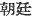
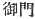

  
[Intangible Textual Heritage](../../index)  [Shinto](../index.md) 
[Index](index)  [Previous](kj088)  [Next](kj090.md) 

------------------------------------------------------------------------

[Buy this Book at
Amazon.com](https://www.amazon.com/exec/obidos/ASIN/B0028Y4SZY/internetsacredte.md)

------------------------------------------------------------------------

  
*The Kojiki*, translated by Basil Hall Chamberlain, \[1919\], at
Intangible Textual Heritage

------------------------------------------------------------------------

p. 260

## \[SECT. LXXXII.—EMPEROR KEI-KŌ (PART VII.—YAMATO-TAKE IS SENT TO SUBDUE THE EAST, AND VISITS HIS AUNT AT ISE).\]

Then the Heavenly Sovereign again urged a command on His Augustness
Yamato-take, saying: "Subdue and pacify the savage Deities and likewise
the unsubmissive people of the twelve roads of the East;" [1](#fn_1590.md) and when he sent him off, joining to
him Prince Mi-suki-tomo-mimi-take, [2](#fn_1591.md) ancestor of the Grandees of
Kibi, [3](#fn_1592.md) he bestowed on \[210\] him
a holly-wood [4](#fn_1593.md) spear eight fathoms
\[long\]. So when he had received the \[Imperial\] command and started
off, he went into the temple of the Great August Deity of Ise, and
worshipped the Deity's court, [5](#fn_1594.md)
forthwith speaking to his aunt, Her Augustness Yamato-hime, saying: "It
must surely be that the Heavenly Sovereign thinks [6](#fn_1595.md) I may die quickly; for after sending
me to smite the wicked people of the West, I am no sooner come up again
\[to the capital\] than, without bestowing on me an army, he now sends
me off afresh to pacify the wicked people of the twelve circuits of the
East. Consequently I think that he certainly thinks I shall die
quickly." When he departed with lamentations and tears, Her Augustness
Yamato-hime bestowed on him the "Herb-Quelling-Sabre," [7](#fn_1596.md) and likewise bestowed on him an august
bag, [8](#fn_1597.md) and said: "If there should
be an emergency, open the mouth of the bag."

------------------------------------------------------------------------

### Footnotes

[260:1](kj089.htm#fr_1594.md) p. 260 See Sect. LXVI. Note 2.

[260:2](kj089.htm#fr_1595.md)
*Mi-suki-tomo-mini-take-hiko*. *Mi* is an [Honorific](errata.htm#51.md),
*mimi* probably signifies "ears," and *take* means "bravo." The words
*suki* and *tomo* are obscure.

[260:3](kj089.htm#fr_1596.md) *Kibi na omi*.

[260:4](kj089.htm#fr_1597.md) Properly the *Olea
aquifolium*, which resembles holly. Motowori p.
261 supposes that an entirely wooden spear or stick is here meant
to be spoken of, and not the weapon with a metal point which is commonly
understood by the word "spear" (*hoko*).

[260:5](kj089.htm#fr_1598.md) Perhaps we should
write "august court," for the characters 
 in the text are evidently intended for the homonymous
 . The court in front of
the Deity's temple is what is here alluded to, and it would perhaps be a
not unpardonable departure from the text to insert the Preposition "at,"
or "in," and translate thus: "worshipped in the Deity's court."

[260:6](kj089.htm#fr_1599.md) Here and below, the
word "thinks," may be understood to mean "wishes."

[260:7](kj089.htm#fr_1600.md) *Kusa-nagi no
tsurugi*. The discovery of this sword by the deity Susa-no wo
("Impetuous Male") inside one of the tails of the eight-headed serpent
which he had slain, is narrated at the end of Sect. XVIII.

[260:8](kj089.htm#fr_1601.md) The use of the
contents of this bag will be seen in the next Section.

------------------------------------------------------------------------

[Next: Section LXXXIII.—Emperor Kei-kō (Part VIII.—Yamato-take Slays the
Rulers of Sagamu.)](kj090.md)
