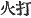

  
[Intangible Textual Heritage](../../index)  [Shinto](../index.md) 
[Index](index)  [Previous](kj089)  [Next](kj091.md) 

------------------------------------------------------------------------

[Buy this Book at
Amazon.com](https://www.amazon.com/exec/obidos/ASIN/B0028Y4SZY/internetsacredte.md)

------------------------------------------------------------------------

  
*The Kojiki*, translated by Basil Hall Chamberlain, \[1919\], at
Intangible Textual Heritage

------------------------------------------------------------------------

p. 261 \[211\]

## \[SECT. LXXXIII.—EMPEROR KEI-KŌ (PART VIII.—YAMATO-TAKE SLAYS THE RULERS OF SAGAMU.)\]

So reaching the Land of Wohari, he went into the house of Princess
Miyadzu, [1](#fn_1598.md) ancestress of the
Rulers of Wohari, [2](#fn_1599.md) and forthwith
thought to wed her; but thinking again that he would wed her when he
should return up \[toward the capital\], and having plighted his troth,
he went \[on\] into the Eastern Lands, and subdued and pacified all the
savage Deities and unsubmissive people of the mountains and rivers. So
then, when he reached the Land of Sagamu, [3](#fn_1600.md) the Ruler of the land lied, saying:
"In the middle of this moor is a great lagoon, and the Deity that dwells
in the middle of the lagoon is a very violent Deity." Hereupon
\[Yamato-take\] entered the moor to see the Deity. Then the Ruler of the
land set fire to the moor. So, knowing that he had been

p. 262

deceived, he opened the mouth of the bag which his aunt, Her Augustness
Yamato-hime had bestowed on him, and saw that inside of it there was a
fire-striker. [4](#fn_1601.md) Hereupon he first
mowed away the herbage with his august sword, took the fire-striker and
struck out fire, and, kindling a counter-fire, burnt \[the herbage\] and
drove back \[the other fire\], and returned forth, and killed and
destroyed all the Rulers [5](#fn_1602.md) of that
Land, and forthwith set fire to and burnt them. So \[that place\] is now
called Yakidzu. [6](#fn_1603.md)

------------------------------------------------------------------------

### Footnotes

[261:1](kj090.htm#fr_1602.md) p. 262 Miyazu-hime (in the "Chronicles "and in the
printed editions of these "Records "previous to Motowori's written
Miyasu-hime without the *nigori*). Neither Motowori nor Tanigaha Shisei
makes any suggestion as to the signification of this name.

[261:2](kj090.htm#fr_1603.md) *Wohari no
miyatsuko*.

[261:3](kj090.htm#fr_1604.md) In the present time
*Sagami*. No authority great or small has given a satisfactory etymology
of this name, though numerous and elaborate attempts have been made to
explain it.

[262:4](kj090.htm#fr_1605.md) In the original
*hi-uchi* ( ). Mr. Satow,
who has given a translation of this passage in a note to his third paper
on the "Rituals "to be found in Vol. IX, Pt. II. p. 202 of these
"Transaction," renders this word by "steel." The present writer prefers
not to prejudge the question as to whether the fire-striker "intended by
the author was a steel, or a wooden fire-drill. Motowori would seem to
have held the latter view, as in his gloss on this passage he refers to
the previous passage near the end of Sect. XXXII, where the fire-drill
is [explicitly](errata.htm#52.md) mentioned. He also quotes an ancient one
in which "a fire-striker of metal "is specially referred to, so that it
would seem that all fire-strikers were not of that material.

[262:5](kj090.htm#fr_1606.md) Remember that this
word "Ruler" (Miyatsuko) had the acceptation of a "gentile name "as well
as of the name of an office, so that we may understand the author to
mean that Yamato-take destroyed the whole Ruling Family of Sagami.
Parallel passage of the "Chronicles'' has "he burnt all that rebel band,
and destroyed them."

[262:6](kj090.htm#fr_1607.md) The words rendered
"that place" are supplied by Motowori, their omission being evidently a
copyist's error. *Yaki-dzu* signifies "the port of burning."

------------------------------------------------------------------------

[Next: Section LXXXIV.—Emperor Kei-kō (Part IX.—Yamato-take's Empress
Stills the Waves](kj091.md)
