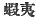

  
[Intangible Textual Heritage](../../index)  [Shinto](../index.md) 
[Index](index)  [Previous](kj091)  [Next](kj093.md) 

------------------------------------------------------------------------

[Buy this Book at
Amazon.com](https://www.amazon.com/exec/obidos/ASIN/B0028Y4SZY/internetsacredte.md)

------------------------------------------------------------------------

  
*The Kojiki*, translated by Basil Hall Chamberlain, \[1919\], at
Intangible Textual Heritage

------------------------------------------------------------------------

p. 264

## \[SECT. LXXXV.—EMPEROR KEI-KŌ (PART X.—YAMATO-TAKE SLAYS THE DEITY OF THE ASHIGARA PASS.)\]

When, having thence penetrated on and subdued all the savage
Yemishi [1](#fn_1612.md) and likewise pacified
all the savage Deities of the mountains and rivers, he was returning up
\[to the capital\], he, on reaching the foot of the Ashigara Pass, [2](#fn_1613.md) was eating his august provisions, when
the Deity of the pass, transformed into a white deer, came and stood
\[before him\]. Then forthwith, on his waiting [3](#fn_1614.md) and striking \[the deer\] with a scrap
of wild chive, [4](#fn_1615.md) \[the deer\] was
hit in the eye and struck dead. So, mounting to

p. 265

the top of the pass, he sighed three times and spoke, saying: "*Adzuma
ha ya!*" [5](#fn_1616.md) So that land is called
by the name of Adzuma.

------------------------------------------------------------------------

### Footnotes

[264:1](kj092.htm#fr_1616.md) This is the
traditional ancient reading of what is according to the modern
pronunciation *Yezo*, while the Chinese characters  , with which the name is
written, signify "Prawn Barbarians," in allusion (if Motowori may be
trusted) to the long beards which make their fades resemble a prawn's
head. The hairy barbarians known to English readers as *Ainos*, and
whose name of *Yezo* is applied by the Japanese to the northernmost
large island of the Japanese Archipelago, which is still chiefly
tenanted by them, are almost certainly here referred to. In ancient
times they inhabited a great part of the Main Island of Japan. The
translator may add that the genuiness of the so-called ancient reading
"*Yemishi*" appears to him doubtful. The name known to the people
themselves, and which apparently can be traced as far as Kamschatka, is
*Yezo*.

[264:2](kj092.htm#fr_1617.md) *Ashigara-zaka*,
one of the passes from Sagami into Suruga leading towards Mount Fuji.

[264:3](kj092.htm#fr_1618.md) *I.e.*, lying in
ambush.

[264:4](kj092.htm#fr_1619.md) *Nira*, the *Allium
odorum*.

[265:5](kj092.htm#fr_1620.md) *I.e.*, "my wife!
"*Adzuma* is still used as a poetical designation of Eastern Japan. The
translator doubts the correctness of the derivation of it given in the
text, although it is universally accepted and certainly fits in well
with the graceful legend by which it is here accounted for.

------------------------------------------------------------------------

[Next: Section LXXXVI.—Emperor Kei-kō (Part XI.—Yamato-take Dwells in
the Palace of Sakawori.)](kj093.md)
