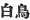

  
[Intangible Textual Heritage](../../index)  [Shinto](../index.md) 
[Index](index)  [Previous](kj096)  [Next](kj098.md) 

------------------------------------------------------------------------

[Buy this Book at
Amazon.com](https://www.amazon.com/exec/obidos/ASIN/B0028Y4SZY/internetsacredte.md)

------------------------------------------------------------------------

  
*The Kojiki*, translated by Basil Hall Chamberlain, \[1919\], at
Intangible Textual Heritage

------------------------------------------------------------------------

p. 274

## \[SECT. XC.—EMPEROR KEI-KŌ (PART XV.—YAMATO-TAKE TURNS INTO A WHITE BIRD)\]

Thereupon \[his\] Empresses [1](#fn_1652.md) and
likewise \[his\] august \[221\] children, who dwelt in Yamato, all went
down [2](#fn_1653.md) and built an august
mausoleum, and, forthwith crawling hither and thither in the rice-fields
encompassing \[the mausoleum\]. sobbed out a Song, saying:

"The *Dioscorea quinqueloba* crawling hither and thither among the
rice-stubble, among the rice-stubble in the rice-fields encompassing
\[the mausoleum\] . . ." [3](#fn_1654.md)

Thereupon \[the dead prince\], turning into a white dotterel [4](#fn_1655.md) eight fathoms \[long\], and soaring up
to Heaven, flew off towards the shore. Then the Empress and likewise the
august children, though they tore their feet treading on the stubble of
the bamboo-grass, forgot the pain, and pursued him with lamentations. At
that time they sang, saying:

"Our loins are impeded in the plain \[over-grown with\] short
bamboo-grass. We are not going through the sky, but oh! we are on
foot." [5](#fn_1656.md)

\[222\] Again when they entered the salt sea, [6](#fn_1657.md) and suffered as they went, they sang,
saying.

"As we go through the sea, our loins are impeded,—tottering in the sea
like herbs growing in a great river-bed." [7](#fn_1658.md)

p. 275

Again when \[the bird\] flew and perched on the sea-side, they sang,
saying:

"The dotterel of the beach goes not on the beach, but follows the
seaside." [8](#fn_1659.md)

These four Songs were all sung at \[Yamato-take's\] august interment. So
to the present day these Songs are sung at the great interment of a
Heavenly Sovereign. So \[the bird\] flew off from that country, [9](#fn_1660.md) and stopped at Shiki in the land of
Kafuchi. [10](#fn_1661.md) So they made an august
mausoleum there, and laid \[Yamato-take\] to rest. [11](#fn_1662) [Forthwith](errata.htm#59.md) that
august mausoleum was called by the \[223\] name of the "August-Mausoleum
of the White-Bird." [12](#fn_1663.md)
Nevertheless the bird soared up thence to heaven again, and flew away.

p. 276

------------------------------------------------------------------------

### Footnotes

[274:1](kj097.htm#fr_1657.md) *I.e.*, wives. It
will be remembered that the historian habitually mentions Yamato-take as
if he had been Emperor.

[274:2](kj097.htm#fr_1658.md) *Q.d.*, to the land
of Ise.

[274:3](kj097.htm#fr_1659.md) The drift of the
Song is a comparison of the; helpless wanderings of the mourners in the
neighbourhood of the tomb to the convolutions of the *Dioscorea
quinqueloba* (a creeping plant) growing among the rice in the adjacent
fields. But there are evidently some lines omitted. If we were to adopt
the elegant verses conjecturally supplied by Moribe, the entire
translation would run thus: "The *Dioscorea quinqueloba* crawl hither
and thither among the rice-stubble, among the rice-stubble in the
rice-fields encompassing \[the mausoleum\]; but though like it, we crawl
hither and thither, and weep and speak to thee, thou answerest not a
word."—Moribe supposes this poem to be the Empress's composition, and
the following three to have proceeded from the children.

[274:4](kj097.htm#fr_1660.md) As usual when the
word chidori (defined as "any kind of dotterel, plover or sandpiper") is
used, it is doubtful what bird is really intended. At the end of this
Section we are told that the Mausoleum was called the Mausoleum of the
White Bird ( )."
Specifically, however, these characters are used with their
Sinico-Japanese pronunciation of *haku-cho* as the name of the swan. But
as swans are nowhere else mentioned in these "Records "and as moreover
their habits are not p. 276 such as to accord
with the legend here narrated, it will perhaps be safer to retain
"dotterel "in the translation. "Heron "also has been suggested.

[274:5](kj097.htm#fr_1661.md) The signification
of this Song is: "It is easy enough for thee, thou bird-spirit! to fly
through the air. But remember that we are on foot, and that our feet are
getting torn by the short stubble of the bamboo-grass (*Bambusa
shino*)."

[274:6](kj097.htm#fr_1662.md) When the bird flew
over the sea, they too waded after it through the waves.

[274:7](kj097.htm#fr_1663.md) The signification
of the Song is: "As we pursue thee through the sea, we sink in the waves
up to our middles, and totter like the water-plants against "which
strikes the current of a great river."—The word *uwe-gusa*, lit. "herbs
planted," is curious; but it simply means "herbs growing," as in the
translation (*conf*. our word "plant"). The latter part of the poem is
in the original highly elliptical.

[275:8](kj097.htm#fr_1664.md) The point of the
Song seems to rest on a delicate distinction between the words *hama*,
"beach "and *iso*, "seaside," which does not obtain in the later
Japanese language any more than it does in English. Both *hama* and
*iso*, "beach" and "seaside," denote the boundary-line between sea and
land; but we must suppose with the commentators that while the former
was used with special reference to the land, the latter considered the
idea (so to speak) from the point of view of the sea. The import of the
song is therefore to upbraid the bird for flying over the waves instead
of flying along the adjacent shore.

[275:9](kj097.htm#fr_1665.md) *I.e.*, says
Motowori, from Ise.

[275:10](kj097.htm#fr_1666.md) Not to be
confounded with the Shiki in Yamato, which is written with different
phonetic character.

[275:11](kj097.htm#fr_1667.md) The Verb used in
the original is *shizumeru*, "to repress," "to quiet," "to lay," "to
establish," hence "to build a temple to a god," "to worship." The
grammatical vagueness of the Japanese language helps in all this passage
to preserve the connection of ideas in a manner which it is difficult to
render in an English translation. Using no pronouns, it does not require
to specialise in each instance whether it is the bird that is meant, or
Yamato-take, but the two are confounded together in language as they
were in thought.

[275:12](kj097.htm#fr_1668.md) *Shira-tori no
misasaki*. According to the parallel passage of the "Chronicles," it was
not only this tomb in Kafuchi, but the previously mentioned tomb at
Nobonu, and also another in Yamato, which were severally known by this
designation.

------------------------------------------------------------------------

[Next: Section XCI.—Emperor Kei-kō (Part XVI.—Yamato-Take's
Butler)](kj098.md)
