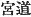
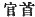
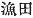

  
[Intangible Textual Heritage](../../index)  [Shinto](../index.md) 
[Index](index)  [Previous](kj098)  [Next](kj100.md) 

------------------------------------------------------------------------

[Buy this Book at
Amazon.com](https://www.amazon.com/exec/obidos/ASIN/B0028Y4SZY/internetsacredte.md)

------------------------------------------------------------------------

  
*The Kojiki*, translated by Basil Hall Chamberlain, \[1919\], at
Intangible Textual Heritage

------------------------------------------------------------------------

## \[SECT. XCII.—EMPEROR KEI-KŌ (PART XVII.—YAMATO-TAKE'S DESCENDANTS).\]

This \[Prince\] His Augustness Yamato-take wedded Her Augustness
Princess Futaji-no-iri, [1b](#fn_1666.md)
daughter of the Heavenly Sovereign Ikume, and begot an august child: His
Augustness Tarashi-naka-tsu-hiko [2b](#fn_1667.md) (one
Deity). Again, wedding Her Augustness Princess
Oto-tachibana [3](#fn_1668.md) who \[afterwards\]
entered the sea, [4](#fn_1669.md) he begot an
august child: King Waka-take [5](#fn_1670.md)
(one Deity). Again, wedding Princess \[224\]
Futaji, [6](#fn_1671.md) daughter of
Oho-tamu-wake, [7](#fn_1672.md) ancestor of the
Rulers of the Land of Yasu in Chika-tsu-Afumi, [8](#fn_1673.md) he begot an august child: King
Ine-yori-wake [9](#fn_1674.md) (one Deity). Again, wedding Princess
Oho-kibi-take, [10](#fn_1675.md) younger sister
of Take-hiko \[ancestor of the\] Grandees of Kiki, [11](#fn_1676.md) he begot an

p. 278

august child: King Take-kahiko [12](#fn_1677.md)
(one Deity). Again, wedding Princess
Kukuma-mori of Yamashiro, [13](#fn_1678.md) he
begot an august child, King Ashi-kagami-wake [14](#fn_1679.md) (one
Deity). A child by another wife was King Okinaga-ta-wake. [15](#fn_1680.md) Al-together the entire \[number\] of
the august children of His Augustness Yamato-take was six Deities. So
His Augustness Tarashi-naka-tsu-hiko \[was he who afterwards\] ruled the
Empire. The next, King Ine-yori-wake (was the
ancestor of the Dukes of Inukami [16](#fn_1681.md) and of the Dukes of
Takebe.) [17](#fn_1682.md) \[225\] The
next, King Take-kahiko (was the ancestor of the
Dukes of Aya in Sanugi, [18](#fn_1683.md) the
Dukes of Wake in Iyo, [19](#fn_1684.md) the Lords
of Towo, [20](#fn_1685.md) the Headmen of
Masa [21](#fn_1686.md) and the Lords of
Miyaji.) [22](#fn_1687.md) King
Ashi-kagami-wake (was the ancestor of the Lords of
Kamakura, [23](#fn_1688.md) the Dukes of
Wodzu, [24](#fn_1689.md) the Lords of
Ihashiro [25](#fn_1690.md) and the Lords of
Fukita.) [26](#fn_1691.md) The child of
the next, King Okinaga-ta-wake was King Kuhi-mata-naga-hiko. [27](#fn_1692.md) This King's children were: Her
Augustness Princess Ihinu-ma-guro, [28](#fn_1693.md) next
Okinaga-ma-waka-naka-tsu-hime, [29](#fn_1694.md)
next Oto-hime [30](#fn_1695.md) (three Deities). So the above mentioned King
Waka-take wedded Princess Ihinu-ma-guro, \[226\] and begot King
Sume-iro-oho-naka-tsu-hiko. [31](#fn_1696.md)
This King wedded Princess Shibanu, [32](#fn_1697.md) daughter of Shibanu-iri-ki [33](#fn_1698.md) of Afumi, and begot a child, Her
Augustness Princess Kaguro. [34](#fn_1699.md) So
the Heavenly Sovereign Oho-tarashi-hiko wedded this \[lady\] Her
Augustness Princess Kaguro, and begot King Oho-ye [35](#fn_1700.md) (one
Deity). This King wedded his younger half-sister Queen
Shiro-kane, [36](#fn_1701.md) and begot children:
King Oho-na-gata, [37](#fn_1702.md) and next Her
Augustness Oho-naka-tsu-hime [38](#fn_1703.md)
(two Deities). So this \[Lady\] Her
Augustness Oho-naka-tsu-hime was the august mother [39](#fn_1704.md) of King Kagosaka [40](#fn_1705.md) and King Oshikuma. [41](#fn_1706.md)

p. 279 p. 280

------------------------------------------------------------------------

### Footnotes

[277:1b](kj099.htm#fr_1671.md) p. 278 For this name see Sect. LXIX, Note 24.

[277:2b](kj099.htm#fr_1672.md) *I.e.*, "the
perfect middle prince," a name which is justified by p. 279 the genealogy as given in the "Chronicles,"
where he is mentioned as the second of three sons borne by this
princess.

[277:3](kj099.htm#fr_1673.md) *Oto-tachibana-hime
no mikoto*. *Oto* signifies "younger \[sister\]," and *Oto-tachibana* is
the name of the orange.

[277:4](kj099.htm#fr_1674.md) See the story in
Sect. LXXXIV.

[277:5](kj099.htm#fr_1675.md) *Waka-tate no
miko*. This name signifies "young brave."

[277:6](kj099.htm#fr_1676.md) *Futaji-hime*.
Signification obscure. Futaji may be the name of a place.

[277:7](kj099.htm#fr_1677.md) If *Tamu* is, as
Motowori surmises, the name of a place, this personal name signifies
"Great Lord of Tamu."

[277:8](kj099.htm#fr_1678.md) *Chika-tsu-Afumi no
Yasu no kuni no miyatsuko*. For *Yasu* see Sect. LXII, Note 62.

[277:9](kj099.htm#fr_1679.md) *Ine-yori-wake no
miko*. This name probably signifies "rice-good-lord."

[277:10](kj099.htm#fr_1680.md)
*Oho-kibi-take-hime*. *Oho* signifies "great." For the other two
elements of the compound see next Note.

[277:11](kj099.htm#fr_1681.md) The text has *Kibi
no omi Take-hiko*, as if this worthy had been himself the "Grandee of
Kibi." Motowori however compares the commencement of Sect. LXXXII (Notes
2 and 3), and supplies the words "ancestor of." *Kibi* is of course the
province of that name (the modern, Bizen, Bitchiū, and Bingo), and
*take* signifies "brave."

[278:12](kj099.htm#fr_1682.md) *Take-kahiko no
miko*. *Take* signifies "brave," *kahiko* is either "egg "or "cocoon,"
or else perhaps a corruption of some other word.

[278:13](kj099.htm#fr_1683.md) *Yamashiro no
Kukuma mori-hime*. This name is obscure. Motowori identifies Kukuma with
a place called *Kurihuma*, and *mori* is probably the Verb "to guard."

[278:14](kj099.htm#fr_1684.md) *Ashi-kagami-wake
no miko*. This name is written with characters signifying
"foot-mirror-\[lord\]."

[278:15](kj099.htm#fr_1685.md) *Okinaga-ta-wake
no miko*. This name is obscure. Motowori believes Okinaga to be the name
of a place in Afumi, but has no explanation to offer of *ta*.

[278:16](kj099.htm#fr_1686.md) *Inukami no kimi*.
Inukami is the name of a district in Afumi, Its signification is not
clear.

[278:17](kj099.htm#fr_1687.md) *Takebi no kimi*.
*Takebe* became the name of a place in Idzumo, but it originally
signified "brave tribe," the family having, as in so many other cases,
given its name to the place of its residence, instead of being called
after the latter. See the origin of the name, given in Motowori's
Commentary, Vol. XXIV, pp. 35-36.

[278:18](kj099.htm#fr_1688.md) *Sanugi no Aya no
kimi*. For *Sanugi* see Sect. V, Note 6. *Aya* is a district in the
province; the name is of doubtful origin.

[278:19](kj099.htm#fr_1689.md) p. 280 *Iyo no wake no kani*. For *Iyo* see Sect.
V, Note 4. (The text here has *Ise* for Iyo, and the word *wake* is
missing, but Motowori's emendation may be accepted). *Wake* is the name
of a district in Iyo.

[278:20](kj099.htm#fr_1690.md) *Towo no wake*. Of
*Towo* nothing is known.

[278:21](kj099.htm#fr_1691.md) *Masa no obito*.
Of *Masa* nothing is known.

[278:22](kj099.htm#fr_1692.md) *Miyagi* ( ) *no wake*. This is Motowori's
ingenious emendation of the characters in the text,  , out of which it is impossible
to make a [family](errata.htm#60.md) name. *Miyagi* is the name of a place
in the province of Mikaha, and signifies "temple road."

[278:23](kj099.htm#fr_1693.md) *Kamakura no
wake*. Kamakura is the name of a district in the province of Sagami,
which became famous during the Middle Ages as the site of an immense
town,—the capital of the Shōgun, and the centre of the feudalism which
then ruled Japan. The import of the name (literally "sickle-store") is
not clear, though it has been fancifully explained by native
etymologists.

[278:24](kj099.htm#fr_1694.md) *Wodzu no kimi*.
The words *no kimi* are supplied by Motowori, this name and the next
being in the text run into one. Wodzu seems to be the name of a place in
Afumi, and signifies "little mart."

[278:25](kj099.htm#fr_1695.md) *Ihashiro no
wake*. Motowori says that this Ihashiro is not the province of that
name, but a place in Kishiu. The meaning of the name is obscure.

[278:26](kj099.htm#fr_1696.md) *Fukita no wake*.
This is but Motowori's conjectural restoration (founded on a statement
in the "Chronicles of Old Matters of Former Ages") of the name as given
in the text,  .

[278:27](kj099.htm#fr_1697.md)
*Kuhimata-naga-hiko no miko*. *Kuhimata* (modern *Kumata*) is the name
of a place in Settsu. The signification is obscure. *Naga-hiko* means
"long prince."

[278:28](kj099.htm#fr_1698.md)
*Ihinu-ma-guro-hime*, *i.e.*, "quite black princess of Ihinu," the
blackness being doubtless predicated of her hair. *Ihinu* is the name of
a district in Ise, and is written with characters signifying
"boiled-rice-moor."

[278:29](kj099.htm#fr_1699.md) For *Okinaga* see
Note 15. *Ma-waka* means "truly young." *Naka-tsu-hime* means "middle
princess," referring to her being the second of three.

[278:30](kj099.htm#fr_1700.md) *I.e.*, "younger
princess."

[278:31](kj099.htm#fr_1701.md) See Sect. LXXVI,
Note 29.

[278:32](kj099.htm#fr_1702.md) *Shibanu-hime*.
This name is obscure.

[278:33](kj099.htm#fr_1703.md) *Shibunu iri-ko*.
This name is obscure.

[278:34](kj099.htm#fr_1704.md) *Ka-gara hime*,
see Sect. LXXVI, Note 28.

[278:35](kj099.htm#fr_1705.md) p. 281 For the confusion in this portion of the
genealogy see Sect. LXXVI, Note 30.

[278:36](kj099.htm#fr_1706.md) *Shiro-kane no
miko*. *Shiro-kane* means "silver," but Motowori suspects corruption in
the text.

[278:37](kj099.htm#fr_1707.md) *Oho-nagata no
miko*, *i.e.*, "great prince of Nagata," the latter being the name of a
place in Settsu, signifying "long rice-field."

[278:38](kj099.htm#fr_1708.md) *I.e.*, "great
middle princess."

[278:39](kj099.htm#fr_1709.md) Literally,
"ancestress."

[278:40](kj099.htm#fr_1710.md) Or, "the King of
Kagosaka," for it is' uncertain whether Kagosaka should or should not be
regarded as the name of a place. The etymology of the name may be
*kago*, "a stag" and *saka*, "an ascent." The original form of the name
and title is *Kagosaka no miko*.

[278:41](kj099.htm#fr_1711.md) Or, "the King of
Oshikuma," *Oshikuma no miko*. *Oshikuma* is a word of doubtful
etymology.

------------------------------------------------------------------------

[Next: Section XCIII.—Emperor Kei-kō (Part XVIII. His Age and Place of
Burial)](kj100.md)
