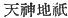
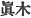

  
[Intangible Textual Heritage](../../index)  [Shinto](../index.md) 
[Index](index)  [Previous](kj103)  [Next](kj105.md) 

------------------------------------------------------------------------

[Buy this Book at
Amazon.com](https://www.amazon.com/exec/obidos/ASIN/B0028Y4SZY/internetsacredte.md)

------------------------------------------------------------------------

  
*The Kojiki*, translated by Basil Hall Chamberlain, \[1919\], at
Intangible Textual Heritage

------------------------------------------------------------------------

p. 286

## \[SECT. XCVII.—EMPEROR CHIŪ-AI (PART III. PREPARATIONS FOR THE CONQUEST OF KOREA).\]

Then, astonished and alarmed, they set him in a mortuary palace, [1](#fn_1737.md) and again taking the country's great
offerings, [2](#fn_1738.md) seeking out all sorts
of crimes, such as flaying alive and flaying backwards, [3](#fn_1739.md) breaking down the divisions of
rice-fields, filling up ditches, evacuating excrements and urine,
marriages between superiors and inferiors, [4](#fn_1740.md) marriages with horses, marriages with
cattle, marriages with fowls, and marriages with dogs, and having made a
great purification of the land, [5](#fn_1741.md)
the Noble Takeuchi again stood in the pure court and requested the
Deities' commands. Thereupon the manner of their instruction and counsel
was exactly the same as on the former day: "Altogether this land is a
land to be ruled over by the august child in Thine
[Augustness's](errata.htm#64.md) august womb." [6](#fn_1742.md) Then the Noble Take-uchi said, "\[I am
filled with\] awe, my Great Deities\] The august child in this Deity's
\[231\] womb, [7](#fn_1743.md) what \[sort of\]
child may it be?" \[The Deities\] replied, saying: "It is a male child."
Then \[the Noble Take-uchi\] requested more particularly, \[saying\]: "I
wish to know the august names of the Great Deities whose words have now
thus instructed us." Forthwith \[the Deities\] replied, saying: "It is
the august doing [8](#fn_1744.md) of

p. 287

the Great-August-Heaven-Shining-Deity, likewise it is the three great
Deities Bottom-Possessing-Male, Middle-Possessing Male and
Surface-Possessing-Male. [9](#fn_1745.md) (At this time the august names of these three great Deities
were revealed. [10](#fn_1746).md) If now
thou truly thinkest to seek that land, thou must, after presenting the
offerings [11](#fn_1747.md) to every one of the
Heavenly Deities and Earthly Deities, [12](#fn_1748.md) and likewise of the Deities of the
mountains and also of all the Deities of the river and of the sea, and
setting our august spirits [13](#fn_1749.md) on
the top of thy vessel, put into gourds [14](#fn_1750.md) the ashes of the *podocarpus
macrophylla* tree, [15](#fn_1751.md) and likewise
make a quantity of chopsticks and also of leaf platters, [16](#fn_1752.md) and must scatter \[232\] them all on
the waves of the great sea, that thou mayest cross over." So when
\[she\] punctually fulfilled these instructions, equipped an army,
marshalled \[her vessels, and crossed over, the fishes of the sea-plain,
both great and small, all bore the august vessels [17](#fn_1753.md) across their backs, and a strong
favourable wind arose, and the august vessel followed the billows.

p. 288

------------------------------------------------------------------------

### Footnotes

[286:1](kj104.htm#fr_1742.md) p. 287 A temporary resting-place for the corpse
before interment. (See Sect. XXXI, Note 20.)

[286:2](kj104.htm#fr_1743.md) Or, if, with
Motowori, we take country in the Plural, "the great offerings of the
countries," *i.e.*, of the various countries or provinces of Japan or of
Kiushiu. These "offerings" (*nusa*) are the same as those mentioned in
Sect. XVI (Notes 24 and 25) under the names *nigi-te* and *mitegura*.
They consisted of cloth, for which in later times paper has been
substituted.

[286:3](kj104.htm#fr_1744.md) There are different
views as to the exact bearing of this curious expression. *Conf*. Sect.
XV, Note 10.

[286:4](kj104.htm#fr_1745.md) *I.e.*, incest
between parents and children.

[286:5](kj104.htm#fr_1746.md) *I.e.*, a general
purification.

[286:6](kj104.htm#fr_1747.md) The Deities now
speak to, as well as through, the Empress. Before the quotation marks
announcing their words we must understand some such clause as and they
added this divine charge." It would p. 288
also be possible to translate the whole passage thus: "Thereupon the
manner of their instruction and counsel. was '\[Things\] being exactly
as on the former day, altogether this land,'" etc., etc.

[286:7](kj104.htm#fr_1748.md) *I.e.*, in the
Empress's womb. Motowori supposes that she is thus spoken of as a Deity
on account of her being at that moment divinely possessed.

[286:8](kj104.htm#fr_1749.md) Literally, "heart."

[287:9](kj104.htm#fr_1750.md)
*Soko-dzu-tsu-no-wo*, *Naka-dzu-tsu-no wo*, and *Uha-dzu-tsu-no-wo*
three of the deities born at the time of the purification of Izanagi
(the "Male-Who-Invites") on his return from Hades, and known
collectively as the Deities of the Inlet of Sumi. (See Sect. X, Notes 18
and 22). The grammar of this sentence is, as Motowori remarks, not
lucid. One would expect the author to say that it was "the august doing"
of all the four deities mentioned.

[287:10](kj104.htm#fr_1751.md) *I.e.*, says
Motowori, they then first informed Take-uchi who they were. Up in that
time, it had not been known by what Deities the Empress was possessed.
Mabuchi, however, rejected this gloss as a later additions.

[287:11](kj104.htm#fr_1752.md) *I.e.*, the sacred
offerings of white and blue cloth.

[287:12](kj104.htm#fr_1753.md) Here [written
with](errata.htm#65.md) the Chinese locution 
, by some rendered "the Spirit of Heaven and Earth."
*Conf*. Sect. I. Note II.

[287:13](kj104.htm#fr_1754.md) Here, as before,
the Singular would be at least as natural an interpretation as the
Plural. The three ocean-deities are supposed to be specially referred
to, and in that case, the three being easily conceived as one (like the
deified peaches mentioned in Sect. IX, Note 19) owing to the want of
discrimination in Japanese between Singular and Plural, we might retain
the Singular in English. Altogether the Sun-goddess seems out of place
in this passage, and it would be satisfactory to have some authority for
expunging from it the mention of her name.

[287:14](kj104.htm#fr_1755.md) Or, "into a
gourd."

[287:15](kj104.htm#fr_1756.md) In the original
*maki* ( ). In modern
*ma-ki* signifies the *P. macrophylla*, as in the translation. It is
however uncertain whether that or the *Chamæcyparis obtusa* (both being
conifers), or simply any "true" (*i.e.*, good) tree is here intended by
the author.

[287:16](kj104.htm#fr_1757.md) *I.e.*, broad
shallow platters made of the oak-tree, and used for placing food on.

[287:17](kj104.htm#fr_1758.md) Viz., that in
which the Empress herself took passage.

------------------------------------------------------------------------

[Next: Section XCVIII.—Emperor Chiū-ai (Part IV.—The Empress Jin-gō
Conquers Korea)](kj105.md)
