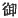

  
[Intangible Textual Heritage](../../index)  [Shinto](../index.md) 
[Index](index)  [Previous](kj107)  [Next](kj109.md) 

------------------------------------------------------------------------

[Buy this Book at
Amazon.com](https://www.amazon.com/exec/obidos/ASIN/B0028Y4SZY/internetsacredte.md)

------------------------------------------------------------------------

  
*The Kojiki*, translated by Basil Hall Chamberlain, \[1919\], at
Intangible Textual Heritage

------------------------------------------------------------------------

p. 295

## \[SECT. CI.—EMPEROR CHIŪ-AI (PART VIII.—THE HEIR APPARENT EXCHANGES NAMES WITH THE GREAT DEITY IZASA-WAKE).\]

So when His Augustness the Noble Take-uchi, taking with him the Heir
Apparent for the purpose of purification, [1](#fn_1794.md) passed through the lands of Afumi and
Wakasa, [2](#fn_1795.md) he built a temporary
palace at Tsunuga [3](#fn_1796.md) at the mouth
of the Road of Koshi [4](#fn_1797.md) \[for the
Heir Apparent\] to dwell in. Then His Augustness the Great Deity
Izasa-wake, [5](#fn_1798.md) who dwelt in that
place, appeared at night in a dream, [6](#fn_1799.md) and said: "I wish to exchange my name
for the august name of the august child." Then \[the dreamer of the
dream\] prayed, saying: "\[I\] am filled with awe! [7](#fn_1800.md) The name shall be respectfully
exchanged according to thy command." Again the Deity charged \[him,
saying\]: "To-morrow morning \[the Heir Apparent\] must go out on the
beach; I will present my \[thank\] offering for the name \[given me\] in
exchange." So when \[the Heir Apparent\] went out in the morning to the
beach, the \[238\] whole shore was lined with broken-nosed
dolphin-fishes. [8](#fn_1801.md) Thereupon the
august child caused the Deity to be addressed, saying: "Thou bestowest
on me fish of thine august food." [9](#fn_1802.md) So again his august name was
[honoured](errata.htm#68.md) by his being called the Great Deity of August
Food. [10](#fn_1803.md)" So he is now styled the
Food-Wondrous-Great-Deity. [11](#fn_1804.md)

p. 296

\[paragraph continues\] Again the blood
from the noses of the dolphin-fishes stank. So the strand was called by
the name of Chiura. [12](#fn_1805.md) it is now
styled Tsunuga.

------------------------------------------------------------------------

### Footnotes

[295:1](kj108.htm#fr_1799.md) Viz., by water, as
described in Sect. X.

[295:2](kj108.htm#fr_1800.md) Etymology obscure.

[295:3](kj108.htm#fr_1801.md) The marvellous
etymology of this name which the author seems to adopt will be found at
the end of the Section (Note 12). The compiler of the "Chronicles "is
probably nearer the truth when he derives it from *tsunu-ga*, "horned
stag."

[295:4](kj108.htm#fr_1802.md) For the meaning of
this curious expression see Sect. LX, Note 20.

[295:5](kj108.htm#fr_1803.md) The commentators
give no explanation of this one of the three names of the deity in
question. It would appear to be made up of a word expressive of
solicitation and of a portion of the Heir Apparent 's name, thus
signifying perhaps "Come on, Wake, \[give me thy name\] "with reference
to the legend here narrated.

[295:6](kj108.htm#fr_1804.md) To which of the two
personages of the legend is not clear. Motowori, however, prefers to
suppose that it was to Take-uchi, as, if the prince himself were
intended, the word "dream "would probably receive the Honorific  .

[295:7](kj108.htm#fr_1805.md) Or, "I reverence
\[thy commands\]."

[295:8](kj108.htm#fr_1806.md) Motowori supposes
that they were caught by being speared in the nose.

[295:9](kj108.htm#fr_1807.md) *I.e.*, "fish that
would naturally have formed part of thine august food," is less good to
translate by "fish for *mine* august food." As usual, the original
Japanese text has no Personal Pronouns to guide the reader; but, though
Emperors are sometimes made to use the Honorific in speaking of
themselves, this is not the custom in the case of princes' and Ō-jin is
supposed to have not yet assumed the Imperial dignity.

[295:10](kj108.htm#fr_1808.md)
*Mi-ke-tsu-oho-kami*. Motowori mentions several Deities of this name,
who were, according to him, separate beings.

[295:11](kj108.htm#fr_1809.md) *Kehi no
oho-kami*. The meaning of the syllable *hi*, rendered by "wondrous "in
accordance with Motowori's suggestion, is not certain.

[296:12](kj108.htm#fr_1810.md) *I.e.*, "the
strand of blood." From *chi-ura* Motowori is obliged to derive Tsunuga
as well as he can in order not to throw discredit on the implied
assertion of the author: that the latter is but a mispronunciation of
the former. The true derivation of Tsunuga is probably from *tsunuga*
"horned stag," as already stated in Note 3.

------------------------------------------------------------------------

[Next: Section CII.—Emperor Chiū-ai (Part VIII.—The Empress Jin-gō
Presents Liquor to the Heir Apparent)](kj109.md)
