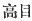

  
[Intangible Textual Heritage](../../index)  [Shinto](../index.md) 
[Index](index)  [Previous](kj110)  [Next](kj112.md) 

------------------------------------------------------------------------

[Buy this Book at
Amazon.com](https://www.amazon.com/exec/obidos/ASIN/B0028Y4SZY/internetsacredte.md)

------------------------------------------------------------------------

  
*The Kojiki*, translated by Basil Hall Chamberlain, \[1919\], at
Intangible Textual Heritage

------------------------------------------------------------------------

p. 299

## \[SECT. CIV.—EMPEROR Ō-JIN [1](#fn_1814) (PART 1.—GENEALOGIES.md).\]

His Augustness Homuda-wake dwelt at the palace of Akira at
Karushima, [2](#fn_1815.md) and ruled the Empire.
This Heavenly Sovereign wedded three [3](#fn_1816.md) queens, daughters of King
Homuda-no-Ma-waka, [4](#fn_1817.md) the name of
one of whom was Her Augustness Princess Takagi-no-iri; [5](#fn_1818.md) of the next, Her Augustness
Naka-tsu-hime; [6](#fn_1819.md) and of the next,
Her Augustness Oto-hime. [7](#fn_1820.md) (The father of these Queens, King Homuda-no-ma-Waka, was
the son of His Augustness Prince Iho-ki-noiri, [8](#fn_1821.md) by his \[241\] wife
Shiritsuki-tome, [9](#fn_1822.md) daughter of the
Noble Take-inada, [10](#fn_1823.md) ancestor of
the Chiefs of Wohari.) [11](#fn_1824.md)
So the august children of Her Augustness Princess Takagi-no-iri were:
His Augustness Nakuta-no-oho-waka-tsu-hiko; [12](#fn_1825.md) next His Augustness
Oho-yama-mori; [13](#fn_1826.md) next His
Augustness Iza-no-ma-waka; [14](#fn_1827.md) next
his younger sister the Lady of Ohohara; [15](#fn_1828.md) next the Lady of Komuku. [16](#fn_1829.md) (Five
Deities). The august children of Her Augustness Naka-tsu-hime
were: the Lady of Arata in Ki; [17](#fn_1830.md)
next His Augustness Oho-sazaki; [18](#fn_1831.md)
next His Augustness Netori. [19](#fn_1832.md)
(Three Deities). The august \[242\] children of Her Augustness Oto-hime
were: the Lady Abe; [20](#fn_1833.md) next the
Lady of Mihara in Ahaji; [21](#fn_1834.md) next

p. 300

the Lady of Unu in Ki; [22](#fn_1835.md) next the
Lady of Minu [23](#fn_1836.md) (five Deities). [24](#fn_1837.md) Again he wedded the Princess
Miya-nushi-ya-kaha-ye, [25](#fn_1838.md)daughter
of the Grandee Wani-no-Hifure, and begot august children:
Uji-no-waki-iratsuko; [26](#fn_1839.md) next his
younger sister Yata-no-waki-iratsume; [27](#fn_1840.md) next Queen Medori. [28](#fn_1841.md) (Three
[Deities](errata.htm#73).md). Again he wedded
Wo-nabe-no-iratsume, [29](#fn_1842.md) younger
sister of Yakaha-ye-hime, and begot an august child:
Uji-no-iratsume. [30](#fn_1843.md) (one Deity). Again he wedded
Okinaga-ma-waka-naka-tsu-hima," [31](#fn_1844.md)
daughter of King Kuhimata-naga-hiko, [32](#fn_1845.md) and begot an august child: King
Waka-nuke-futa-mata [33](#fn_1846.md) (one Deity). Again he wedded the Princess of
Itowi, [34](#fn_1847.md) daughter of
Shima-tari-ne, [35](#fn_1848.md) ancestor \[243\]
of the Agricultural Chiefs of Sakurawi, [36](#fn_1849.md) and begot an august child; His
Augustness Hayabusa-wake [37](#fn_1850.md) (one Deity). Again, he wedded Naga-hime of Idzumi in
Himuka, [38](#fn_1851.md) and begot august
children: King Oho-haye, [39](#fn_1852.md) next
King Wo-haye; [40](#fn_1853.md) next
Hata-bi-no-waki-iratsume [41](#fn_1854.md) (three Deities). Again he wedded Princess
Ka-guro, [42](#fn_1855.md) and begot august
children: Kaha-rada-no-iratsume; [43](#fn_1856.md) next, Tama-no-iratsume, [44](#fn_1857.md) next,
Osaka-no-oho-naka-tsu-hime; [45](#fn_1858.md)
next, Toho-hi-no-iratsume; [46](#fn_1859.md)
next, King Kataji [47](#fn_1860.md) (five Deities). Again, he wedded Nu-iro-me of
Kadzuraki, [48](#fn_1861.md) and begot an august
\[244\] child: King Iza-no-ma-waka, [49](#fn_1862) (one Deity.md). The august children of
this Heavenly Sovereign \[numbered\] altogether twenty-six (eleven Kings and fifteen Queens). Of these His
Augustness Oho-sazaki \[was he who afterwards\] ruled the Empire.

p. 301 p. 302

------------------------------------------------------------------------

### Footnotes

[299:1](kj111.htm#fr_1819.md) Son of the Emperor
Chiū-ai and the Empress Jin-gō.

[299:2](kj111.htm#fr_1820.md) In Yamato. *Akira*
Signifies "brilliant." [*Karushima*](errata.htm#69.md) seems to mean "the
neighbourhood of Karu, Karu being the often mentioned place of that name
in Yamato.

[299:3](kj111.htm#fr_1821.md) The Auxiliary
Numeral for deities is here used.

[299:4](kj111.htm#fr_1822.md) p. 301 *Homuda-no-ma-waka no miko*. *Homuda* has
already been met with as the came of a place in Kahachi. *Ma-waka*
signifies "truly young." The name might therefore be rendered "truly
young king of Homuda."

[299:5](kj111.htm#fr_1823.md) *Takagi no iri-bime
no mikoto*. Motowori identifies this princess with the Takaki-hime of
Sect. LXXVI, Note 21.

[299:6](kj111.htm#fr_1824.md) *I.e.*, "middle
princess," she being the second of three sisters.

[299:7](kj111.htm#fr_1825.md) *I.e.*, "younger
princess," she being the youngest of the sisters.

[299:8](kj111.htm#fr_1826.md)
*I-ho-ki-no-iri-biko no mikoto*. See Sect. LXXVI, Note 12.

[299:9](kj111.htm#fr_1827.md) *I.e.*, probably
"old woman of Shiritsuki." But it is not certain that Shiritsuki is the
name of a place.

[299:10](kj111.htm#fr_1828.md) *Take-inada no
sukune*. In the "Chronicles of Old Matters of Former Ages" the name is
written *Take-ina-dane*, and it may therefore mean "brave-rice-seed."

[299:11](kj111.htm#fr_1829.md) *Wohari no
murazhi*.

[299:12](kj111.htm#fr_1830.md) *I.e.*, "great
middle Prince of Nukata," the latter being the name of a place in
Yamato. It is of uncertain signification.

[299:13](kj111.htm#fr_1831.md) *I.e.*, "great
mountain-warden." For the appropriateness of this name conf. Sect. CV.

[299:14](kj111.htm#fr_1832.md) The same name has
appeared in Sect. LXIII, Note 13.

[299:15](kj111.htm#fr_1833.md) *Ohohara no
iratsume*. [Ohohara](errata.htm#70.md) is the name of a place in Yamato It
signifies "great moor."

[299:16](kj111.htm#fr_1834.md) *Komuku no
iratsume*. This name is written 
 and its reading as *Komuku* is somewhat
[hypothetical](errata.htm#71.md). It is the name of a place in Kahachi, and
probably signifies "an overflowing pool of water."

[299:17](kj111.htm#fr_1835.md) *Ki no Arata no
iratsume*. *Ki* is the [province](errata.htm#72.md) of that name, and Arata
is a place in it. The latter name probably means "uncultivated fields."

[299:18](kj111.htm#fr_1836.md) This name
signifies "Great Wren," and is thus accounted for by the author of the
"Chronicles": "On the day when the Emperor \[this Prince became the
Emperor Nin-toku\] was born, an owl flew into the parturition-hall. Next
morning early, the Heavenly Sovereign Homuda \[*i.e.*, the Emperor
Ō-jin\] sent for the Prime Minister, the Noble Takeuchi, and asked him
whereof this might be a sign. The Prime Minister replied, saying: 'It is
a good omen. Moreover yesterday, when thy servant's wife was delivered
of a child, a wren flew into the parturition-house, likewise a strange
thing.' Then the Heavenly Sovereign said: 'It is a portent from heaven
that my child and thine should be born on the same day, and both be
attended by a good omen. So let the names of the birds be taken,' and
each used for the name of the other \[*i.e.*, p.
302 the name of the owl for him into whose parturition-house the
wren flew, and *vice-versâ*\], as a covenant for the future.' So the
wren's name was bestowed on the Heir Apparent, who was called Great-Wren
Prince, and the owl's name was give Ito the Prime Minister's child. who
was called the Noble Owl."

[299:19](kj111.htm#fr_1837.md) This name is
obscure.

[299:20](kj111.htm#fr_1838.md) *Abe no iratsume*.
Abe is the name of several places in different provinces, and is of
obscure derivation and import.

[299:21](kj111.htm#fr_1839.md) *Ahaji no Mikara
no iratsume*. The text properly has *Ayuchi*, but Motowori emends this
to *Ahaji* on the authority of the "Chronicles."' Mihara is the name of
a district in the island of Ahaji, and probably signifies "three moors."

[300:22](kj111.htm#fr_1840.md) *Ki no Unu*
[*no*](errata.htm#74.md) *iratsume*. *Ki* is the province of that name, and
*Unu* a place in it. The latter name is of uncertain import.

[300:23](kj111.htm#fr_1841.md) *Minu no
iratsume*. *Minu* (*Mino*) is the province of that name.

[300:24](kj111.htm#fr_1842.md) "Five" must here
be a mistake for "four."

[300:25](kj111.htm#fr_1843.md) For this name and
the next see Sect. CVI, Notes 5 and 4.

[300:26](kj111.htm#fr_1844.md) *I.e.*, "the young
lord of Uji." Uji is the name of a district in Yamashiro, famous in
classical and modern times for its tea. The etymology is obscure.

[300:27](kj111.htm#fr_1845.md) *I.e.*, "the young
lady of Yata." Yata is the name of a place in Yamato. The etymology is
obscure.

[300:28](kj111.htm#fr_1846.md) *Medori no* miko.
*Medori* signifies "hen-bird:" but the reason for the application of so
strange a name to this princess, whose fortunes are related at some
length in Sect. CXXVI and CXXVII, does not appear. A similar remark
applies to the next name.

[300:29](kj111.htm#fr_1847.md) *I.e.*, probably
"the lady of the little kettle."

[300:30](kj111.htm#fr_1848.md) *I.e.*, "the young
lady of Uji."

[300:31](kj111.htm#fr_1849.md) *I.e.*, "the truly
young middle princess of Okinaga."

[300:32](kj111.htm#fr_1850.md) See Sect. XCII,
Note 27.

[300:33](kj111.htm#fr_1851.md)
*Waka-muke-futa-mata no miko*. This name is obscure.

[300:34](kj111.htm#fr_1852.md) *Itowi-hime*.
Itowi is the name of a place in Yamato, and is of uncertain origin.

[300:35](kj111.htm#fr_1853.md) *Shima* is
probably the name of a place, while *tari* and *ne* are the frequently
recurring Honorifics rendered respectively "perfect" and "lord "in
former parts of this translation.

[300:36](kj111.htm#fr_1854.md) *Sakurawi no ta-be
no murazhi*. *Ta-be*, rendered "agricultural," is literally "rice-field
tribe." *Sakurawi* ("cherry well") is the name of a place in Kahachi.

[300:37](kj111.htm#fr_1855.md) *I.e.*,
falcon-lord.

[300:38](kj111.htm#fr_1856.md) p. 303 *Himuka no Idzumi no Naga-hime*. Himuka is
the name of a province, and Idzumi that of a district now comprised
within .the limits of Satsuma. *Nagahime*, literally "long princess,"
probably signifies "elder princess."

[300:39](kj111.htm#fr_1857.md) *Oho-haye no
miko*. Signification obscure.

[300:40](kj111.htm#fr_1858.md) *Wo-haye no miko*.
Signification obscure. The antithesis of the Adjectives *oho* and *wo*
("great" and "small") shows however that the names partly served to
distinguish the elder from the younger brother.

[300:41](kj111.htm#fr_1859.md) *Waki-iratsume* is
"younger lady." *Hata-bi* is incomprehensible.

[300:42](kj111.htm#fr_1860.md) See Sect. LXXVI,
Note 28.

[300:43](kj111.htm#fr_1861.md) *I.e.*, probably
"the lady of Kaharada." The latter name (literally "rice-field on the
border of a river") is often met with.

[300:44](kj111.htm#fr_1862.md) *I.e.*, "the jewel
lady."

[300:45](kj111.htm#fr_1863.md) *I.e.*, "the great
middle lady of Osaka," the latter being the name of a place in Yamato
(see Sect. XLVIII, Note 1).

[300:46](kj111.htm#fr_1864.md) Motowori
identifies this name with that *Koto-fushi no iratsume* in Sect. CXVII,
*q.v.*, and thinks that both this and the preceding name have only crept
into this Section by mistake.

[300:47](kj111.htm#fr_1865.md) *Kataji no miko*,
Signification obscure,

[300:48](kj111.htm#fr_1866.md) *Kadzuraki no
Nu-iro-me*. All the elements of this name have already been met with
several times.

[300:49](kj111.htm#fr_1867.md) This child has
already appeared early in this Section, and the name is here doubtless
only repeated through some copyist's error.

------------------------------------------------------------------------

[Next: Section CV.—Emperor Ō-jin (Part II.—He Divides the Inheritance
Between His Three Sons)](kj112.md)
