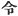

  
[Intangible Textual Heritage](../../index)  [Shinto](../index) 
[Index](index)  [Previous](kj112)  [Next](kj114) 

------------------------------------------------------------------------

[Buy this Book at
Amazon.com](https://www.amazon.com/exec/obidos/ASIN/B0028Y4SZY/internetsacredte)

------------------------------------------------------------------------

  
*The Kojiki*, translated by Basil Hall Chamberlain, \[1919\], at
Intangible Textual Heritage

------------------------------------------------------------------------

## SECT. CVI.—EMPEROR Ō-JIN (PART III.—HE WOOES PRINCESS MIYA-NUSHI-YA-KAHA-YE).\]

One day [1](#fn_1868) the Heavenly Sovereign,
when he had crossed over into the land of Afumi, augustly stood on the
moor of Uji, gazed on the moor of Kadzu, and sang, saying: \[245\]

"As I look on the Moor of Kadzu in Chiba. both the hundred thousand-fold
abundant house-places are visible, and the land's acme is
visible." [2b](#fn_1869)

p. 305

So when he reached the village of Kohara, [3](#fn_1870) a beautiful maiden met him at a fork
in the road, Then the Heavenly Sovereign asked the maiden, saying:
"Whose child art thou?" She replied, saying: "I am the daughter of the
Grandee Wani-no-Hifure, [4](#fn_1871) and my
name is Princess Miya-nushi-ya-kaha-ye." [5](#fn_1872) The Heavenly Sovereign forthwith said
to the maiden: "When I return on my progress to-morrow, I will enter
into thy house." So Princess Ya-kaha-ye told her father all that \[had
happened\]. Thereupon her father replied, saying: "Ah! it was the
Heavenly Sovereign! \[His commands are\] to be respected. My child,
respectfully serve him!"—and so saying he grandly decorated the house,
and awaited \[the Heaven ly Sovereign's return\], whereupon he came in
on the next day. [6](#fn_1873) So when \[the
father\] served \[the Heavenly Sovereign\] a great august feast, he made
his daughter Her Augustness [7](#fn_1874)
Princess Ya-kaha take the great august \[246\] liquor-cup and present
it. Thereupon, while taking the great liquor-cup, the Heavenly Sovereign
augustly sang, saying:

"Oh this crab! whence this crab? \[It is\] a crab from far-distant
Tsunuga. Whither  reaches its sideward motion? \[It has\] come towards
Ichiji-shima and Mi-shima. It must be because, plunging and breathless
like the grebe, I went without stopping along the up and down road by
the wavelets, that the maiden I met on the Kohata road has a back oh!
like a small shield, a row of teeth like acorns. Oh! the earth of the
Wani pass at Ichihiwi! Owing to the skin of the first earth being ruddy,
to the last p. 306 earth being of a reddish
black, she, without exposing to the actual sun that makes one bend one's
head the middle earth like three chestnuts, draws thickly down her drawn
eye-brows;—the women I met, the child I saw and wanted in this way, the
child I saw and wanted in that way, oh! she is opposite to me at the
height of the feast! oh! she is at my side!" [8](#fn_1875)

\[247\] Ita auguste coivit \[cum illâ\], et procreavit filium
Uji-no-waki-iratsuko.

p. 307

------------------------------------------------------------------------

### Footnotes

[304:1](kj113.htm#fr_1873) Literally, "one
time."

[304:2b](kj113.htm#fr_1874) According to
Moribe, whose interpretation has been followed throughout, this Song
signifies: "As I gaze across from Uji to the Moor of Toba, I see the
numerous and prosperous homesteads of the people, I see the most fertile
portion of the country."—On this view Chiba is identified with Toba, the
name of a district; and the word *ho*, rendered "acme," is taken to mean
the best, highest, most showy part of anything. For Motowori's opinion,
which is that of the older commentators as well, that *chi-ba* is a
Pillow-Word, there is much to be said, and if we followed it, we should
have to render the first two lines thus: "As I look on the
thousand-leafed pueraria-moor," etc. (*kadzu* signifying "pueraria.")
Motowori's explanation of *momo-chi-dare* (here rendered by "hundred
thousand-fold abundant") as referring to the soot of the peasant's
roofs, and of *ho* as signifying "a plain surrounded by mountains "seems
much less good than Moribe's interpretation of those difficult
expressions.

[305:3](kj113.htm#fr_1875) In the district of
Uji in the province of Yamashiro. The characters with which the name is
written signify "tree-flag."

[305:4](kj113.htm#fr_1876) *Wani no Hifure no
omi*. For *Wani no omi* see Sect. LXII, Note 11. The meaning of *Hifure*
is obscure.

[305:5](kj113.htm#fr_1877) *Miya-nushi
ya-kata-hime*. *Miya-nushi* is "priestess," or more literally
"temple-guardian." For the rest of the name see Sect. XXVI, Note 14,
though the personages are of course meant to be different.

[305:6](kj113.htm#fr_1878) *I.e.*, that day
having passed by, the Emperor came on the next day according to his
promise.

[305:7](kj113.htm#fr_1879) Motowori supposes
with apparent reason that the character 
, p. 307 "Augustness," has
only crept into the text through the attraction of the following
character  , "made," which
it resembles in appearance.

[306:8](kj113.htm#fr_1880) It must be
understood that in this Song the Imperial singer commences by referring
to what doubtless formed part of the feast,—a crab,—and thence passes on
by an imperceptible transition to allude to his own adventure with the
maiden. As the crab when alive walked sideways, so was the Emperor
zigzagging up and down the road that lines the shore of Lake Biwa,
pursuing his breathless course like that of the busy grebe that
perpetually plunges into the water, when the maiden met him near Kohata.
Beautiful indeed was she: her back straight as a shield, her teeth like
a row of acorns, and the artificial eye-brows painted a dark colour on
her forehead drawn low down in a perfect crescent-shape. She had been
careful in selecting the clay to make the paint, rejecting the upper
layer of earth, for that was of too bright a red, rejecting likewise the
lower layer, for that was too dark, but taking the middle, which was of
the correct blue tint, and drying it, not in the fierce, but in a mildly
tempered, sun-light. And now this maiden, for whom his heart had been
panting and turning this way and that ever since the previous day, is
actually seated opposite to him, nay! at his very side, and he is
feasting in her sweet company.—Tsunuga is the name of a place in the
province of Echizen. "Far-distant" is an imperfect attempt at rendering
the force of the Pillow-Word *momo-dzutafu*, which implies that the
traveller must pass through a hundred other places before reaching his
destination. "Whither reaches its sideward motion?" signifies "whither
is it going with its sideward motion? "Ichiji-shima and Mishima are
places of which nothing is known, so that the allusion to them is
obscure. At this point Motowori's interpretation diverges from that of
Moribe, which has been followed throughout. *Sasanami*, here rendered
"wavelets," is taken by him, as by the older commentators, as the name
of a place, and the description of the maiden's teeth is misunderstood
to signify that she had a beak filled with a row of teeth like the
water-caltrop! Motowori also would here divide the Song in two, a
proceeding for which there is not sufficient warrant. On other minor
points, too, his decisions do not seem so happy as Moribe's. The view of
both commentators will be found at length in Motowori's Commentary, Vol.
XXXII, pp. 33.51, and in Moribe's "*Idzu no Kato-Waki*," *in loco*.
Three chestnuts" (*mitsu-guri no*) is a common Pillow-Word for *naka*,
"middle," founded on the fact, real or supposed, that one burr always
contains three nuts, whereof one of course is in the middle, between the
other two.

------------------------------------------------------------------------

[Next: Section CVII.—Emperor Ō-jin (Part IV.—He Grants Princess Kaminaga
to His Son Oho-Sazaki)](kj114)
