  
[Intangible Textual Heritage](../../index)  [Shinto](../index) 
[Index](index)  [Previous](kj116)  [Next](kj118) 

------------------------------------------------------------------------

[Buy this Book at
Amazon.com](https://www.amazon.com/exec/obidos/ASIN/B0028Y4SZY/internetsacredte)

------------------------------------------------------------------------

  
*The Kojiki*, translated by Basil Hall Chamberlain, \[1919\], at
Intangible Textual Heritage

------------------------------------------------------------------------

\[252\]

## \[SECT. CX.—EMPEROR Ō-JIN (PART VIII.—TRIBUTE FROM KOREA).\]

Again King Shō-ko, [1](#fn_1899) the Chieftain
of the land of Kudara, sent as tribute by Achi-kishi [2](#fn_1900) one stallion and one mare. (This Achi-kishi was the ancestor of the Achiki
Scribes. [3](#fn_1901)) Again he sent
as tribute a cross-sword, [4](#fn_1902) and
likewise a large mirror. Again he was graciously bidden [5b](#fn_1903) to send as tribute a wise man, if
there were any such in the land of Kudara. Therefore receiving the
\[Imperial\] commands, he sent as tribute a man named Wani-kishi, [6](#fn_1904) and likewise by this man he sent as
tribute the Confucian Analects [7](#fn_1905)
in ten volumes and the Thousand Character Essay [8](#fn_1906) in one volume,—altogether eleven
volumes.

p. 314

\[paragraph continues\] \[253\] (This Wani-kishi was the ancestor of the Fumi
Grandees.) [9](#fn_1907) Again he sent
as tribute two artisans,—a smith from Kara named Taku-so [10](#fn_1908) and a weaver from Go [11](#fn_1909) named Sai-so. [12](#fn_1910)

------------------------------------------------------------------------

### Footnotes

[313:1](kj117.htm#fr_1904) p. 314 
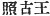, according to the Japanese *kana* spelling, *Sen-ko*.

[313:2](kj117.htm#fr_1905)  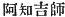. Other forms of the name are
*Ajiki* and *Atogi*, and all three are but attempts at transcribing
phonetically into Japanese a Korean name, the proper characters for
which are not given.  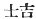 is
not properly part of the name, but is simply an official title ( 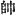 here stands for  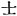).

[313:3](kj117.htm#fr_1906) *Achiki no
fumi-bito*, *Pumi-bito* (abbreviated to *Fubito*) became a "gentile
name."

[313:4](kj117.htm#fr_1907) See Sect. XLV, Note
5.

[313:5b](kj117.htm#fr_1908) *Q.d.*, by the
Japanese Emperor.

[313:6](kj117.htm#fr_1909) Here written
phonetically  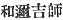, but
properly,  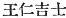, *i.e.* "the
Official Wang In." He is generally spoken of simply as Wani.

[313:7](kj117.htm#fr_1910)  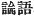. ("*Lun Yu*," or
[according](errata.htm#77) to the Japanese pronunciation "*Rongo*.")

[313:8](kj117.htm#fr_1911)  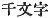. ("*Chien Tzu Wen*," or
according to the Japanese pronunciation "*Sen ji-mun*.") See the
translator's remarks on this subject in the Introduction, [p.
xliii](kj005.htm#page_xliii). The "Chronicles" more prudently mention
only "various classics."

[314:9](kj117.htm#fr_1912) *Fumi no obito*.
*Fumi* signifies "any written document," so that this "gentile name "is
equivalent to our word "scribe."

[314:10](kj117.htm#fr_1913)  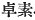 The transliteration of this,
as of all other such names here occurring, is the Sinico-Japanese
transliteration. *Kara* (Korea) is written 
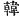.

[314:11](kj117.htm#fr_1914)  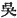 (*Wu*, Jap. *Go*), one of the
states into which China was divided during the third century of our era.
A draper's shop is still called *go-fuku-ya*, *i.e.*, "Wu-garment-house
"in memory of the introduction of wearing apparel from that country.

[314:12](kj117.htm#fr_1915)  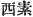.

------------------------------------------------------------------------

[Next: Section CXI.—Emperor Ō-jin (Part VIII.—The Emperor
Intoxicated)](kj118)
