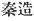
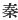
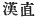
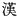
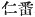
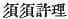

  
[Intangible Textual Heritage](../../index)  [Shinto](../index.md) 
[Index](index)  [Previous](kj117)  [Next](kj119.md) 

------------------------------------------------------------------------

[Buy this Book at
Amazon.com](https://www.amazon.com/exec/obidos/ASIN/B0028Y4SZY/internetsacredte.md)

------------------------------------------------------------------------

  
*The Kojiki*, translated by Basil Hall Chamberlain, \[1919\], at
Intangible Textual Heritage

------------------------------------------------------------------------

p. 315

## \[SECT. CXI.—EMPEROR Ō-JIN (PART VIII.—THE EMPEROR INTOXICATED).\]

Again there came over \[to Japan\] the ancestor of the Hada
Rulers, [1](#fn_1911.md) the ancestor of the Aya
Suzerains, [2](#fn_1912.md) and likewise a man
who knew how to distil liquor, and whose name was Nim-pan, [3](#fn_1913.md) while another name for him was
Susukori. [4](#fn_1914.md) So this \[man\]
Susukori distilled some great august liquor, and presented it to the
Heavenly Sovereign, who, excited with the great august liquor that had
been presented to him augustly sang, saying:

"I have become intoxicated with the august liquor distilled by Susukori.
I have become intoxicated with the soothing liquor, with the smiling
liquor." [5](#fn_1915.md)

On his walking out singing thus, he hit with his \[254\] august staff a
large stone in the middle of the Ohosaka [6](#fn_1916.md) road, upon which the stone ran away.
So the proverb says: "Hard stones get out of a drunkard's way."

------------------------------------------------------------------------

### Footnotes

[315:1](kj118.htm#fr_1916.md) p. 315 *Hada na miyatsuko*,  , a "gentile name." *Hada* is
the native Japanese word used as the equivalent of the Chinese name
 , *Ch’in*. Its origin is
uncertain.

[315:2](kj118.htm#fr_1917.md) *Aya no ataha*
 , a "gentile name." The
use of Aya to represent the Chinese name 
, *Han*, is as difficult to account for as is that of
Hada mentioned in the preceding Note.

[315:3](kj118.htm#fr_1918.md)  . Another and more
Japanese-like reading, *Niho*, is invented by Motowori; but the older
editors read *Nim-pan* according to the usual Sinico-Japanese sound of
the characters. The modern Korean reading would be In-pon.

[315:4](kj118.htm#fr_1919.md) Written
phonetically  .

[315:5](kj118.htm#fr_1920.md) Thus translated,
this Song is too clear to need any explanation. The lines, however,
which are rendered by "with the soothing liquor, with the smiling
liquor."—in Japanese *koto nagu shi we-guzhi-ni*,—are in reality
extremely obscure, and Moribe understands them to signify, "Oh! p. 316 how difficult it is for me to speak! Oh! how
ill at ease I am!" In order to do so he has, however, to change and add
to the text; and the translator, though not sure of being in the right
path, has preferred to follow Motowori, whose interpretation, without
requiring any such extreme measures, yet gives a very plausible sense.

[315:6](kj118.htm#fr_1921.md) See Sect. LXIV,
Note 25.

------------------------------------------------------------------------

[Next: Section CXII.—Emperor Ō-jin (Part IX.—Troubles Which Followed His
Decease)](kj119.md)
