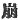

  
[Intangible Textual Heritage](../../index)  [Shinto](../index.md) 
[Index](index)  [Previous](kj119)  [Next](kj121.md) 

------------------------------------------------------------------------

[Buy this Book at
Amazon.com](https://www.amazon.com/exec/obidos/ASIN/B0028Y4SZY/internetsacredte.md)

------------------------------------------------------------------------

  
*The Kojiki*, translated by Basil Hall Chamberlain, \[1919\], at
Intangible Textual Heritage

------------------------------------------------------------------------

p. 320

## \[SECT. CXIII.—EMPEROR Ō-JIN (PART X.—PRINCES OHO-SAZAKI AND UJI-NO-WAKI-IRATSUKO CEDE THE EMPIRE TO EACH OTHER)\]

Thereupon while the two Deities [1](#fn_1936.md)
His Augustness Oho-sazaki and Uji-no-waki-iratsuko were, each of them,
ceding the Empire to the other, [2](#fn_1937.md)
a fisherman [3](#fn_1938.md) came with a great
feast as tribute. [4](#fn_1939.md) So they each
resigned it to the other. So the elder brother refused it, and caused
\[258\] it to be offered to the younger brother, and the younger brother
refused it, and caused it to be offered to the elder brother, during
which mutual cedings many days elapsed. As such mutual ceding took place
not \[only\] once or twice, the fisherman wept from the fatigue of going
backwards and forwards. So the proverb says:

p. 321

\[paragraph continues\] "Ah! the fisherman
weeps on account of his own things." [5a](#fn_1940.md) Meanwhile Uji-no-waki-iratsuko died
early. [6](#fn_1941.md) So His Augustness
Oho-sazaki did rule the Empire.

------------------------------------------------------------------------

### Footnotes

[320:1](kj120.htm#fr_1941.md) It is not actually
the word *kami*, "deity," that is here used in the original, but
*hashira*, which is the Auxiliary Numeral for Deities.

[320:2](kj120.htm#fr_1942.md) Neither being
willing to accept the Imperial dignity.

[320:3](kj120.htm#fr_1943.md) Or, "some
fishermen," and similarly in the Plural throughout.

[320:4](kj120.htm#fr_1944.md) *I.e.*, came to
present fish to His Majesty.

[321:5a](kj120.htm#fr_1945.md) Motowori is
probably right in saying that the point of this proverb lies in the
consideration that, whereas people in general weep for that which they
have not, this fisherman wept on account of the trouble which was caused
to him by the fish which he had.

[321:6](kj120.htm#fr_1946.md) Or, "died first,"
The use in this place of the character 
, properly confined to the meaning of the "death of an
Emperor," is remarkable. See Motowori's observations on the point in
Vol. XXXIII, pp. 78-80.

------------------------------------------------------------------------

[Next: Section CXIV.—Emperor Ō-jin (Part XI.—Ama-no-hi-boko Crosses Over
to Japan)](kj121.md)
