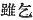
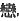
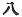
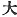
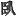
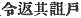
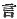
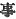

  
[Intangible Textual Heritage](../../index)  [Shinto](../index) 
[Index](index)  [Previous](kj122)  [Next](kj124) 

------------------------------------------------------------------------

[Buy this Book at
Amazon.com](https://www.amazon.com/exec/obidos/ASIN/B0028Y4SZY/internetsacredte)

------------------------------------------------------------------------

  
*The Kojiki*, translated by Basil Hall Chamberlain, \[1919\], at
Intangible Textual Heritage

------------------------------------------------------------------------

p. 326

## \[SECT. CXVI.—EMPEROR Ō-JIN (PART XIII.—THE YOUTH-OF-THE-GLOW-ON-THE-AUTUMN-MOUNTAINS AND THE YOUTH-OF-THE-HAZE-ON-THE-SPRING-MOUNTAINS).\]

So this Deity had a daughter whose name was the Deity
Maiden-of-Idzushi. [1](#fn_1975) So eighty
Deities wished to \[262\] obtain this Maiden-of-Idzushi in marriage, but
none of them could do so. [2](#fn_1976)
Hereupon there were two Deities, brothers, of whom the elder was called
the Youth-of-the-Glow-on-the-Autumn-Mountains, [3](#fn_1977) and the younger was named the
Youth-of-the-Haze-on-the-Spring-Mountains. [4](#fn_1978) So the elder brother said to the
younger brother: "Though I beg for [5](#fn_1979) the Maiden of Idzushi, I cannot obtain
her in marriage. Wilt thou \[be able\] to obtain her?" He answered,
saying: "I will easily obtain her." Then the elder brother said: "If
thou shalt obtain this maiden, I will take off my upper and lower
garments, and distil liquor in a jar of my own height, [6](#fn_1980) and prepare all the things of the
mountains and of the rivers [7](#fn_1981)
\[and give them to thee\] in payment of the wager." Then the younger
brother told his mother everything that the elder brother had said.
Forthwith the mother, having taken wistaria-fibre, wove and sewed in the
space of a single night an upper garment and trowsers, and also socks
and boots, and likewise made a bow and arrows, and clothed him in this
upper garment, trowsers, \[263\] etc., made him take the bow and arrows,
and sent him to the maiden's house, where both his apparel and the bow
and arrows all turned into wistaria-blossoms. Thereupon the
Youth-of-the-Haze-on-the-Spring-Mountains hung up the bow and arrows in
the maiden's privy. Then, when the Maiden-of-Idzushi, thinking the
blossoms strange, brought them \[home, the
Youth-of-the-Haze-on-the-Spring-Mountains\]

p. 327

followed behind the maiden into the house, and forthwith wedded her. So
she gave birth to a child. [8](#fn_1982) Then
he spoke to his elder brother, saying: "I have obtained the
Mayden-of-Idzushi." Thereupon the elder brother, vexed that the younger
brother should have wedded her, did not pay the things he had wagered.
Then when \[the younger brother\] complained to his mother, his august
parent replied, saying: "During my august life the Deities indeed are to
be well imitated; moreover it must be because he imitates mortal
men [9](#fn_1983) that he does not pay those
things." Forthwith, in her anger with her elder child, she took a
jointed bamboo [10](#fn_1984) from an island
in the River Idzushi, and made a coarse basket with eight holes, [11](#fn_1985) and took stones from the river, and
mixing them with brine, wrapped them in the leaves of the bamboo [12](#fn_1986) and caused this curse to be
spoken: [13](#fn_1987) "Like unto the becoming
green of these bamboo-leaves, \[do thou\] become green and wither!
\[264\] Again, like unto the flowing and ebbing of this brine [14](#fn_1988) \[do thou\] flow and ebb! Again, like
unto the sinking of these stones, \[do thou\] sink and be prostrate!
"Having caused this curse to be spoken, she placed \[the basket\] over
the smoke. [15](#fn_1989) Therefore the elder
brother dried up, withered, sickened, and lay prostrate [16](#fn_1990) for the space of eight years. So on
the elder brother entreating his august parent with lamentations and
fears, she forthwith caused the curse to be reversed. [17](#fn_1991) Thereupon his body became sound [18](#fn_1992) as it had been before. (This is the
origin of the term "a divine wager payment.") [19](#fn_1993)

p. 328

------------------------------------------------------------------------

### Footnotes

[326:1](kj123.htm#fr_1980) p. 327 *Idzushi-wotome no kami*.

[326:2](kj123.htm#fr_1981) Literally "eighty
Deities wished to obtain this Maiden of Idzushi, but none could wed
(her)." But the sense is that given in the translation.

[326:3](kj123.htm#fr_1982) p. 328 *Ahi yama no shita-bi-wotoko*. The
explanation of the name is that given by Motowori (following Mabuchi),
who sees in it a reference to the ruddy brilliance of the leaves, which
is so marked a feature of the Japanese woods in autumn. The Chinese
characters used have, indeed, the signification of the lower ice of the
autumn mountains; but "lower ice "may well be simply phonetic in this
case.

[326:4](kj123.htm#fr_1983) *Haru-yamu no
kasumi-wotoko*.

[326:5](kj123.htm#fr_1984) In Japanese
*kohedomo*, written with the characters 
. Perhaps Motowori is right in supposing this Verb to
have been originally identical with *kofuru*, "to love" ( ) whose corresponding form is
*kofuredomo*. If so, the author may have meant to make his hero say,
"though I love the maiden, etc." But it is better to be guided by the
characters, and to suppose that he referred to the request made to her
mother to grant her to him.

[326:6](kj123.htm#fr_1985) Literally, "compute
the height of my person and distil liquor in a jar."

[326:7](kj123.htm#fr_1986) *I.e.*, all the
valuable produce of the chase and of the fisheries, such as are
perpetually mentioned in the Shinto "Rituals" as being presented to the
gods, Thus in the "Service of the Goddess of Food" (see Mr. Satow's
translation in Vol. VII, Pt. IV, p. 414 of these "Transactions,") we
read that the worshipper offered: "as to things which dwell in the
mountains—things soft of hair and things rough of hair; as to things
which grow in the great-field-plain sweet herbs and bitter herbs; as to
things which dwell in the blue-sea-plain—things wide of fin and things
narrow of fin, down to weeds of the offing and weeds of the shore."

[327:8](kj123.htm#fr_1987) Literally, "one
child."

[327:9](kj123.htm#fr_1988) The Japanese
original of the words here unavoidably rendered by "mortal men" in order
to mark the antithesis to the word "Deities, has been more literally
translated by "living people" in an earlier passage of the work (see
Sect. IX, Note 17). The signification of the entire sentence is: "During
my lifetime, thy brother should be careful to imitate the upright
conduct of the gods. For if, instead of doing so, he be dishonest and
untruthful as are the sons of men, it will be at his own peril."

[327:10](kj123.htm#fr_1989) Or, according to
the more usual reading, "a one-jointed bamboo;" but in either case the
meaning is obscure. Motowori, who adopts the reading that has been
followed in the translation, suggests that the expression may simply be
a periphrasis for the bamboo in general.

[327:11](kj123.htm#fr_1990)  . Motowori remarks that the
word "eight" in this p. 329 place (where, to
indicate a considerable number we should rather expect "eighty") is
curious, and he surmises that 
 may be an error for 
, "large." The word "coarse" itself is sufficient to
show that the apertures left in the plaiting of the basket were large.

[327:12](kj123.htm#fr_1991) *Scil*. of which
the basket was woven.

[327:13](kj123.htm#fr_1992) *Scil*. by her
younger son.

[327:14](kj123.htm#fr_1993) In this case, as
Motowori remarks, it is the sea-water that is intended to be spoken of,
whereas the allusion in the previous sentence is to hard salt. But the
Japanese language uses the same word for both, and the same Chinese
character is here also used in both contexts. For this curse *conf*.
Sect. XL (Note 18 *et. seq.*) and Sect. XLI.

[327:15](kj123.htm#fr_1994) *Scil*. of the
furnace (kitchen) in the younger brother's house, as Motowori suggests.

[327:16](kj123.htm#fr_1995) The text has the
character  , which
signifies "to wither" or "dry up" (spoken of trees). But the translator
agrees with Motowori in considering it to be in all probability an error
for  , "to be prostrate;
and in any case it could not here be rendered by either of the verbs
"dry up" or "wither "without introducing into the English version a
tautology which does not exist in the Japanese original.

[327:17](kj123.htm#fr_1996) Such seems to be
the meaning of the obscure original *sono tokohi-do wo kahesashimeki*
( ), Motowori would
understand it in a rather more specialized sense to signify that "she
caused the implement of the curse (*i.e.*, the basket) to be taken
away,"

[327:18](kj123.htm#fr_1997) Literally, "was
pacified."

[327:19](kj123.htm#fr_1998) Or, if we take
  in the text as
equivalent to  , "this is
the origin of "divine water-payments."

------------------------------------------------------------------------

[Next: Section CXVII.—Emperor Ō-jin (Part XVI.—Genealogies)](kj124)
