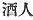

  
[Intangible Textual Heritage](../../index)  [Shinto](../index) 
[Index](index)  [Previous](kj123)  [Next](kj125) 

------------------------------------------------------------------------

[Buy this Book at
Amazon.com](https://www.amazon.com/exec/obidos/ASIN/B0028Y4SZY/internetsacredte)

------------------------------------------------------------------------

  
*The Kojiki*, translated by Basil Hall Chamberlain, \[1919\], at
Intangible Textual Heritage

------------------------------------------------------------------------

p. 329

## \[SECT. CXVII.—EMPEROR Ō-JIN (PART XVI.—GENEALOGIES).\]

Again this Heavenly Sovereign Homuda's [1](#fn_1994) august child King Wake-nuke-futa-mata
wedded his mother's younger sister Momo-shiki-iro-be, [2](#fn_1995) another name for whom was Her
Augustness Oto-hime-ma-wake-hime, [3](#fn_1996) and begot children:
Oho-iratsuko, [4](#fn_1997) another name for
whom \[265\] was King Ohohodo; [5](#fn_1998)
next her Augustness Osaka-no-oho-naka-tsu-hime: [6](#fn_1999)

p. 330

next Tawi-no-naka-tsu-hime; [7](#fn_2000) next
Tamiya-no-naka-tsu-hime; [8](#fn_2001) next
Fujihara-no-koto-fushi-no-ira-tsume; [9](#fn_2002) next Queen Torime; [10](#fn_2003) next King Sane. [11](#fn_2004) (Seven Kings (and
Queens). [12](#fn_2005)) So King Oho-hodo (was the ancestor of the Dukes of
Mikuni, [13](#fn_2006) the Dukes of
Hata, [14](#fn_2007) the Dukes of
Okinaga, [15](#fn_2008) the Dukes of Sakahito
of Sakata, [16](#fn_2009) the Dukes of
Yamaji, [17](#fn_2010) the Dukes of \[266\]
Meta in Tsukushi, [18](#fn_2011) and the Dukes
of Fuse.) [19](#fn_2012) Again King
Netori wedded his younger half-sister the Lady Mihara, and begot
children: King Naka-tsu-hiko; [20](#fn_2013)
next King Iwa-shiha [21](#fn_2014) (Two Kings.) Again the child of King
Kata-shiha [22](#fn_2015) was King Kuni. [23](#fn_2016)

p. 331

------------------------------------------------------------------------

### Footnotes

[329:1](kj124.htm#fr_1999) p. 330 *I.e.*, the Emperor Ō-jin's.

[329:2](kj124.htm#fr_2000) The import of this
compound is not clear.

[329:3](kj124.htm#fr_2001) *I.e.*, "the 
younger princess, the truly young princess."

[329:4](kj124.htm#fr_2002) *i.e.*, "the great
lord."

[329:5](kj124.htm#fr_2003) *Oho-hodo no miko*.
The signification of *Oho-hodo* is obscure. Motowori surmises it to have
been originally the name of a place.

[329:6](kj124.htm#fr_2004) *I.e.*, "the great
middle princess of Osaka. Osaka is the name of a place in Yamato. The
word "middle "should by the analogy of other such genealogies indicate
the fact that this princess was the fourth child out of seven. Here
however she is mentioned second, and the same designation is applied to
the two next daughters. There is evidently some confusion in the
tradition.

[330:7](kj124.htm#fr_2005) *I.e.*, "the middle
princess of Tawi,"—a place in Kahachi.

[330:8](kj124.htm#fr_2006) *I.e.*, the middle
princess of Tamiya.

[330:9](kj124.htm#fr_2007) *I.e.*, "the lady
Koto-fushi of Fuji-hara." But the meaning of Kato fushi is obscure, and
Motowori surmises it to be an alternative or corrupt form of
*Sotohoshi*. (For the celebrated princess of the latter name see Sect.
CXXXVII, Note 9.) Fujihara is the name of a place in Yamato, and
signifies "wistaria-moor."

[330:10](kj124.htm#fr_2008) *Torime no miko*.
This name is obscure.

[330:11](kj124.htm#fr_2009) *Sane no miko*.
Motowori believes *sane* to stand erroneously for *sami*; but both forms
are obscure.

[330:12](kj124.htm#fr_2010) The Japanese word
includes both genders.

[330:13](kj124.htm#fr_2011) p. 331 *Mikuni no kimi*. *Mikuni* is the name of a
well-known place in the province of Echizen. It signifies "three
countries."

[330:14](kj124.htm#fr_2012) *Hata no kimi*.
There are several places called Hata, and it is not known which of them
is here intended. The signification of the name is also uncertain.

[330:15](kj124.htm#fr_2013) *Okinaga no kimi*.
See Sect. LXII, Note 31.

[330:16](kj124.htm#fr_2014) *Sakata no
Saka-bito no kimi*. This is Motowori's restoration of an apparently
corrupt text. Sakata and Sakabito are both taken to be names of places,
the first of a district in Afumi, the second of a place in Settsu.
Sakabito ( ) seems a very
curious compound for the name of a place. Moreover the double title is
unusual, and it may be thought that the word "Dukes" has fallen out of
the text, and that in reality two families were intended to be spoken
of.

[330:17](kj124.htm#fr_2015) *Yamaji no kimi*.
*Yamaji* ("mountain road") is supposed by Motowori to be the name of a
place,—perhaps in the province of Higo.

[330:18](kj124.htm#fr_2016) *Tsukushi no Meta
no kimi*. Tsukushi is the old name of the whole of the South-Western
island of the Japanese archipelago and Meta the name of a place in the
province of Hizen in that island. The etymology of Meta is uncertain.

[330:19](kj124.htm#fr_2017) *Fuse no kimi*.
Fuse is the name of uncertain import found in several provinces. It is
not known which is meant to be here designated.

[330:20](kj124.htm#fr_2018) *Naka-tsu-hiko no
miko*, *i.e.*, "the middle prince," a designation which would lead one
to expect to find mention of an elder brother.

[330:21](kj124.htm#fr_2019) *Iwashima no
miko*. Iwashima seems to be the name of a place, but the signification
of *Iha* (not to be confounded with *iha* "stone" or "rock") is
altogether obscure.

[330:22](kj124.htm#fr_2020) *Katashiha no
miko*. This prince has not been mentioned in the previous genealogies,
which is curious. Katashiha is the name of a place in Chikuzen, and
signifies "hard rock."

[330:23](kj124.htm#fr_2021) *Kunu no miko*.
*Kunu* is altogether obscure.

------------------------------------------------------------------------

[Next: Section CXVIII.—Emperor Ō-jin (Part XV.—His Age and Place of
Burial)](kj125)
