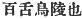

  
[Intangible Textual Heritage](../../index)  [Shinto](../index) 
[Index](index)  [Previous](kj124)  [Next](kj126) 

------------------------------------------------------------------------

[Buy this Book at
Amazon.com](https://www.amazon.com/exec/obidos/ASIN/B0028Y4SZY/internetsacredte)

------------------------------------------------------------------------

  
*The Kojiki*, translated by Basil Hall Chamberlain, \[1919\], at
Intangible Textual Heritage

------------------------------------------------------------------------

p. 332

## \[SECT. CXVIII.—EMPEROR Ō-JIN (PART XV.—HIS AGE AND PLACE OF BURIAL).\]

The august years of this Heavenly Sovereign Homuda were altogether one
hundred and thirty. His august mausoleum is on the mound of Mofusu [1](#fn_2017) at Wega in Kafuchi.

------------------------------------------------------------------------

### Footnotes

[332:1](kj125.htm#fr_2022) p. 332 Or, as Motowori reads it, *Mofushi*. The
etymology is uncertain. *Wega* has already appeared in Sect. CIII (Note
3). The Old Printed Edition and some Manuscripts have at the conclusion
of this volume the following note: 
, "It is the mausoleum of Mozu." But Mozu is in the
province of Idzumi, and all the later editions discard this note as an
interpolation.

------------------------------------------------------------------------

[Next: Section CXIX.—Emperor Nin-toku (Part I.—Genealogies)](kj126)
