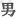
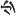

  
[Intangible Textual Heritage](../../index)  [Shinto](../index.md) 
[Index](index)  [Previous](kj125)  [Next](kj127.md) 

------------------------------------------------------------------------

[Buy this Book at
Amazon.com](https://www.amazon.com/exec/obidos/ASIN/B0028Y4SZY/internetsacredte.md)

------------------------------------------------------------------------

  
*The Kojiki*, translated by Basil Hall Chamberlain, \[1919\], at
Intangible Textual Heritage

------------------------------------------------------------------------

p. 333\[267\]

# VOL. III. [1](#fn_2018.md)

## \[SECT. CXIX.—EMPEROR NIN-TOKU (PART I.—GENEALOGIES).\]

His Augustness Oho-sazaki dwelt in the palace of Takatsu [2](#fn_2019.md) at Naniha, and ruled the Empire. This
Heavenly Sovereign wedded (the Empress [3](#fn_2020).md) Her Augustness
Iha-no-hime, [4](#fn_2021.md) daughter of
Kadzuraki-no-sotsu-biko, [5](#fn_2022.md) and
begot august children: His Augustness Ohoye-no-izaho-wake; [6](#fn_2023.md) next the Middle King of the Inlet of
Sumi; [7](#fn_2024.md) next His Augustness
Midzu-ha-wake of Tajihi; [8](#fn_2025.md) next
His Augustness the Noble Wo-asadzuma-no-waku-go [9](#fn_2026.md) (four
Deities.) Again he wedded Princess Kami-naga, daughter of the
Duke of Muragata in Himuka, as mentioned above, [10](#fn_2027.md) and begot august children:
Hatabi-no-oho-iratsuko, [11](#fn_2028.md) another
\[268\] name for whom was the King of Great Kusaka; [12](#fn_2029.md) next Hatabi-no-waki-iratsume, [13](#fn_2030.md) another name for whom was Her
Augustness Princess Nagahi, [14](#fn_2031.md) and
another name was Her Augustness Waka-kusaka-be [15](#fn_2032.md)(Two
Deities.) Again he wedded his younger half-sister
Yata-no-waki-iratsume [16](#fn_2033.md) Again he
wedded his younger half-sister Uji-no-waki-iratsume. These two Deities
had no august children. Altogether the august children of this Heavenly
Sovereign Oho-sakaki \[numbered\] in all six Deities, (Five Kings and one Queen). So His Augustness
Izaho-wake \[was he who afterwards\] ruled the Empire. Next His
Augustness Tajihi-no midzu-ha-wake likewise ruled the Empire. Next His
Augustness the Noble Oh-asadzuma-no-waku-go likewise ruled the
Empire. [17](#fn_2034.md)

------------------------------------------------------------------------

### Footnotes

[333:1](kj126.htm#fr_2023.md) p. 333 Literally, "lower volume"(there being three
in all). See Author's Preface, Note 1.

[333:2](kj126.htm#fr_2024.md) *I.e.*, "high
port."

[333:3](kj126.htm#fr_2025.md) p. 334 Motowori surmises that the reason why the
characters [signifying](errata.htm#81.md) "Empress" are in all the text
here written in small characters is on account of this personage not
having been of Imperial birth.

[333:4](kj126.htm#fr_2026.md) *I.e.*, "the rock
princess." Motowori supposes the name to be indicative of prosperity and
long life.

[333:5](kj126.htm#fr_2027.md) See Sect. LXI, Note
55,

[333:6](kj126.htm#fr_2028.md) *I.e.*, "the elder
brother lord Izaho," the latter name being of uncertain import.

[333:7](kj126.htm#fr_2029.md) *Sumi-no
ye-no-naka-tsu-miko*. Both the phrase "middle king" and the Inlet of
Sumi have been already commented on.

[333:8](kj126.htm#fr_2030.md) *Tajihi no
midzu-ha-wake*. Tajihi is the name of a place in Kahachi. The
traditional origin of its application to this will be found in
Motowori's Commentary, Vol. XXXV, p. 6. *Midzu-ha-wake* probably means
"the lord with the beautiful teeth."

[333:9](kj126.htm#fr_2031.md)
*Wo-asadzuma-no-waku-go no sukune*. Asadzuma is the name of a place in
Yamato, and *wo* (though written 
) seems to be the slightly Honorific Prefix *wo*
( ) whose proper
signification is "small" *Waku-go* means "younger child."

[333:10](kj126.htm#fr_2032.md) See Sect. CVII.

[333:11](kj126.htm#fr_2033.md) *I.e.*, "the great
lord of Hatabi." *Hatabi* is altogether obscure.

[333:12](kj126.htm#fr_2034.md) *Oha-kusaka no
miko*. For *Kusaka* see Sect. CI, Note 2.

[333:13](kj126.htm#fr_2035.md) *I.e.*, "the young
lady of Hatabi." Conf. Note 1 I.

[333:14](kj126.htm#fr_2036.md) *Nagahi-hime*.
This name is obscure.

[333:15](kj126.htm#fr_2037.md) *Kusaka-be* is an
alternative form of *Kusaka*. The compound therefore signifies "young
princess of Kusaka."

[333:16](kj126.htm#fr_2038.md) This name and the
following have already appeared in the genealogies of the preceding
reign (Sect. CIV.)

[333:17](kj126.htm#fr_2039.md) These were the
Emperors Ri-chiu, Han-zei, and In-giyo.

------------------------------------------------------------------------

[Next: Section CXX: Emperor Nin-toku (Part II.—Various Deeds)](kj127.md)
