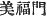

  
[Intangible Textual Heritage](../../index)  [Shinto](../index.md) 
[Index](index)  [Previous](kj126)  [Next](kj128.md) 

------------------------------------------------------------------------

[Buy this Book at
Amazon.com](https://www.amazon.com/exec/obidos/ASIN/B0028Y4SZY/internetsacredte.md)

------------------------------------------------------------------------

  
*The Kojiki*, translated by Basil Hall Chamberlain, \[1919\], at
Intangible Textual Heritage

------------------------------------------------------------------------

p. 334

## \[SECT. CXX: EMPEROR NIN-TOKU (PART II.—VARIOUS DEEDS).\]

In the august reign of this Heavenly Sovereign the Kadzuraki Tribe [1](#fn_2035.md) was established as the august proxy of
the Empress, Her Augustness Iha-no-hime. Again the Mibu

p. 335

\[paragraph continues\] Tribe [2](#fn_2036.md) was established as the august proxy of
the Heir Apparent, His Augustness Izaho-wake. Again the Tajihi
Tribe [3](#fn_2037.md) was established as the
august proxy of His Augustness Midzuna-wake. Again the Oho-kusaka
Tribe [4](#fn_2038.md) was \[269\] established as
the august proxy of King Oho-kusaka, and the Waka-kusaka Tribe [5](#fn_2039.md) was established as the august proxy of
King Waga-kusake-be. Again people from Hada were set to labour, and the
embankment at Mamuta [6](#fn_2040.md) and also
the granaries of Manuta were made. Again the Pool of Wani [7](#fn_2041.md) and the Pool of Yosemi were made.
Again the Naniha Channel [8](#fn_2042.md) was
dug, and \[the waters of the rivers\] led to the sea. Again the Wobashi
Channel [9](#fn_2043.md) was dug. Again the port
of the inlet of Sumi [10](#fn_2044.md) was
established.

------------------------------------------------------------------------

### Footnotes

[334:1](kj127.htm#fr_2040.md) p. 335 *Kadzuraki be*. For Kadzuraki see Sect. LV,
Note 1.

[335:2](kj127.htm#fr_2041.md) *Mibu-be*. Motowori
quotes approvingly a derivation of the "gentile name" of Mibu from
*Bi-fuku-mon* ( ), the
name of a gate which the first bearer of the name is related to have
constructed. Taking into account the letter-changes which occurred in
older times in the passage of words from Chinese into Japanese, the
etymology is plausible enough.

[335:3](kj127.htm#fr_2042.md) *Tajihi-be*. Tajihi
is the name of a place in Kahachi, and is of uncertain origin.

[335:4](kj127.htm#fr_2043.md) *Oho-kusaka-be*.
This tribe of course took its name simply from that of Prince
Oho-kusaka.

[335:5](kj127.htm#fr_2044.md) *Waka-kusaka-be*. A
similar observation to that in the last applies to this name.

[335:6](kj127.htm#fr_2045.md) See Sect. LIII,
Note I.

[335:7](kj127.htm#fr_2046.md) *Wani no ike*, in
the province of Kahachi. *Wani* signifies "crocodile," and it was also
the name of the Korean personage mentioned in Sect. CX (Note 6). But the
reason why the Pool here spoken of was so called does net appear. The
Pool of Yosami has already been mentioned in Sect. LXII (Note 85).
Motowori supposes that it must have dried up during the interim.

[335:8](kj127.htm#fr_2047.md) *Naniha no
hori-ye*. Motowori tells us that the regularization of p. 336 the channels of the Yodo and Yamato Rivers,
whose mouths nearly meet at this point with various intersecting
branches, is what is here intended to be referred to.

[335:9](kj127.htm#fr_2048.md) *Wobashi no ye*.
*Wo-bashi* ("little bridge") is the name of a village in the province of
Settsu.

[335:10](kj127.htm#fr_2049.md) *Suminoye no tsu*.
Close of Naniha; it is the modern *Sumiyoshi*. Conf. Sect. X, Note 22.

------------------------------------------------------------------------

[Next: Section CXXI.—Emperor Nin-toku \[Part III.—He Remits the
Taxes)](kj128.md)
