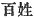
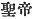
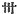

  
[Intangible Textual Heritage](../../index)  [Shinto](../index.md) 
[Index](index)  [Previous](kj127)  [Next](kj129.md) 

------------------------------------------------------------------------

[Buy this Book at
Amazon.com](https://www.amazon.com/exec/obidos/ASIN/B0028Y4SZY/internetsacredte.md)

------------------------------------------------------------------------

  
*The Kojiki*, translated by Basil Hall Chamberlain, \[1919\], at
Intangible Textual Heritage

------------------------------------------------------------------------

p. 336

## \[SECT. CXXI.—EMPEROR NIN-TOKU \[PART III.—HE REMITS THE TAXES)\]

Thereupon the Heavenly Sovereign, ascending a lofty mountain and looking
on the land all round, spoke, saying: "In the whole land there rises no
smoke; the land is all poverty-stricken. So I remit [1](#fn_2045.md) all people's taxes and \[forced
labour\] from now till three years \[hence.\]" Therefore the great
palace became dilapidated, and the rain leaked in everywhere; but no
repairs were made. The rain that leaked in was caught in troughs, [2](#fn_2046.md) and \[the inmates\] removed from \[its
reach\] to places where there was no leakage. When later \[the Heavenly
Sovereign\]\] looked on all the land, the smoke was abundant in the
land. So finding the people rich, he now exacted taxes and forced
labour. Therefore the peasantry [3](#fn_2047.md)
prospered, and did not suffer from forced labour. So in praise of that
august reign, it was called the reign of the Emperor-Sage. [4](#fn_2048.md)

------------------------------------------------------------------------

### Footnotes

[336:1](kj128.htm#fr_2050.md) Motowori's reading
of this Verb in the Imperative Mood (as if containing an order addressed
by the monarch to his ministers) seems less natural than the order
reading in the Indicative, which accordingly the translator has
followed.

[336:2](kj128.htm#fr_2051.md) There is
uncertainty as to the exact character in the original. p. 337 But the older editions read it as the
Japanese word *hako*, "boxes." while Motowori prefers *hi*, "tubes."
"Troughs "seems to conciliate both views, and to be also appropriate to
the use mentioned in the text.

[336:3](kj128.htm#fr_2052.md) Or simply, "the
people." But the expression 
 is generally used in Japanese of the peasantry only.

[336:4](kj128.htm#fr_2053.md)  ; If, following most texts, we
omitted the final character 
, "reign," the English translation would be "in praise
of that august reign, (the Heavenly Sovereign) was called the
Emperor-Sage."

------------------------------------------------------------------------

[Next: Section CXXII.—Emperor Nin-toku (Part IV.—He Loves Princess
Kuro)](kj129.md)
