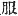
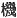
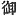

  
[Intangible Textual Heritage](../../index)  [Shinto](../index.md) 
[Index](index)  [Previous](kj132)  [Next](kj134.md) 

------------------------------------------------------------------------

[Buy this Book at
Amazon.com](https://www.amazon.com/exec/obidos/ASIN/B0028Y4SZY/internetsacredte.md)

------------------------------------------------------------------------

  
*The Kojiki*, translated by Basil Hall Chamberlain, \[1919\], at
Intangible Textual Heritage

------------------------------------------------------------------------

## \[SECT. CXXVI.—EMPEROR NIN-TOKU (PART VIII.—DEATH OF KING HAYABUSA-WAKE AND QUEEN MEDORI).\]

Again the Heavenly Sovereign begged for his younger half-sister Queen
Medori, using as middle-man his younger brother King Haya-busa-wake.
Then Queen Medori \[281\] spoke to King Hayabusa-wake, saying: "Owing to
the

p. 350

violence of the Empress, \[the Heavenly Sovereign\] has not deigned to
take Yata-no-waki-iratsume \[into the Palace.\] So I will not
respectfully serve him. I will become the wife of Thine Augustness."
Forthwith they wedded each other, wherefore King Hayabusa-wake made no
report \[to the Heavenly Sovereign. [1](#fn_2102.md)\] Then the Heavenly Sovereign, going
straight to the place where Queen Medori dwelt, stood on the door-sill
of the palace. Hereupon, Queen Medori being at her loom, was weaving
garments. Then the Heavenly Sovereign sang saying:

"Oh! for whom may be the garments that my Great Lady Medori
weaves?" [2](#fn_2103.md)

Queen Medori replied in a Song saying:

"For an august veil for the high-going Falcon-Lord." [3](#fn_2104.md)

So the Heavenly Sovereign, perceiving her feelings, returned into the
palace. At this time [4](#fn_2105.md) when her
husband King Hayabusa-wake came, his wife Queen Medori sang, saying:

"The lark flies to heaven. Oh! high-going Falcon-Lord, catch the
wren." [5](#fn_2106.md)

\[282\] The Heavenly Sovereign, hearing this Song, [6](#fn_2107.md) forthwith raised an army, wishing to
slay King Hayabusa and Queen Medori, who then fled away together, and
ascended Mount Kurahashi. [7](#fn_2108.md)
Thereupon King Hayabusa-wake sang, saying:

"Owing to the steepness of ladder-like Mount Kurahashi, being unable to
clamber \[up\] the rocks, oh! she takes my hand! [8](#fn_2109.md)

Again he sang, saying:

"Though ladder-like Mount Kurahashi be p. 351
steep, it is not steep when I ascend it with my younger sister."

So when they fled thence, and reached Soni in Uda, [9](#fn_2110.md) the Imperials [10](#fn_2111.md) army pursued, overtook, and slew
them.

------------------------------------------------------------------------

### Footnotes

[350:1](kj133.htm#fr_2107.md) p. 351 *Scil*. of the success of his mediation.

[350:2](kj133.htm#fr_2108.md) Or, "for whom is
the loom \[employed\], with which my Great Lady Medori weaves?"—The word
*hata* in Archaic Japanese signifies both "garment" and the instrument
which is used to weave a garment, *i.e.* a "loom" (  and  ). In later times the second
meaning has prevailed to the exclusion of the first.

[350:3](kj133.htm#fr_2109.md) There is here a
play on the name of the Queen's paramour Hayabusa-wake, which signifies
"Falcon-Lord" as in the translation—The parallel passage of the
"Chronicles" gives these two Songs as a single one which is put into the
mouth of Queen Medori's handmaidens,—is a more acceptable version of the
incident.

[350:4](kj133.htm#fr_2110.md) Motowori suspects
that there is here an error in the text, which should, according to him,
read: "After this."

[350:5](kj133.htm#fr_2111.md) The gist of this
Song is an instigation to murder the Emperor (whose name was
*Oho-sazaki*, *i.e.*, "Great Wren." Conf. Sect. CIV, Note 18), addressed
to the singer's husband (whose name was *Hayabusa-wake*, *i.e.*, "Falcon
Lord"). But the allusion to the lake remains obscure. Keichiū suggests
that it is simply mentioned as a term of comparison for the falcon's
power of flight, while Motowori opines that the meaning rather is: "The
lark flies so high up to heaven that it would be hard to catch it; but
the wren is an easy prey."

[350:6](kj133.htm#fr_2112.md) Viz., as may be
supposed, repeated by some fourth person.

[350:7](kj133.htm#fr_2113.md) *Kurahashi-yama*,
in Yamato.

[350:8](kj133.htm#fr_2114.md) The Song, like the
next, is too clear to stand in need of explanation. "Ladder-like" is an
attempt to render the force of the Pillow-Word *hashi-tate*. See
Mabuchi's "Dictionary of Pillow-Words," s.v., for the exact force
attributed to it by Mabuchi.

[351:9](kj133.htm#fr_2115.md) For Uda see Sect.
XLVI, Note, 14. The etymology of Soni is equally obscure.

[351:10](kj133.htm#fr_2116.md) The character
 , though read by the
commentators with the usual Japanese Honorific *mi*, "august," has here
its proper Chinese signification of "Imperial."

------------------------------------------------------------------------

[Next: Section CXXVII.—Emperor Nin-toku (Part VIII.—Queen Medori's
Armlet)](kj134.md)
