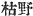

  
[Intangible Textual Heritage](../../index)  [Shinto](../index.md) 
[Index](index)  [Previous](kj135)  [Next](kj137.md) 

------------------------------------------------------------------------

[Buy this Book at
Amazon.com](https://www.amazon.com/exec/obidos/ASIN/B0028Y4SZY/internetsacredte.md)

------------------------------------------------------------------------

  
*The Kojiki*, translated by Basil Hall Chamberlain, \[1919\], at
Intangible Textual Heritage

------------------------------------------------------------------------

p. 355

## \[SECT. CXXIX:—EMPEROR NIN-TOKU (PART X.—A VESSEL IS MADE INTO A LUTE)\]

In this august reign there was a tall tree on the west of the river
Tsuki. [1](#fn_2124.md) The shadow of this tree,
on its being struck by the morning sun, reached to the Island of
Ahaji: [2](#fn_2125.md) and on its being struck
by the evening sun, it crossed Mount Takayasu. [3](#fn_2126.md) So the tree was cut down and made into
a vessel, and a very swift-going vessel it was. At the time, this vessel
was called by the name of Karanu. [4](#fn_2127.md) So with this vessel the water of the
Island of Ahaji was drawn morning and evening, and presented as the
great august water. [5](#fn_2128.md) The broken
\[pieces\] of this vessel were used \[as fuel\] to burn salt and the
pieces of wood that remained over from the burning were made into a
lute, whose sound re-echoed seven miles [6](#fn_2129.md) \[off\]. So \[some one [7](#fn_2130.md)\] sang, saying:

"Karanu was burnt \[as fuel\] for salt; the remainder was made into a
lute; oh! when struck, it sounds like the wet plants standing rocked on
the reefs in the middle of the harbour, the harbour of Yura." [8](#fn_2131.md)

This is a Changing Song which is a Quiet song. [9](#fn_2132.md) \[285\]

------------------------------------------------------------------------

### Footnotes

[355:1](kj136.htm#fr_2129.md) p. 355 This is Moribe's reading (given without any
comment) of the original characters 
. Motowori pronounces them corrupt; but, having no
emendation to propose, simply leaves them without any *kana* reading.

[355:2](kj136.htm#fr_2130.md) See Sect. V, Note
3.

[355:3](kj136.htm#fr_2131.md) *Takayasu no yama*,
in the province of Kahachi. The characters with which the name is
written signify "high and easy."

[355:4](kj136.htm#fr_2132.md) The significance of
this name, written  ,
remains obscure notwithstanding the efforts of the commentators to
explain it.

[355:5](kj136.htm#fr_2133.md) *I.e.*, this vessel
was used to bring over every morning and evening p.
356 the water for the Imperial household, which was drawn on the
Island of Ahaji.

[355:6](kj136.htm#fr_2134.md)  , the Chinese *li* Japanese
*ri*. The length of the *ri* has varied greatly at different times and
in different parts of the country. The modern standard Japanese *ri* is
equivalent to about 2.44 English statute miles: but Motowori supposes
the *ri* of the epoch mentioned in our text to have been less than
one-seventh of that distance.

[355:7](kj136.htm#fr_2135.md) In the "Chronicles"
this story is placed in the reign of the Emperor Ō-jin, and the Song is
attributed to that monarch.

[355:8](kj136.htm#fr_2136.md) In this Song the
sound of the twanging of the lute that had been made from the remnant of
the boat Karanu is compared to the rustling of the plants standing half
out of water on the reefs in the harbour of Yura.—The compound word
*kaki-hiku*, rendered by "struck," signifies literally "scratched and
struck," the lute being struck with the nail. The onomatopoetic word
*saya-saya*, of which "sound" is but a colourless equivalent, represents
both the delightful ring of the lute and the rustling of the sea-plants.
What plants are intended by the expression "wet plants" (*nadzu no ki*)
is a point that has been much disputed. Moribe even thinks that the term
is meant for the name of a particular species of (apparently) coral now
found in the island of Hachijo. Yura is in the Island of Ahaji.

[355:9](kj136.htm#fr_2137.md) See Sect. CXXIV,
Note 19.

------------------------------------------------------------------------

[Next: Section CXXX.—Emperor Nin-toku (Part XI.—His Age and Place of
Burial)](kj137.md)
