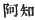
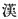

  
[Intangible Textual Heritage](../../index)  [Shinto](../index.md) 
[Index](index)  [Previous](kj138)  [Next](kj140.md) 

------------------------------------------------------------------------

[Buy this Book at
Amazon.com](https://www.amazon.com/exec/obidos/ASIN/B0028Y4SZY/internetsacredte.md)

------------------------------------------------------------------------

  
*The Kojiki*, translated by Basil Hall Chamberlain, \[1919\], at
Intangible Textual Heritage

------------------------------------------------------------------------

p. 358

## \[SECT. CXXXII.—EMPEROR RI-CHIU (PART II.—HE IS TAKEN TO ISO-NO-KAMI).\]

Originally, when dwelling at the palace of Naniha, \[the Heavenly
Sovereign\] on holding a copious feast when at the great tasting, [1](#fn_2142.md) was intoxicated with the great august
liquor, and fell greatly and augustly asleep. Then his younger brother,
King Sumi-no-ye-naka-tsu, wishing to take the Heavenly Sovereign, set
fire to the great palace. Thereupon the Suzerain of Achi, [2](#fn_2143.md) ancestor of the Suzerains of Aya [3](#fn_2144.md) in Yamato, having taken him away by
stealth, set him on an august horse, and caused him to make a progress
into Yamato. So \[the Heavenly Sovereign\] awoke on reaching the moor of
Tajihi, [4](#fn_2145.md) and said: "What place is
this?" Then the Suzerain of Achi said: "King Sumi-no-ye-no-naka-tsu set
fire to the great palace; so I am fleeing with thee into Yamato." Then
the Sovereign sang, saying: \[257\]

"Had I known that I should sleep on the Moor of Tajihi, oh! I would have
brought my dividing matting, had I known that I should sleep!" [5](#fn_2146.md)

On reaching the Pass of Hanifu [6](#fn_2147.md)
and gazing at the palace of Naniha, the fire was still bright. Then the
Heavenly Sovereign sang again, saying:

"The group of houses sparklingly burning, as I stand and look from the
Pass of Hanifu, is in the direction of the house of my spouse." [7](#fn_2148.md)

So when they reached the entrance of the Ohosaka mountain, [8](#fn_2149.md) they met one woman. This woman said:
"A number of men bearing weapons are barring \[the

p. 359

way across\] the mountain. Thou shouldst cross it going round by way of
Tagima. [9](#fn_2150.md) Then the Heavenly
Sovereign sang, saying:

"Oh! on asking the way of the maiden we met at Ohosaka, she tells not
\[the\] direct \[way\], but tells of the Tagima way." [10](#fn_2151.md)

So making his progress up, he dwelt in the temple of \[289\] the Deity
of Isonokami. [11](#fn_2152.md)

------------------------------------------------------------------------

### Footnotes

[358:1](kj139.htm#fr_2147.md) p. 359 *I.e.*, on the occasion of his performing
the religious ceremony of tasting the first rice of the season.

[358:2](kj139.htm#fr_2148.md) *Achi no atahe*,
supposed to be of Korean origin, and to be a descendant of  , great grandson of the Chinese
Emperor  .

[358:3](kj139.htm#fr_2149.md) *Aya no atahe*.
This family was of continental origin, *Aya* being the Japanese reading
of the character  ; see
Sect. CXI, Note 2.

[358:4](kj139.htm#fr_2150.md) *Tajihi no nu*, in
the provinces of Kahachi. The signification of the name is obscure.

[358:5](kj139.htm#fr_2151.md) This Song expresses
the Monarch's regret at not having brought his mats with him.—From the
expression used in the text (*tatsu-gomo*), the, commentators suppose
that such mats were used as a sort of screen to avert draughts. One
proposal is to consider *tatsu* as the Verb *tatsuru*, "to set up,"
because these mats must have been "set up" round the room. But it agrees
better with grammatical usage to take it in its other sense of
"cutting," or "dividing," and to suppose that the mats were so called
because they "cut off" the draught from the person sitting behind them.

[358:6](kj139.htm#fr_2152.md) Or "Hill of
Hanifu," *Hanifu-zaka*, in the province of Kahachi.

[358:7](kj139.htm#fr_2153.md) The meaning of this
Song is perfectly clear.

[358:8](kj139.htm#fr_2154.md) See Sect. LXIV,
Note 25. The word rendered "entrance  here and below in the same context
is literally "mouth."

[359:9](kj139.htm#fr_2155.md) See Sect. LXII,
Note 49.

[359:10](kj139.htm#fr_2156.md) Moribe thus
paraphrases this Song: "If the maiden whom I met at Ohosaka and whom I
sought direction of had been a common mortal, she would have simply told
me the shortest road. But now I see why it was that she bid me go round
by way of Tagima: it was to preserve me from danger. Ah! she must have
been a Goddess."—The p. 360 words *tada ni*
generally have the sense of "directly," "immediately," and are indeed
here so understood by Motowori. Moribe's interpretation, which has been
followed by the translator, does but little violence to the text, and
suits the general meaning better.

[359:11](kj139.htm#fr_2157.md) See Sect. XLV,
Note 16.

------------------------------------------------------------------------

[Next: Section CXXXIII.—Emperor Ri-chiu (Part III.—His Rebellious
Brother and the Latter's Retainer Sobakari Are Slain)](kj140.md)
