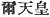
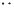
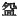
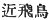
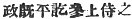

  
[Intangible Textual Heritage](../../index)  [Shinto](../index) 
[Index](index)  [Previous](kj139)  [Next](kj141) 

------------------------------------------------------------------------

[Buy this Book at
Amazon.com](https://www.amazon.com/exec/obidos/ASIN/B0028Y4SZY/internetsacredte)

------------------------------------------------------------------------

  
*The Kojiki*, translated by Basil Hall Chamberlain, \[1919\], at
Intangible Textual Heritage

------------------------------------------------------------------------

p. 360

## \[SECT. CXXXIII.—EMPEROR.—RI-CHIU (PART III.—HIS REBELLIOUS BROTHER AND THE LATTER'S RETAINER SOBAKARI ARE SLAIN)\]

Thereupon his younger brother His Augustness Midzu-ha-wake came,
[and](errata.htm#87) sent \[to ask for\] an audience. [1](#fn_2153) Then the Heavenly Sovereign caused him
to be told \[these words\]: As I am in doubt whether perhaps Thine
Augustness may \[not\] be of like mind [2](#fn_2154) with King Sumi-no-ye-no-naka-tsu, I
will not meet and speak with thee." \[His Augustness Midzu-ha-wake\]
replied, saying: "I have no evil intent. I am not of like mind with King
Sumi-no-ye-no-naka-tsu." \[The Heavenly Sovereign\] again caused him to
be told \[these words\]: "If that be so, \[do thou\] now return down,
and slay King Sumi-no-ye-no-naka-tsu, and come up \[again hither\]. At
that time I will surely meet and speak with thee." So he forthwith
returned down to Naniha, and deceived \[a man\] named Sobakari, [3](#fn_2155) a man-at-arms [4](#fn_2156) in the personal service of [5](#fn_2157) King Sumi-no-ye-no-naka-tsu, saying:
"If thou wilt obey my words, I shall become Heavenly Sovereign, and will
make thee prime Minister, to rule the Empire. [6](#fn_2158) How \[would this be\]?" Sobakari
replied, saying "" \[I \[290\] will do\] according to thy command." Then
plenteously endowing that man-at-arms, he said: "If that be so,

p. 361

slay the King." Thereupon Sobakari watched for the time when his King
went into the privy, and thrust him to death with a spear. So when \[His
Augustness Midzu-ha-wake\] was making his progress to Yamato taking
Sobakari with him, he, on reaching the entrance of the Ohosaka mountain,
thought \[thus\]: "Although Sobakari deserves very well of me, he has
truly [7](#fn_2159) slain his lord. This is
unrighteous. Nevertheless if I reward not his deed, I may be called
untruthful; and if I quite carry out my promise, his intentions are on
the contrary to be feared. So, though recompensing his deed, I will
destroy his actual person." Therefore he said to Sobakari: "I will halt
here to-day and bestow on thee the rank of Prime Minister, and to-morrow
will \[continue my\] progress up." So a halt was made at the entrance to
the mountain, a temporary palace forthwith built, a copious feast [8](#fn_2160) suddenly held, the rank of Prime
Minister forthwith bestowed on the man-at-arms, and all the
officials [9](#fn_2161) made to do obeisance
\[to him\]. The man-at-arms, delighted, thought that he had accomplished
his design. Then \[His Augustness Midzu-ha-wake\] said to the
man-at-arms: "To-day I will drink liquor from the same cup as the Prime
Minister." And when they drank together, a bowls large \[enough\] to
hide the face was filled with the liquor presented. [10](#fn_2162) Hereupon the King's child drank
first, and the man-at-arms drank afterwards. So when the man-at-arms was
drinking, the great cup covered his face. Then \[His Augustness
Midzu-ha-wake\] drew forth a sabre which he had laid under the matting,
and cut off the head of the man-at-arms. Forthwith on the morrow he made
his progress up. So the place was called by the name of
Chika-tsu-Asuka. [11](#fn_2163)

p. 362

\[paragraph continues\] \[291\] Going up
and reaching Yamato, he said: "I will halt here to-day and, having
purified myself, will go forth to-morrow and worship at the temple of
the Deity." [12](#fn_2164) So that place is
called by the name of Toho-tsu-Asuka. [13](#fn_2165) So going forth to the temple of the
Deity of Iso-no-kami [14](#fn_2166), he sent
to report to the Heavenly Sovereign that he had come up to serve him
after accomplishing the work \[with which he had been entrusted\]. [15](#fn_2167) So \[the Heavenly Sovereign\] sent
for, and met, and spoke with him.

------------------------------------------------------------------------

### Footnotes

[360:1](kj140.htm#fr_2158) p. 362 The original of this clause is very
elliptical, consisting only of the two characters  . The old reading joins thereto
the characters  , which
according to Motowori form the commencement of the next sentence. The
meaning is not affected by the change.

[360:2](kj140.htm#fr_2159) Literally, "heart."
Similarly below, where the word "intent" is used in the translation.

[360:3](kj140.htm#fr_2160) The signification
of this name is quite obscure.

[360:4](kj140.htm#fr_2161) *Hayabito*. The
reader should compare Section XXXVIII. Note 11.

[360:5](kj140.htm#fr_2162) Literally, "closely
accustomed to."

[360:6](kj140.htm#fr_2163) The original leaves
it uncertain whether the words "to rule the Empire "should be applied to
the speaker, to Sobakari, or to both; and the ambiguous application has
therefore been preserved in the translation.

[361:7](kj140.htm#fr_2164) Literally,
"already."

[361:8](kj140.htm#fr_2165) See Sect. CVII,
Note 7.

[361:9](kj140.htm#fr_2166) Literally, "the
hundred officials," a Chinese phrase, which has been met with before.

[361:10](kj140.htm#fr_2167) The character
  used in the text implies
by its radical that the bowl was of metal. It is an unauthorized form of
  or  .

[361:11](kj140.htm#fr_2168) *Scil*. by the
prince to the man-at-arms.

[362:12](kj140.htm#fr_2169) *I.e.*, Nearer
Asuka. The name is written 
. The student should consult Motowori's note on this
passage in Vol. XXXVIII, pp. 38-39 of his Commentary, to see what can be
done towards reconciling the name, the characters it is written with,
and the origin ascribed to it, all of which are so apparently
incongruous.

[362:13](kj140.htm#fr_2170) p. 363 
, *i.e.*, Further Asuka. *Conf*. Note.

[362:14](kj140.htm#fr_2171) *Scil*. of
Isonokami. This deity was the sword forming the subject of the legend
narrated in Sect. XLV.

[362:15](kj140.htm#fr_2172) This is the gist
of the original phrase, which will not bear literal translation into
English:  .

------------------------------------------------------------------------

[Next: Section CXXXIV.—Emperor Ri-chiu (Part IV.—Various Deeds)](kj141)
