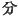
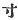
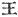

  
[Intangible Textual Heritage](../../index)  [Shinto](../index) 
[Index](index)  [Previous](kj142)  [Next](kj144) 

------------------------------------------------------------------------

[Buy this Book at
Amazon.com](https://www.amazon.com/exec/obidos/ASIN/B0028Y4SZY/internetsacredte)

------------------------------------------------------------------------

  
*The Kojiki*, translated by Basil Hall Chamberlain, \[1919\], at
Intangible Textual Heritage

------------------------------------------------------------------------

## \[SECT. CXXXV.—EMPEROR HAN-ZEI.\]

His Augustness Midzu-ha-wake dwelt in the palace of Shibakaki at
Tajihi, [1](#fn_2176) and ruled the Empire.
The length of this Heavenly sovereign's august person was nine feet two
inches and a half. [2](#fn_2177) The length of
his august teeth was one inch, and their breadth two lines, and the
upper and lower \[row\] corresponded exactly, \[like jewels strung
together\]. The Heavenly Sovereign wedded the Lady of Tsunu, [3](#fn_2178) daughter of Kogoto, Grandee of
Wani, [4](#fn_2179) and begot august children:
the Lady of Kahi; [5](#fn_2180) next the Lady
of Tsubura [6](#fn_2181) (two Deities). Again he wedded Oto-hime, [7](#fn_2182) daughter of the same Grandee, and
begot august children: King Takara; [8](#fn_2183) next the Lady of Takabe. [9](#fn_2184)—-altogether four Kings \[and
Queens\]. [10](#fn_2185) The Heavenly
Sovereign's august years were sixty. His august mausoleum is on the Moor
of Mozu. [11](#fn_2186)

------------------------------------------------------------------------

### Footnotes

[364:1](kj143.htm#fr_2181) p. 364 For Tajihi see Sect. CXXXII, Note 4.
*Shiba-kaki* (or *Shiba-gaki*) signifies "a fence of brushwood."

[364:2](kj143.htm#fr_2182) As to the ancient
Japanese measures we have no accurate information, and the English
equivalents used in this passage correspond but approximately to the
modern Japanese standards. The character rendered "line" is  , which denotes the tenth part
of a   or "inch." Motowori
remarks that the dimensions of the teeth are not anything extraordinary
p. 365 judged by the present standard, and
suppose that anciently the measures of length must have been smaller
than at present.

[364:3](kj143.htm#fr_2183) *Tsunu no
iratsume*. The signification of this name is obscure.

[364:4](kj143.htm#fr_2184) *Wani no kogoto no
omi*. The meaning of Kogoto is obscure, Wani has already often appeared.

[364:5](kj143.htm#fr_2185) *Kahi no iratsume*.
Kahi is the name of a province, but it cannot be said for certain that
it is from it that this Princess derived her name.

[364:6](kj143.htm#fr_2186) *Tsubura no
iratsume*. The meaning of *Tsubura* is obscure.

[364:7](kj143.htm#fr_2187) *I.e.*, "the
younger princess."

[364:8](kj143.htm#fr_2188) *Takara no miko*.
*Takara* signifies "treasure."

[364:9](kj143.htm#fr_2189) *Takabe no
iratsume*. *Takabe* seems to be the name of a place unless it be
considered to be connected with the word *taka*, "hawk."

[364:10](kj143.htm#fr_2190) Remember that the
single character  
includes both sexes.

[364:11](kj143.htm#fr_2191) See Sect. CXXX.
Note 1.

------------------------------------------------------------------------

[Next: Section CXXXVII.—Emperor In-giyō (Part I—Genealogies)](kj144)
