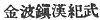
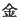
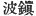
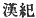
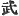

  
[Intangible Textual Heritage](../../index)  [Shinto](../index) 
[Index](index)  [Previous](kj144)  [Next](kj146) 

------------------------------------------------------------------------

[Buy this Book at
Amazon.com](https://www.amazon.com/exec/obidos/ASIN/B0028Y4SZY/internetsacredte)

------------------------------------------------------------------------

  
*The Kojiki*, translated by Basil Hall Chamberlain, \[1919\], at
Intangible Textual Heritage

------------------------------------------------------------------------

p. 367

## \[SECT. CXXXVIII.—EMPEROR IN-GIYŌ (PART II.—HIS SICKNESS IS CURED BY A KOREAN PHYSICIAN).\]

The Heavenly Sovereign, when first about to rule the succession of
Heaven's Sun, [1a](#fn_2200) declined, saying:
"I have a long sickness; I cannot rule the sun's succession."
Nevertheless, as from the Empress downwards all the magnates strongly
urged him, he forthwith ruled the Empire. At this time the ruler of
Shiragi [2a](#fn_2201) dutifully sent
eighty-one vessels with august tribute. Then the chief envoy [3](#fn_2202) sent with the august tribute, whose
name was Komu-ha-chimu-kamu-ki-mu, [4](#fn_2203) was a man deeply versed in the medical
art. So he cured the Heavenly Sovereign's august sickness.

------------------------------------------------------------------------

### Footnotes

[367:1a](kj145.htm#fr_2205) p. 367 For this expression see Sect. XXXIII, Note
27. The story of the refusal of this monarch to accept the crown which
was offered to him by the magnates of the nation is told at considerable
length in the parallel passage of the "Chronicles." According to the
same authority he belonged to a collateral branch of the Imperial
family, and was therefore not in the regular line of succession.

[367:2a](kj145.htm#fr_2206) See Sect. XCVIII.
Note 2.

[367:3](kj145.htm#fr_2207) Literally, "great
messenger."

[367:4](kj145.htm#fr_2208)   Motowori decides that   is the surname,   an official title,   an official designation of the
kinsmen of the Korean King, and 
 the personal name.

------------------------------------------------------------------------

[Next: Section CXXXIX.—Emperor In-giyō (Part III. He Rectifies the
People's Names)](kj146)
