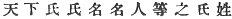
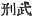
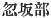

  
[Intangible Textual Heritage](../../index)  [Shinto](../index.md) 
[Index](index)  [Previous](kj145)  [Next](kj147.md) 

------------------------------------------------------------------------

[Buy this Book at
Amazon.com](https://www.amazon.com/exec/obidos/ASIN/B0028Y4SZY/internetsacredte.md)

------------------------------------------------------------------------

  
*The Kojiki*, translated by Basil Hall Chamberlain, \[1919\], at
Intangible Textual Heritage

------------------------------------------------------------------------

## \[SECT. CXXXIX.—EMPEROR IN-GIYŌ (PART III. HE RECTIFIES THE PEOPLE'S NAMES).\]

Thereupon the Heavenly Sovereign, lamenting the transgressions in the
surnames and gentile names of the people of all the surnames and names
in the Empire [1b](#fn_2204.md) placed jars \[for
trial by\] hot water [2b](#fn_2205.md) at the
Wondrous

p. 368

\[paragraph continues\] Cape of Eighty
Evils in Words at Amakashi, [3](#fn_2206.md) and
deigned to establish the surnames and gentile names of the eighty heads
of companies. [4](#fn_2207.md) Again the Karu
Tribe [5](#fn_2208.md) was established as the
august proxy of King Karu of Ki-nashi; the Osaka Tribe [6](#fn_2209.md) was established as the Empress's
august proxy; and the Kaha Tribe [7](#fn_2210.md)
was established as the august proxy of the Empress's younger sister
Ta-wi no Naka-tsu-hime. [8](#fn_2211.md)

------------------------------------------------------------------------

### Footnotes

[367:1b](kj146.htm#fr_2209.md) p. 368 The original is;  , which Motowori reads *ame no
shita no uji-uji na-na no hito domo no uji kabane*.

[367:2b](kj146.htm#fr_2210.md) We learn from the
"Chronicles" that he whose hand was injured in the process of dipping it
into the jar of boiling water was pronounced a deceiver, while those who
stood the trial unhurt were considered to be telling the truth.

[368:3](kj146.htm#fr_2211.md) *Amakashi no
koio-yo-maga-tsu-hi no saki*. Motowori truly observes that this does not
sound like an actual geographical name, but was rather, it may be
supposed, a new designation given to Cape Amakashi (see Sect. LXXII,
Note 10) on account of the incident here mentioned. The name reminds us
of that of one of the deities born from the purification of the person
of the creator Izanagi after his return from Hades (see X, Note 14).

[368:4](kj146.htm#fr_2212.md) *Ya-sotomo-no-wo*.
See Sect. XXXIII, Note 19.

[368:5](kj146.htm#fr_2213.md) *Karu-be*.

[368:6](kj146.htm#fr_2214.md) *Osaka-be*, so
called after the Empress's native place (See Sect. CXXXVII, Note 3, and
Sect. CXVII, Note 6). The reading of *Osaka-be* is given in all the
editions to the characters in the text, 
, where we should expect 
. Motowori's explanation of the reason why the name
was thus written will be found in Vol. XXXIX, p. 19, of his Commentary.

[368:7](kj146.htm#fr_2215.md) *Kaha-be*. Motowori
supposes that there is here some corruption of the text, as no
connection can be discovered between the name of this Tribe and that of
the Princess whose proxy the tribe became.

[368:8](kj146.htm#fr_2216.md) See Sect. CXVII,
Note 7.

------------------------------------------------------------------------

[Next: Section CXI. Emperor In-giyō (Part IV.—His Age and Place of
Burial)](kj147.md)
