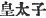

  
[Intangible Textual Heritage](../../index)  [Shinto](../index.md) 
[Index](index)  [Previous](kj147)  [Next](kj149.md) 

------------------------------------------------------------------------

[Buy this Book at
Amazon.com](https://www.amazon.com/exec/obidos/ASIN/B0028Y4SZY/internetsacredte.md)

------------------------------------------------------------------------

  
*The Kojiki*, translated by Basil Hall Chamberlain, \[1919\], at
Intangible Textual Heritage

------------------------------------------------------------------------

\[296\]

## \[[SECT](errata.htm#88). CXLI.—EMPEROR IN-GIYŌ (PART V.—PRINCE KARU LOVES HIS SISTER PRINCESS SO-TOHOSHI.md)\]

After the decease of the Heavenly Sovereign, it was settled that King
Karu of Ki-nashi should rule the Sun's succession. [1b](#fn_2213.md) But in the interval before his
accession, he debauched his younger sister the Great Lady of Karu, and
sang, saying:

"Making rice-fields on the mountain, making hidden conduits run on
account of the mountain's height:—to-day indeed \[my\] body easily
touches the younger sister whom I wooed with a hidden wooing, the spouse
for whom I wept with a hidden weeping." [2](#fn_2214.md)

This is a Hind-Lifting Song. [3](#fn_2215.md)
Again he sang, saying:

"The rattle-rattle of the hail against the bamboo-grass:—After I shall
have certainly slept, what though I be plotted against by people! When I
shall have slept delightfully, if there is the disorder of the cut
*Hydropyrum latifolium*, let there be disorder,—when I shall have slept
a good \[297\] sleep!" [4](#fn_2216.md)

This is a Rustic Lifting Song. [5](#fn_2217.md)

p. 370

------------------------------------------------------------------------

### Footnotes

[369:1b](kj148.htm#fr_2218.md) p. 370 See Sect. XXXII. Note 27. The wording of
this sentence would make it appear that it was only *after* the Emperor
In-giyo's death that King Karu was chosen to succeed him. But probably
King Karu had been appointed Heir Apparent (
) during his Father's life time, as is indeed
expressly stated in the "Chronicles," and is implied in later passages
of this work; and what our author meant to say was: "It was settled that
King Karu should rule the "Empire after the former Sovereign's decease."
etc.

[369:2](kj148.htm#fr_2219.md) The meaning of the
Song is: "The sister, the mistress, whom I wooed with such difficulty,
is now easily mine."—The first phrase, down to "mountain's height," is
but a "Preface "to the poem properly so called, serving to introduce by
a *jeu-de-mots* the word *shita-dohi*, which means not only "hidden
conduit," but "hidden wooing." At the same time the implied
[comparison](errata.htm#89.md) of the poet's secret love of one so
difficult to obtain as his own sister, to the course of the water in
hidden conduits which is carried up the mountain's side to irrigate a
field perched in a spot almost inaccessible, is by no means devoid of
aptness. The word "mountain" (*yama*) is in the original preceded by the
Pillow-Word *ashihiki* (or *askiki*) *no*, whose signification is
obscure and much disputed.

[369:3](kj148.htm#fr_2220.md) *Shirage-uta*
(written phonetically). The interpretation of the term here adopted is
that which has the sanction of Motowori and Moribe. They explain it to
signify that the voice rose gradually toward the latter part of the
Song.

[369:4](kj148.htm#fr_2221.md) As in the case of
the preceding Song, the first phrase is but a Preface, which plays on
the coincidence in sound between the words *tashi-dashi*, "rattling,"
and *tashika*, "certainly," *i.e.* "undisturbedly." The signification of
the Song proper is: "If I shall but have gratified my passion, what care
I however men may plot against me? If I can but press my beloved to my
bosom, let all things go to rack and ruin, like the Hydropyrum
latifolium, a grass which, when cut, falls into disorder!"—Of the
sentiment of the Song, the less said the better; but viewed simply from
a literary point of view, it is certainly one of the most fascinating
little productions of the early Japanese muse, and the literal rendering
of it into English does it woful injustice. Moribe rightly rejects
Motowori's proposal to divide the poem in two after the words *hito
hakayu to mo*, "plotted against by people." *Kari-komo no*, "of the
*Hydropyrum latifolium*," is a Pillow-Word.

[369:5](kj148.htm#fr_2222.md) *Hinaburi no
ageuta*. The commentators have nothing more precise to tell us
concerning the expression "Lifting-Song "than that "it refers to the
lifting of the voice in singing."

------------------------------------------------------------------------

[Next: Section CXLII.—Emperor In-giyō (Part VI.—War Between Prince Karu
and Prince Anaho)](kj149.md)
